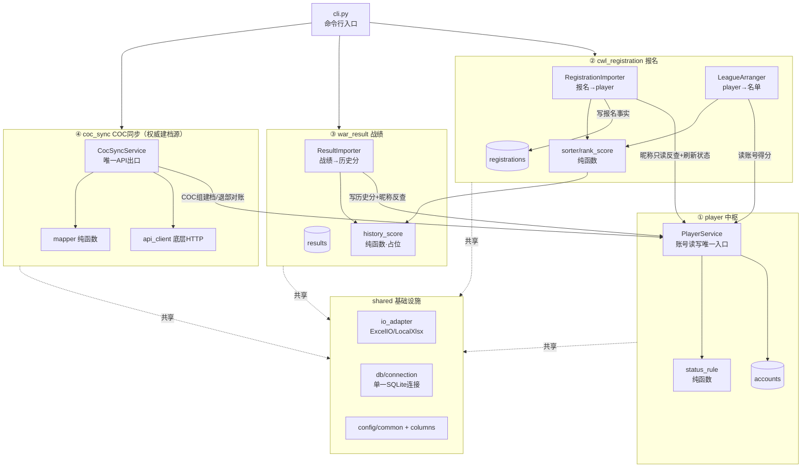
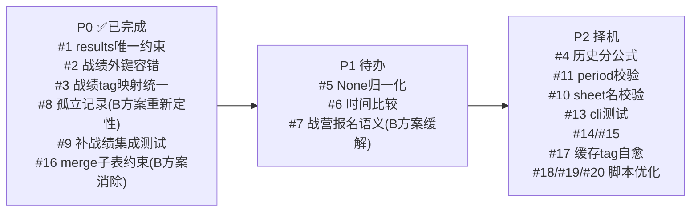

# sky-admin 代码详解与隐患审查

> 本文档基于对全部源码与单元/集成测试的通读整理，用于讲解系统结构、评估测试覆盖、梳理隐藏问题与整改优先级。
>
> **v2.x（当前）**：架构已由"技术分层"（`core` / `io_adapter` / `db`）重构为"业务领域分模块"——`shared` 基础设施 + `modules/{player, cwl_registration, war_result, coc_sync}`，其中 **`player` 为数据中枢、`PlayerService` 为账号读写的唯一入口**。账号身份采用**走 A：COC 真实 Tag 作主键**，`coc_sync` 为权威建档源。测试改用真实内存 `Database(":memory:")` + `FakeExcelIO` / `FakeCocApiClient`，去掉了 `InMemoryRepository`。
>
> **v2.2 报名解耦（B 方案，本次更新）**：`registrations` 从"accounts 的子表"升级为**自包含的报名事实源**——自持 `account_name`（报名昵称，主标识）/ `player_name`，`player_tag` 降为**可空的关联缓存、去外键**，唯一键 `(player_tag, period)` → `(account_name, period)`。报名导入**不再写 accounts、不再临时建档、不再合并**：`accounts` 全由 COC 权威建档 + 战绩历史分填充，报名侧只读反查真实 Tag 做缓存。"报名有 / COC 无"的新人照常入 `registrations`、排序得 0 分。由此**退休**了 `is_provisional` 临时建档、`merge_provisional` 合并、`unmatched.py` 未匹配钩子、coc-sync 残留告警一整套逻辑（原隐患 #14/#16 随之消解）。架构细节另见 `DESIGN.md` §13.6、§十四。新增**战营排除名单 `EXCLUDED_CAMP_NAMES`**：在导入阶段（`importer._read_camp`）和排序阶段（`roster._load_accounts`）双阶段过滤，排除名单上的账号正常入库但不出现在联赛名单中。
>
> **部落成员身份体系**：`accounts.membership_status`（`member`/`left`）与 **coc-sync 退部对账**——与报名维度 `status` 完全解耦。详见 `DESIGN.md` §八、§十三、§十四（§14.6 退部对账 / §14.7 大本等级预留）。

---

## 一、系统整体结构

这是一个「月度联赛报名 → 名单编排 → 战绩回写」的管理系统，采用**领域分模块 + 依赖注入**架构：`player` 处于底层被依赖（数据中枢），三个业务模块都"更新到 player"，彼此互不感知；纯逻辑、IO、存储三者解耦，便于替换与测试。



分层职责：

- **纯函数层**：`rank_score`（排序综合分）、`sorter`（分组排序）、`status_rule`（状态推断）、`history_score`（历史分，占位）、`mapper`（COC 字段映射）、`columns`（表头关键词解析），输入→输出无副作用，最好测。
- **IO 层**：`shared/io_adapter/ExcelIO` 抽象，当前用 `LocalXlsxAdapter`，`TencentDocAdapter` 预留。
- **存储层**：三个各管一表的 Repository（`PlayerRepository` / `RegistrationRepository` / `ResultRepository`），共享 `shared/db/connection.py` 的**同一个** SQLite 连接，外键与唯一约束照常生效。测试用内存库 `Database(":memory:")`。
- **中枢**：`PlayerService` 是账号数据读写的唯一入口，其他模块不直接碰 `accounts` 表；player 被依赖但不反向依赖任何业务模块（无循环依赖）。

---

## 二、模块逐一讲解

### shared —— 跨模块基础设施

1. **`shared/config/common.py`** — 只放"多模块共用"的常量：账号类型（combat/normal）、账号状态（active/missed/maybe_left/left）、联赛类型（combat/shell）、IO 开关、DB 路径。各模块自己的参数（列映射、权重、阈值）就近放在各模块 `config.py`。
2. **`shared/columns.py`** — 表头关键词解析与取值工具（纯函数，报名/战绩两侧共用）：
   - `norm_header(text)`：去所有空白（含换行），用于关键词匹配。
   - `resolve_columns(headers, spec)`：按 `{field: {include:[], exclude:[]}}` 规则解析表头，归一化后包含任一 include 且不含任何 exclude 即命中，命中多个取第一个。解决真实表头带换行/空格且列语义随月份漂移的问题。
   - `to_float(value)`：转 float，空/非法返回 None。
   - `clean_str(value)`：去空白，空返回 None。
3. **`shared/io_adapter/`** — `base.ExcelIO` 抽象；`local_xlsx.LocalXlsxAdapter` 读支持 `fill_merged`（合并单元格向下填充），写为**追加式**（已存在文件则新建/覆盖同名 sheet，保留其余页）；`tencent_doc` 预留。
4. **`shared/db/connection.py`** — `Database` 持有单一 SQLite 连接（内存库需单连接才能共享数据），集中建表 + 幂等迁移。三表含约束：**`registrations UNIQUE(account_name, period)`（v2.2，无 accounts 外键）**、`results UNIQUE(player_tag, period, league_type)`；开启外键。`reset()` 清空重建，`_migrate()` 为旧库补列并把旧 `registrations` 重建为 B 方案自包含形态（`_rebuild_registrations`）。

### ① player —— 玩家中枢

5. **`player/service.py`（`PlayerService`）** — 账号读写唯一对外接口，报名模块通过它只读访问 accounts 表。

   **报名相关方法**：
   - `resolve_tag_by_name(account_name)` → `Optional[str]`：按昵称反查 COC 真实 Tag。`PlayerRepository.find_by_name()` 查 `accounts` 表，命中多个取首个并告警（改名/重名边界），未命中返回 None（B 方案下正常）。
   - `refresh_status(current_period, registered_names)`：按本月报名昵称集合遍历全体真实账号，调 `infer_status()` 推断状态并写回 `accounts.status`。
   - `list_members_by_clan(clan_tags)` → `list[dict]`：按部落标签查成员（战营名单数据源）。
   - `get(player_tag)` → `Optional[dict]`：取单个账号（排序阶段取 trophies + history_score）。

   **其他方法**：`list_all(status)` 列表查询、`update_history_score()` 战绩回写、`update_from_coc()` COC 权威建档、`mark_left_alliance()` / `relocate_within_alliance()` 部落归属维护。

6. **`player/repository.py`（`PlayerRepository`）** — `accounts` 表 CRUD。
   - `find_by_name(account_name)`：按昵称查账号（供 `resolve_tag_by_name` 反查）。
   - `get(player_tag)`：按 Tag 查单个账号。
   - `list_by_clan_tags(clan_tags)`：按部落标签批量查（战营名单、退部对账候选）。
   - `upsert(fields)`：`ON CONFLICT ... COALESCE(excluded.col, 旧值)` 实现字段分组互不覆盖（COC 组 vs 战绩组）。
   - `update_status(player_tag, status)`：更新报名维度状态。
   - `set_clan_membership()`：显式 UPDATE 部落归属三列。
   - 派生列 `last_reg_period`：SELECT 统一带子查询 `MAX(period)` 按 `account_name` 关联 registrations。

7. **`player/status_rule.py`** — 纯函数，账号状态推断规则。
   - `period_diff(from_period, to_period)`：计算两个 `YYYY-MM` 间隔月数。
   - `infer_status(last_reg_period, current_period, registered_this_period, maybe_left_months)`：
     - 本月报名 → `active`
     - 从未报名 → `maybe_left`
     - 距最后报名 ≥ N 月 → `maybe_left`
     - 否则 → `missed`

### ② cwl_registration —— 报名（核心业务模块）

报名模块是系统核心，负责「报名表 → 数据库 → 联赛名单」的完整数据流，分两个功能、七个步骤。

**数据流概览**：
```
报名表(腾讯文档/本地xlsx)
  → [1] read_sheet(fill_merged=True)    — 读取原始行
  → [2] parse_registration_row() × N    — 关键词映射 + 清洗
  → [3] _fill_player_name_forward()     — 兜底：空主号前向填充
  → [4] _dedup_latest()                 — 同昵称取最新提交
  → [5] _read_camp()                    — 从 accounts 拉 #2QQ 战营成员
  → [6] _merge_camp()                   — 战营优先合并
  → [7] _save() × N                     — 反查真实Tag → 落库 registrations
         ↓
  registrations 表（自包含报名事实）
         ↓
  → [A] _load_accounts(period)          — 读报名 + 反查得分 + 过滤排除名单
  → [B] sort_accounts()                 — 纯函数分组排序
  → [C] update_arrangement() × N        — 回写 league_type / rank_order
  → [D] write_sheet()                   — 导出名单到新 sheet
```

8. **`cwl_registration/importer.py`（`RegistrationImporter`）** — 功能①「报名导入」。

   核心方法 `import_from(source, period, sheet)` 执行七步：
   - **Step 1** `read_sheet(fill_merged=True)`：读取报名表，合并单元格左上值向下填充。
   - **Step 2** `parse_registration_row()`（纯函数）：`resolve_columns()` 关键词映射表头 → `clean_str()`/`to_float()` 清洗 → `_parse_join_combat()` 转换实战意愿 → 产出标准报名 dict（`account_type=NORMAL`）。缺 `account_name` 的行跳过。
   - **Step 3** `_fill_player_name_forward()`：兜底逻辑——源表未真·合并单元格时，按物理行把空主号向前填充为最近非空主号。
   - **Step 4** `_dedup_latest()`：同一 `account_name` 多条时，按 `submit_time` 保留最新一条，打印 stderr 告警。
   - **Step 5** `_read_camp()`：`PlayerService.list_members_by_clan(["#2QQ"])` → 从 `accounts` 表拉战营部落成员 → 过滤 `EXCLUDED_CAMP_NAMES` → 返回战营昵称集合。
   - **Step 6** `_merge_camp()`：报名表中有的人若在战营集合中 → 强制 `combat` + 实战。战营成员本月没报名也纳入（`match_value=None`）。战营优先覆盖。
   - **Step 7** `_save()` × N：`resolve_tag_by_name()` 按昵称只读反查 `accounts` 真实 Tag（命中缓存到 `player_tag`，未命中留空）→ `RegistrationRepository.add_registration()` upsert 落库（`ON CONFLICT(account_name, period) DO UPDATE`）→ **不建 accounts 行**。
   - 最后 `PlayerService.refresh_status()` 按本月报名集合刷新全体账号状态。

9. **`cwl_registration/roster.py`（`LeagueArranger`）** — 功能②「名单编排与导出」。

   - `_load_accounts(period)`：读 `registrations` 本月报名 → 过滤 `EXCLUDED_CAMP_NAMES` → 优先用缓存 `player_tag`，空则 live 反查 `resolve_tag_by_name()` → `PlayerService.get(tag)` 取 `trophies` + `history_score` → 上月排名反查上月 `registrations.rank_order` → 输出排序列表。
   - `arrange(period, weights)`：调 `sort_accounts()` → `update_arrangement()` 回写 `league_type/rank_order`。
   - `arrange_and_export(period, target, sheet)`：`arrange()` + `write_sheet()` 导出到新 sheet（缺省名 `名单_<period>`）。

10. **`cwl_registration/sorter.py`** — 纯函数 `sort_accounts(accounts, weights)`。
    - `_extents()` 计算全体 match_value / history_score 极值。
    - 逐条调 `compute_rank_score()` 算综合分。
    - `_is_combat_league()` 判断实战/壳子：战营账号默认实战，普通账号看 `join_combat`。
    - 分三组：`combat_camp`（战营）→ `combat_normal`（普通实战）→ `shell`（壳子）。
    - 战营内部 `camp_sort_key` 按 `trophies` 降序（同杯以综合分 tie-break）→ `adjust_camp_by_prev_rank` 微调（当前恒等，预留接口）。
    - 普通实战 / 壳子按综合分降序。
    - 全局编号 `rank_order` 从 1 开始。

11. **`cwl_registration/rank_score.py`** — 纯函数 `compute_rank_score(account, match_min, match_max, hist_min, hist_max, weights)`。
    - `_normalize(value, lo, hi)` 归一化到 [0,1]，含除零保护（`hi<=lo` 返回 0）和 None 保护。
    - 综合分 = `W_match × 归一化匹配值 + W_history × 归一化历史分`（默认 0.6/0.4）。

12. **`cwl_registration/repository.py`（`RegistrationRepository`）** — `registrations` 表数据访问。
    - `add_registration(reg)`：upsert，唯一键 `(account_name, period)`，`ON CONFLICT DO UPDATE` 覆盖 `player_name/match_value/join_combat/account_type/prev_rank`，`player_tag` 用 COALESCE 保留非空缓存。
    - `get_registrations(period)`：按月份查全部报名。
    - `rank_orders_of_period(period)`：返回 `{account_name: rank_order}`，供下月编排取上月排名。
    - `last_period_of(account_name)`：该昵称最后报名月份（状态推断数据源）。
    - `update_arrangement(reg_id, league_type, rank_order)`：回写编排结果。

13. **`cwl_registration/config.py`** — 报名模块全部配置集中于此。
    - `REGISTRATION_COLUMN_KEYWORDS`：报名表列关键词映射（`player_name`/`account_name`/`match_value`/`join_combat`/`submit_time`），每个字段含 `include`/`exclude` 关键词数组。
    - `SORT_WEIGHTS`：`{"match_value": 0.6, "history_score": 0.4}`。
    - `CAMP_CLAN_TAG`：`"#2QQ"` 战营部落标签。
    - `EXCLUDED_CAMP_NAMES`：战营排除名单（`set[str]`），双阶段过滤。
    - `REGISTRATION_TAG_SOURCE`：`"account_name"`（昵称反查模式）。
    - `REGISTRATION_DEDUP`：`"latest_submit"` 去重策略。
    - `JOIN_COMBAT_TRUE_TEXTS`：`{"是","yes","y","true","1","参加"}`。
    - `ARRANGEMENT_OUTPUT_HEADERS`：名单输出列顺序。

### ③ war_result —— 战绩

14. **`war_result/importer.py`（`ResultImporter`）** — 读战绩表 → 关键词解析 tag/联赛类型（其余列进 `raw_metrics` JSON）→ 按昵称 `resolve_tag_by_name`，**未知账号跳过 + 告警**（不因外键整批失败）→ upsert 写 `results` → 对涉及账号重算 `history_score` 回写。
15. **`war_result/history_score.py`** — 纯函数 `compute_history_score`，**当前占位恒返回 `0.0`**，待补公式。
16. **`war_result/repository.py`（`ResultRepository`）** — `results` 表读写，`add_result` 走 upsert（`(player_tag, period, league_type)` 唯一，`league_type` 为 NULL 时 SQLite 不视为冲突）。
17. **`war_result/config.py`** — 战绩表列关键词（与报名侧一致）、`RESULT_TAG_SOURCE`（当前=account_name）。
18. **`war_result/api_client.py`** — 🔒 COC 战绩 API 预留。

### ④ coc_sync —— COC 同步（权威建档源）

19. **`coc_sync/service.py`（`CocSyncService`）** — 唯一 API 编排出口：遍历多部落抓成员 → `mapper` 标准化 → 按真实 Tag 汇总去重（跨部落重复按策略处理）→ `update_from_coc` 建档/更新 → **退部对账**（`_reconcile_left_members`：仅对本次成功同步的部落，成员列表消失的真实账号调 `get_player` 查新部落；仍属联盟则只更新归属，联盟外/无部落则 `membership_status=left`；查询失败本轮跳过不误判）。`fetch_clan_members` 提供只读预览（不落库）。单部落失败按 `FAIL_FAST` 隔离。**v2.2（B 方案）起不再做临时账号合并与残留告警**——报名与 accounts 解耦后无临时账号产生，`stats` 也去掉了 `merged`/`provisional_residual`。
20. **`coc_sync/api_client.py`（`CocApiClient`）** — 底层 HTTP：token 仅环境变量、SSRF 白名单（硬编码只允许 `api.clashofclans.com` + host 校验）、tag URL 编码、请求超时。仅本模块内部调用。`get_player` 供退部对账查成员当前部落（也是后续补大本等级的接口）。
21. **`coc_sync/mapper.py`** — 纯函数 `map_member`：COC 原始成员 dict → player COC 组字段（含 `coc_raw` JSON 快照 + 部落上下文，建档即 `membership_status=member`）；`normalize_tag` 统一 tag 规范化（去空白/大写/补 `#`）。注：`townHallLevel` 成员接口不返回，`town_hall_level` 暂空，待接 `get_player` 补齐。
22. **`coc_sync/config.py`** — `CLANS`（tag/name/enabled）+ `DUP_ACROSS_CLANS` + `FAIL_FAST` + `alliance_clan_tags()`（联盟全部落 tag，含 `enabled=False`，供退部对账判定"新部落是否仍属联盟"）。

### 入口

23. **`cli.py`** — 命令行入口，六个子命令 + 一个导出命令，按模块装配依赖（`Database` → 各 Repository → `PlayerService` → 各编排器）。

   **报名相关命令**：
   - `import-reg`（`cmd_import_reg`）：装配 `RegistrationImporter(player_service, reg_repo, excel_io)` → `import_from(source, period, sheet)`。支持 `--to tencent`（腾讯文档 fileId）和 `--to local`（本地 xlsx 路径）。
   - `arrange`（`cmd_arrange`）：装配 `LeagueArranger(player_service, reg_repo, excel_io)` → `arrange_and_export(period, target, sheet)`。输出实战/壳子人数统计。

   **其他命令**：`coc-sync` / `import-result` / `accounts` / `player-export` / `reset-db`。

### 运维脚本

24. **`scripts/load_env.sh`** — 公共环境变量加载器：从项目根 `.env` 逐行安全解析 `KEY=VALUE`（防注入、兼容 CRLF、Key 合法性校验、环境变量优先），被其它脚本 `source` 引用。
25. **`scripts/register_and_arrange.sh`** — 报名一体化入口：三步串联「COC 同步（已注释）→ `import-reg --to tencent` → `arrange --to tencent`」，每月开赛前跑一次。`period` 支持命令行参数或环境变量 `LEAGUE_PERIOD`，含格式校验；报名子表名支持自动推算（Python 精确计算当月末日）。所有凭证从 `.env` 读取。
26. **`scripts/sync_and_export.sh`** — 长期维护入口：两步串联「`coc-sync` → `player-export --to tencent`」，适合 cron 定时执行，保持 player 数据库与 COC 官方同步。
27. **`scripts/probe_coc_clan.py/.sh`** / **`scripts/dump_clans_to_xlsx.py/.sh`** — 调试工具：探测部落成员 / 导出数据到本地 xlsx。

---

## 三、单元测试覆盖情况

测试按模块归类，统一用 `conftest.py` 的内存 `Database` + `fakes.py` 的 `FakeExcelIO` / `FakeCocApiClient`。

| 模块 | 测试文件 | 覆盖度 | 备注 |
|------|---------|--------|------|
| `columns` / 数据访问三表 | `shared/test_repositories.py` | 良好 | 账号 upsert / **报名唯一约束 `(account_name, period)`(v2.2)** / results 唯一约束(#1) / 历史分不被清零 / 分组 COALESCE / find_by_name |
| `local_xlsx.py` | `shared/test_local_xlsx.py` | 良好 | round-trip / 列序 / 空行 / 合并填充 / 追加 sheet |
| `status_rule.py` | `player/test_status_rule.py` | 良好 | 各状态转换 + period_diff |
| `player/service.py` | `player/test_service.py` | 良好 | 服务层读写 / 反查 / 状态刷新 |
| `rank_score.py` | `cwl_registration/test_rank_score.py` | 良好 | 归一化 / 除零 / 权重 / None |
| `sorter.py` | `cwl_registration/test_sorter.py` | 良好 | 战营优先 / 组内降序 / 空 / 单账号 / 全等 / camp_order |
| `importer.py`（报名） | `cwl_registration/test_importer.py` | 良好 | 关键词映射 / 战营合并 / 去重 / 重导 / 状态 / **反查真实账号回填 tag 缓存 / 未匹配新人只落报名不建账号** |
| `roster.py` | `cwl_registration/test_roster.py` | 良好 | 分组顺序 / 回写 / 导出 |
| `history_score.py` | `war_result/test_history_score.py` | 占位 | 当前返回 0，补公式后再扩展 |
| `importer.py`（战绩） | `war_result/test_importer.py` | 良好 | **#9 补齐**：同时验证 #1（重导覆盖）/#2（未知账号跳过告警）/#3（关键词映射取 tag） |
| `mapper.py` | `coc_sync/test_mapper.py` | 良好 | 字段映射 / tag 规范化 / coc_raw |
| `service.py`（COC） | `coc_sync/test_service.py` | 良好 | 多部落建档 / 增量更新 / 跨部落去重 / 失败隔离 / 只读预览不落库 / **退部对账（无部落判退 / 转联盟外判退 / 转联盟内不判退 / 抓取失败不误判）** |
| `cli.py` | **无** | ❌ 无 | 见隐患 #13 |
| `api_client.py`（COC HTTP） | **无** | ❌ 无 | 涉及真实网络，仅靠 Fake 间接覆盖编排；SSRF/编码逻辑本身未单测 |
| `scripts/*.sh` | **无** | ❌ 无 | 运维脚本无自动化测试（依赖真实 COC API / 腾讯文档 API，手动验证） |

> 整体覆盖显著优于 v1.x：曾经零覆盖的战绩导入（#9）已补齐，新增的 player 中枢、coc_sync 均有测试；v2.2 报名解耦后测试同步对齐新模型（报名不建行、tag 缓存），删除了已失效的 provisional/merge 用例。剩余缺口集中在 `cli.py` 与 `CocApiClient` 的纯 HTTP/安全逻辑。

---

## 四、隐藏问题清单（重点）

### 🔴 严重（已全部整改）

**#1 `results` 表无唯一约束，战绩重复导入会累积脏数据** ✅ **已修复**

`results` 加 `UNIQUE(player_tag, period, league_type)`（`shared/db/connection.py`），`ResultRepository.add_result` 改为 upsert，同月同类型重复导入覆盖而非累积。`tests/shared/test_repositories.py::test_results_unique_constraint_upserts` 与 `war_result/test_importer.py::test_reimport_same_period_type_overwrites` 覆盖。
> 遗留细节：`league_type` 为 NULL 时 SQLite 不把多个 NULL 视为冲突，故同账号同月多条"无联赛类型"战绩会各自保留（代码注释已声明为预期："类型未知先都留着"）。

**#2 导入战绩时外键约束可能直接报错** ✅ **已修复**

`war_result/importer.py` 导入前用 `PlayerService.resolve_tag_by_name` 校验，未知账号**跳过并打 stderr 告警**，不再整批失败。`test_import_skips_unknown_account_with_warning` / `test_mixed_known_and_unknown_partial_import` 覆盖。

**#3 战绩表 tag 与报名体系 tag 不一致的风险** ✅ **已修复**

`war_result/config.py` 改为与报名一致的**关键词映射**，`RESULT_TAG_SOURCE="account_name"` 与报名统一 tag 来源；两侧共用 `shared/columns.resolve_columns`。列名漂移也能命中。

### 🟠 中等（仍待办）

**#4 历史分维度当前完全失效** 🟡 **占位（设计预留）**

`compute_history_score` 恒返回 0，所有账号 `history_score=0`，排序时历史分归一化恒为 0，实际**只有匹配值在起作用**（哪怕权重 0.6/0.4）。这是设计中的占位状态，使用者需知晓"当前名单排序 ≈ 纯按匹配值"。补公式即闭环。

**#5 `None` 匹配值被当 0 参与归一化，扭曲分布** 🔴 **未修复**

`sorter._extents` 仍用 `a.get("match_value") or 0.0` 把 `None` 视作 `0.0` 计入极值。战营名单里"未报名、无匹配值"的账号（`match_value=None→0`）会把 `m_min` 拉到 0，改变所有普通账号的归一化结果；且 `x or 0.0` 对**合法的 0 值**也当空处理。建议归一化时排除 None 而非填 0。（`rank_score._normalize` 已能处理 None，但极值计算这一层未处理。）

**#6 去重"取最新提交"依赖字符串比较，类型混用不安全** 🔴 **未修复**

`importer._submit_key` 仍用 `str(submit_time)` 后比较。openpyxl 读日期可能是 `datetime` 也可能是字符串，混用或格式不统一时"保留最新"可能判断错误。建议统一解析为可比较的时间类型。

**#7 战营未报名账号被写成"本月已报名 + active"** 🟠 **部分缓解（B 方案）**

`importer._merge_camp` 对战营名单里本月**没报名**的账号也纳入报名快照。v2.2 报名解耦后，这些账号只写入 `registrations`（`match_value` 为空、`player_tag` 缓存），**不再触发临时建档**，影响面较 v2.1 明显收窄。但仍存留一个语义问题：`refresh_status` 按 `registrations.account_name` 集合刷新状态时，会把这些"仅战营默认纳入、并未真正报名"的账号也算作本月已报名 → 状态恒 active，**对战营成员的漏报/疑似离开跟踪仍失效**。需明确是否为预期（"战营默认全员参赛"），若不是则应在报名快照里区分"实际报名"与"战营默认纳入"。

**#8 `arrange` 对孤立报名记录静默降级** ✅ **已重新定性（B 方案）**

v2.1 曾在 `roster._load_accounts` 中对 join 不到账号打 stderr 告警。**v2.2 报名解耦后此告警撤销**：报名与 accounts 解耦，"报名有 / COC 无"是常态，未命中账号取 0 分是正常语义而非异常，不再需要告警。

### 🟡 轻微 / 测试缺口

- **#9** ✅ **已修复** 战绩导入曾零测试，现有 `tests/war_result/test_importer.py` 集成测试，同时覆盖 #1/#2/#3。
- **#10** 🔴 自定义 `--sheet` 名未做 openpyxl 合法性校验（超 31 字符或含 `[]:*?/\` 会抛错）。
- **#11** 🔴 `--period` 无格式校验，非法值不报错，`period_diff` 静默返回 0，可能导致状态误判。
- **#12** 🟡 部分改善：`_migrate` 现按列表补多列（camp_order/COC 组/membership_status 等），并新增 `_rebuild_registrations` 把旧子表重建为 B 方案自包含形态（`_rebuild_accounts` 同理重建 accounts）；但仍无版本号/降级机制，跨版本迁移靠"缺列/缺形态即重建"的幂等启发式维护。
- **#13** 🔴 `cli.py` 无任何测试，`args.func` 调度、各 `cmd_*` 未覆盖。
- **#18** 🟡 `register_and_arrange.sh` 第 1 步 `coc-sync` 已注释：战营部落成员不频繁变化时影响不大，但若忘记单独跑 `coc-sync`，报名导入时按昵称反查真实 Tag 的失败率会上升（新人未建档）。建议加注释说明取消注释条件，或提供 `--sync` 开关控制。
- **#19** 🟡 `register_and_arrange.sh` 硬编码 `--to tencent`：只能走腾讯文档模式，无法回退到本地 xlsx 模式。建议改为可配置（如 `IO_MODE="${IO_MODE:-tencent}"`）。
- **#20** 🟡 脚本缺少步骤间的状态校验：`register_and_arrange.sh` 在步骤 [2] 和 [3] 之间不检查导入条数，若导入 0 条仍会继续生成空名单。

### 🆕 v2.x 新结构引入的关注点

- **#14** 🟢 **昵称当 tag 的过渡期重名风险（B 方案已大幅缓解）**：报名/战绩表仍用昵称反查（`REGISTRATION_TAG_SOURCE="account_name"`），`resolve_tag_by_name` 对同名多个真实账号取首个并告警——改名/重名边界下仍可能关联到错误账号，影响个别人的**得分精度**（不再影响架构整洁性）。v2.2 报名解耦后，**原"临时账号漏合并残留"隐患已彻底消失**（报名不建行、无合并环节）；改名/重名的彻底根治仍需报名表补"玩家Tag"列。
- **#15** 🟡 **`CocApiClient` 的 SSRF/URL 编码逻辑无直接单测**：安全逻辑（host 白名单、`_encode_tag`、token 缺失分支）仅靠 Fake 间接绕过，建议补纯逻辑单测锁定安全行为。
- **#16** ✅ **`merge_provisional` 直接操作子表的维护约束已消除**：该方法是 v2.1 时 player 层唯一直接改子表的例外；v2.2 报名解耦后临时账号/合并整体退休，`merge_provisional` 已删除，此维护约束不复存在。
- **#17** 🟢 **报名行缓存 `player_tag` 不自愈（可选优化，待办）**：`registrations.player_tag` 仅在导入那一刻由 `importer._save` 经 `resolve_tag_by_name` 写入一次。若操作顺序为「先 `import-reg`（该新人 COC 未建档，tag 落 NULL）→ 后 `coc-sync`（建档得到真实 Tag）」，该报名行的缓存 tag **不会自动回填**，要等下次重新 `import-reg` 覆盖时才更新。`arrange` 阶段有 live 反查兜底（`roster._load_accounts` 在缓存空时按昵称当场再 resolve），故**排序得分结果正确、不受影响**——问题仅在于缓存列长期为 NULL、未体现已能命中的事实。
  - 待办方案：在 `roster._load_accounts` 中当「缓存为空但 live 反查命中」时，顺手把真实 tag 回写该报名行（需给 `RegistrationRepository` 增 `update_player_tag(reg_id, tag)` 小方法；现有 `update_arrangement` 只写 league/rank）。纯优化、零行为变更，优先级最低。

---

## 五、安全性评估（对照安全规则）

| 项 | 状态 | 说明 |
|----|------|------|
| SQL 注入 | ✅ | 全部参数绑定，无字符串拼接（含 upsert 的动态列名来自固定白名单常量，非用户输入） |
| 命令执行 | ✅ | 无 shell/exec |
| 反序列化 | ✅ | `json.loads` 仅解析自己写入的 `raw_metrics` / `coc_raw` 可信数据 |
| SSRF | ✅ | `coc_sync/api_client.py` 硬编码仅允许 `https://api.clashofclans.com`，请求前再校验 scheme/host，拒绝内网地址；tag 参数 URL 编码且不放行 `/`；腾讯文档为预留空实现 |
| 密钥管理 | ✅ | `COC_API_TOKEN` 仅从环境变量读取，绝不入库/提交；缺失时明确报错 |
| 文件解析 | 🟡 | `load_workbook` 解析外部 xlsx，理论存在 zip-bomb 风险，实际风险低（本地可信文件） |

安全方面无实质缺陷，符合"默认安全"要求。建议补 #15 的 `CocApiClient` 安全逻辑单测以防回归。

---

## 六、整改优先级建议



**建议动手顺序**：
1. **P1** 优先处理 #5（None 归一化，直接影响排序正确性）、#6（时间比较，影响去重）、#7（战营报名语义，B 方案已缓解临时建档面，但状态恒 active 仍待定性）——三者都改动小、影响业务正确性。
2. **P2** 择机：#4 补历史分公式（补齐后 #5 影响面更大，可一并回归）、#11/#10 输入校验、#13 补 cli 测试、#14（补真实 Tag 列根治重名）/#15（补 CocApiClient 安全单测）、#18/#19/#20（脚本健壮性优化）。
