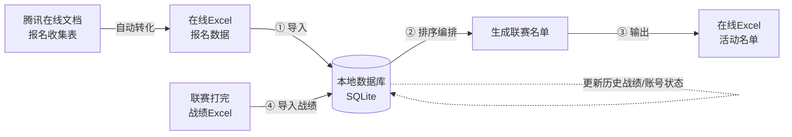
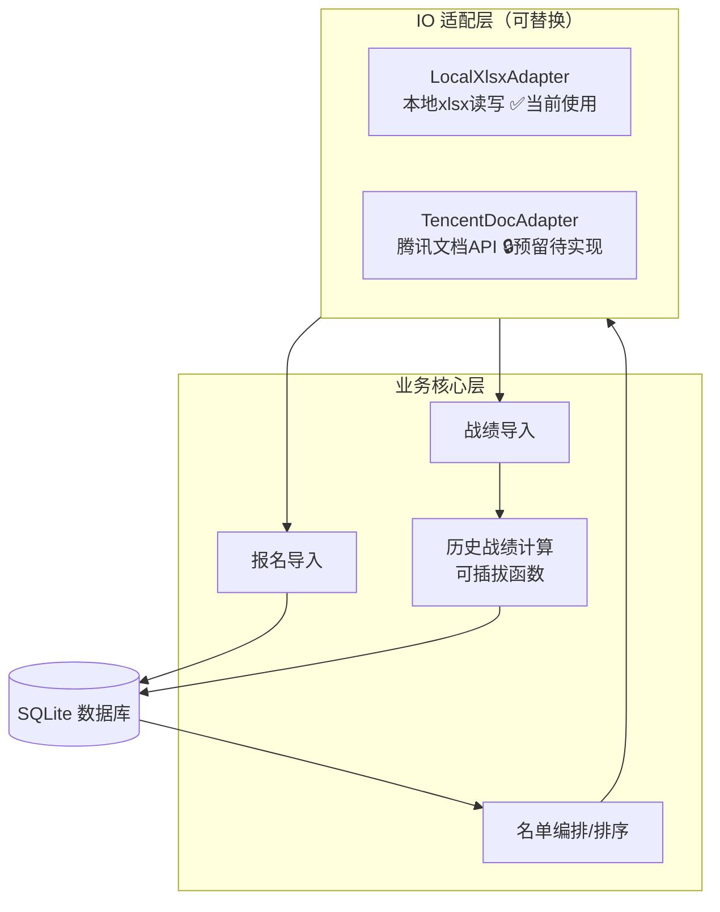
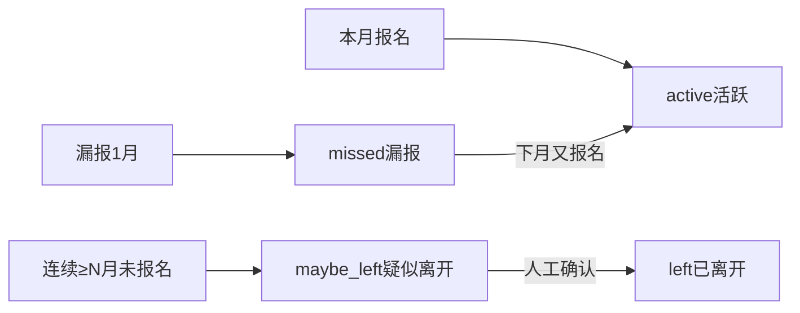
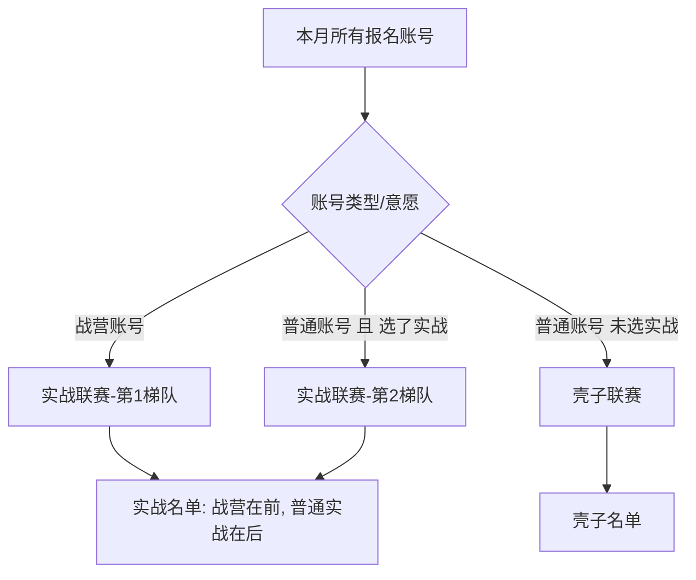
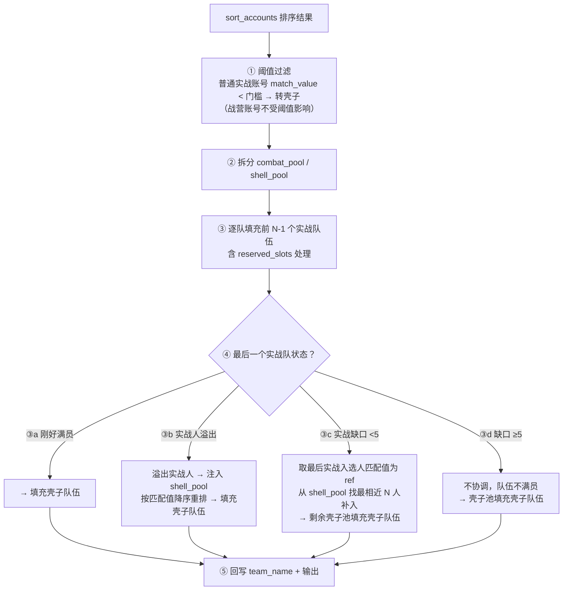
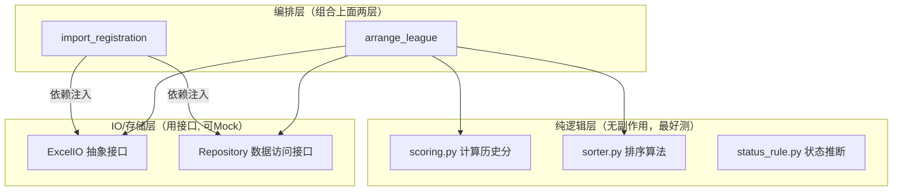
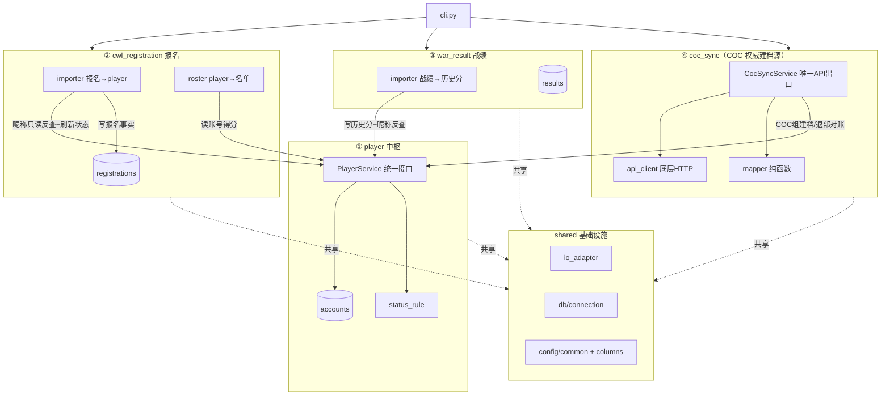
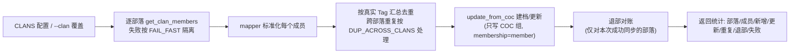

# 联赛报名与名单编排管理系统 — 设计方案

> 版本：v2.8
> 说明：本文档为编码前的完整设计，并已随真实报名表结构落地更新（见 §5.x）。IO 层采用可替换适配器，第一版走本地 xlsx，预留腾讯文档 API 接口；战绩计算做成可插拔的空函数，后续补充公式。
>
> **v2.0 架构升级**：由"技术分层"（core/io_adapter/db）重构为"业务领域分模块"（player 中枢 + cwl_registration + war_result + coc_sync），详见 §十三。原设计中的分层思想（纯函数 / IO 抽象 / 存储抽象 / 依赖注入）在新架构中完整保留，只是按领域重新组织归属。
>
> **v2.1 表结构瘦身**：accounts 只留账号级事实（21→16 列），按月维度字段（`account_type` / `camp_order` / `latest_match_value` / `join_combat`）下沉 registrations，`last_reg_period` 改为读取时派生；旧库经回填 + 重建表迁移，详见 §13.5。
>
> **v2.2 报名解耦（B 方案）**：`registrations` 从"accounts 的子表"升级为**自包含的报名事实源**——自持 `account_name`（报名昵称，主标识）/ `player_name`（主号归属），`player_tag` 降为可空的关联缓存、**去外键**，唯一键 `(player_tag, period)` → `(account_name, period)`。报名导入**不再写 accounts、不再临时建档、不再需要合并**：`accounts` 完全由 COC 权威建档，报名侧只读反查真实 Tag 做缓存。"报名有 / COC 无"的新人照常入 `registrations`、排序得 0 分，主表零污染。由此**退休** `is_provisional` 临时账号建档 / `merge_provisional` 合并 / `unmatched.py` 未匹配钩子 / coc-sync 残留告警等一整套复杂度，详见 §13.6 与 §十四。
>
> **v2.3 队伍分配**：在排序名单基础上新增**自动队伍填充**（`team_filler.py`，纯函数）——按 `TEAMS` 配置将排序后人员逐队分配，支持实战最低匹配值门槛、预留位置、最后一个实战队边界处理（刚好/溢出协调壳子/缺口<5 协调壳子），结果同时回写 `registrations.team_name` 列和在同一 sheet 下半部分输出队伍明细，详见 §5.x.4 步骤 3.5 与 §5.x.8。
>
> **v2.4 升降级**：新增**实战队伍升降级系统**（`promotion.py`，纯函数）——在 `fill_teams()` 后根据 CWL 星数在相邻实战队伍间交换人员（≤18 星逐级下沉，满星 21 逐级上升）。`fetch_cwl_data.py` 合并 COC API 拉取 + results 表导入 + 冷启动回退，按队伍级缓存和容错。详见 `docs/promotion_relegation_design.md`。
>
> **v2.5 period 语义统一**：所有 CLI 接口的 `--period` 统一为**联赛月份**（实际打 CWL 的月份）。`registrations.period` 从报名时间改为联赛时间，与 `arrange --period` 对齐。`fetch_cwl_data.py` 保持传入 CWL 实际发生月（编排 N 月联赛时传 N-1 月）。`arrange()` 不再需要为读 registrations 做 `_prev_period()` 转换，仅在读上月 CWL 星数时使用。
>
> **v2.6 发布简化**：新增 `publish-results` 命令，将 Part4 网格发布到公示文档。前 20 行固定文字直接硬编码（`PUBLISH_FIXED_ROWS`），Part4 数据复用 `arrange()` 结果保证一致性。删除了 ~170 行复杂的模板匹配逻辑（`_get_template_fixed_rows`、`_assemble_publish_content`、`_rebuild_team_results`）。
>
> **v2.7 列结构优化**：`ARRANGEMENT_OUTPUT_HEADERS` 删除 `team_name`（由 `cur_team`/`prev_team` 替代）。Part4 改为独立 5 列写入（不经过 header dict 映射），避免 `cur_team`/`prev_team` 在 Part4 区域产生中间空列。`insert_normal_new` 从二分插入改为追加到实战区末尾（壳子区之前）。`NEW_NORMAL_INSERT_START` 已废弃。Part4 抬头行管理信息放第 5 列。
>
> **v2.8 管理意愿 + 部落信息**：
> - **管理意愿**：报名表新增 `willing_to_manage` 字段（报名表列"是否愿意做联赛管理员"），解析时读取并落库到 `registrations.willing_to_manage`。`REGISTRATION_COLUMN_KEYWORDS` 新增 `willing_to_manage` 映射。
> - **管理员三级分配**：`_assign_managers()` 改造为三级优先级：① `MANAGER_CANDIDATES` 列表顺序匹配（现有逻辑）；② config 未命中时，在队伍成员中找 `willing_to_manage=True` 的第一个；③ 都没有则留空。
> - **Part4 部落信息**：抬头行 5 列全部填充——col1 队伍信息、col2 clan_tag、col3 部落名（COC API 获取）、col4 首领（COC API 从 memberList 找 role=leader）、col5 管理（追加"开战/捐兵给一份额外"）。`_fetch_clan_info()` 批量获取部落信息并缓存，tag 格式校验（恰好一个 #）。
> - `arrange_and_export` 队伍标题行同步增加部落名和 COC 首领信息。

---

## 一、需求背景与业务流程

围绕"月度循环"的数据流转，管理部落联赛的报名、名单编排与战绩跟踪。



### 原始需求清单（10 点）

1. 活动每月报名，一个人可能有多个账号，每个账号含：名字、匹配值、是否参加实战。
2. 联赛按账号来排名单。
3. 每个账号有"匹配值"和"历史战绩"两个关键参数，据此排序。
4. 联赛分两种：实战（要求高，要好好打）、壳子（可随便打）。
5. 账号分两类：战营账号（默认参加实战）、普通账号（报名时选择是否参加实战）。
6. 实战人员排在一起：战营在前、普通实战在后，两类内部再按匹配值+历史战绩排序。
7. 部落人员流动，需要长期跟踪每个账号状态（漏报 / 离开等）。
8. 需要数据库保存每月报名信息。
9. 每月联赛结束后上传战绩，更新账号历史战绩。
10. 每月活动名单输出到在线 Excel。

### 关键决策（已确认）

| 决策点 | 结论 |
|--------|------|
| 在线 Excel 交互 | 目标是腾讯文档 API 自动读写；**但当前无企业资质**，第一版先走本地 xlsx，预留 API 接口层 |
| 账号唯一标识 | 游戏唯一 Tag（如 `#XXXX`）作为主键 `player_tag` |
| 排序组合方式 | 加权综合分：归一化匹配值 × 0.6 + 归一化历史战绩 × 0.4（权重可配） |
| 历史战绩计算 | 多指标折算，先写占位空函数 `compute_history_score()`，公式后续自行补充 |

---

## 二、总体架构（分层，IO 可替换）



IO 层用抽象基类 `ExcelIO`，定义 `read_sheet()` / `write_sheet()`。当前实例化 `LocalXlsxAdapter`；未来新增 `TencentDocAdapter` 并在 `config` 切换开关，业务代码零改动。

- `read_sheet(source, sheet=None, fill_merged=False)`：`fill_merged=True` 时把**合并单元格**的左上值填充到区内所有单元格（真实报名表主信息合并在首行、一次提交多账号跨行时用到）。
- `write_sheet(target, rows, headers=None, sheet=None)`：**追加式**写出——目标文件已存在时在其中**新建一个 sheet**（保留其余 sheet），同名 sheet 覆盖重建；文件不存在则新建工作簿。用于把编排名单单独输出为一个新 sheet，而不破坏源报名表其它页。

---

## 三、数据库设计（SQLite，三张表）

### accounts（账号档案，长期跟踪）

只保留**账号级事实**：**COC 权威组**（由 `coc_sync` 更新）与少量**账号级报名/战绩字段**（`player_name` / `status` / `history_score`，由 `cwl_registration` / `war_result` 更新）。两组经 upsert 的 COALESCE 语义**互不覆盖**（只有本次传入的非 NULL 字段才覆盖旧值）。

> **v2.1 瘦身**：原本挂在 accounts 上的**按月维度**字段（`account_type` / `camp_order` / `latest_match_value` / `join_combat`）已**下沉到 registrations**（一个账号不同月份可不同，落账号级会丢历史、语义错位）；`last_reg_period` 不再落列，**读取账号时由 `registrations` 实时派生**（`MAX(period)`）。旧库升级时会先回填再**重建表物理删除**这些废弃列，详见 §13.5。

| 字段 | 类型 | 组 | 说明 |
|------|------|----|------|
| player_tag | TEXT PK | — | **COC 真实 Tag** `#XXXX`（走 A 后名实相符，见 §五之一） |
| account_name | TEXT | COC | 游戏昵称（COC 为主；报名/战绩按此反查真实 Tag） |
| exp_level | INTEGER | COC | 等级 |
| trophies | INTEGER | COC | 奖杯 |
| league_name | TEXT | COC | 联赛段位 |
| town_hall_level | INTEGER | COC | 大本营等级 |
| clan_tag | TEXT | COC | 当前所在部落（多部落汇总区分来源） |
| clan_role | TEXT | COC | 部落职位 |
| coc_raw | TEXT(JSON) | COC | API 原始成员数据全量快照，后续扩展字段零改表 |
| last_synced_at | TEXT | COC | 最近一次 COC 同步时间 |
| membership_status | TEXT | COC | 联盟部落身份：`member` 在联盟部落 / `left` 已退部（由 coc-sync 退部对账维护，默认 `member`） |
| is_provisional | INTEGER | — | **保留备用**：历史上用于「昵称临时建档」标记。v2.2（B 方案）起报名侧不再建任何临时行，`accounts` 全由 COC 权威建档，故该列恒为 0、无业务读取；schema 保留以兼容旧库与退部对账候选过滤 |
| player_name | TEXT | 报名 | 归属人（= 主号昵称） |
| status | TEXT | 报名 | `active` / `missed` / `maybe_left` / `left`（报名维度） |
| history_score | REAL | 战绩 | 历史战绩综合分（由战绩表回算，独立方法更新） |
| updated_at | TEXT | — | 更新时间 |

> **读取时派生列**：`PlayerRepository` 的 SELECT 统一带一个子查询 `MAX(period)` 输出 `last_reg_period`（最后报名月份），对上层调用方（导出/CLI）表现与原字段一致，但不再占用 accounts 的存储列。**v2.2 起该子查询按 `account_name` 关联 registrations**（报名事实以昵称为主标识、无 FK），而非旧的 `player_tag`。

### registrations（月度报名快照 · v2.2 自包含事实源）

> **v2.2 B 方案**：本表不再是"accounts 的子表"，而是**自成一体的报名事实源**。自持 `account_name`/`player_name`，唯一键改为 `(account_name, period)`，`player_tag` 降为**可空的关联缓存、去外键**（命中真实账号才回填，命中不了留空）。这样"报名有 / COC 无"的新人也能照常落库，不必先在 accounts 建行。

| 字段 | 类型 | 说明 |
|------|------|------|
| id | INTEGER PK | 自增主键 |
| account_name | TEXT NOT NULL | **报名昵称：报名事实主标识**（报名表必有），展示/派生不再依赖 accounts join |
| player_name | TEXT | 主号归属（本表自持，不再从 accounts join） |
| period | TEXT | 联赛月份 `2026-08`（v2.5 起统一为联赛时间，原为报名时间） |
| match_value | REAL | 本月填写匹配值 |
| join_combat | INTEGER | 是否参加实战 (0/1) |
| account_type | TEXT | 本月账号分类 `combat` 战营 / `normal` 普通（v2.1 由 accounts 下沉） |
| camp_order | INTEGER | 本月战营名单顺序，仅战营账号有值（v2.1 由 accounts 下沉） |
| league_type | TEXT | 编排结果（最终类别）：`combat` 实战 / `shell` 壳子 |
| rank_order | INTEGER | 名单内排序位次 |
| player_tag | TEXT | **可空、无 FK**：命中真实账号时缓存其 Tag，作关联缓存供排序取分；未命中留空（v2.2） |
| team_name | TEXT | 分配到哪个队伍（如"实战一队"），NULL=未分配（v2.3） |
| — | — | 唯一约束 `(account_name, period)` 防重复导入（v2.2 由 `(player_tag, period)` 改；player_tag 多为 NULL 不能做唯一键） |

### results（月度战绩，多指标）

| 字段 | 类型 | 说明 |
|------|------|------|
| id | INTEGER PK | 自增主键 |
| player_tag | TEXT FK | 关联账号 |
| period | TEXT | CWL 实际发生月（`fetch_cwl_data` 写入）或战绩所属月（`import-result` 写入） |
| league_type | TEXT | 实战 / 壳子 |
| raw_metrics | TEXT(JSON) | 原始多指标（星星/胜场/贡献…灵活扩展） |

> 用 JSON 存原始指标，后续补充/调整战绩字段时**无需改表结构**，配合可插拔计算函数即可。

---

## 四、账号状态流转（人员流动跟踪）



- 漏报 1 次仍保留在档案。
- 连续 ≥N 个月未报名自动标记 `maybe_left`（N 可配置）。
- 最终是否 `left` 由人工确认。

> **两套独立的"离开"体系，切勿混淆**：
> - `status`（上图，`active`/`missed`/`maybe_left`/`left`）是**报名维度**——由 `status_rule.infer_status` 按报名情况推断，反映"还在不在参加联赛报名"。
> - `membership_status`（`member`/`left`）是**部落成员维度**——由 `coc_sync` 退部对账维护，反映"账号当前是否还在联盟旗下部落里"。
>
> 二者互不干扰：一个账号可能"报名维度 active、但已退出联盟部落"（跳槽到外部部落仍来帮打），也可能"报名维度 maybe_left、但仍在联盟部落内"（长期挂机没报名）。退部对账只改 `membership_status`/`clan_tag`/`clan_role`，绝不触碰 `status` 与 COC 属性/`history_score`。详见 §14.6。

---

## 五、排序编排规则（核心）

**分组规则：**



**综合分计算 = 可插拔开放函数（预留，先给默认实现）：**

综合分的具体算法抽成一个开放函数 `compute_rank_score()`，与排序流程解耦。**当前先按"归一化后加权"给一个简单默认实现**，后续你可深入修改（换算法、加参数）而不影响排序编排逻辑。

默认实现（当前方案）：

```
归一化匹配值 = (匹配值 - 本月最小) / (本月最大 - 本月最小)
综合分 = W_match × 归一化匹配值 + W_history × 归一化历史战绩
（默认 W_match=0.6, W_history=0.4，可在 config 配置；最大=最小时做除零保护）
```

- **实战名单** = 战营账号 ＋ 普通实战账号，战营整体排前。
  - 战营账号**按战营名单顺序 `camp_order` 升序**排列（当前规则）；待补齐历史战绩后，再改为按综合分/历史分排序。（v2.1 起 `camp_order` / `account_type` 存于 registrations 按月行，`roster` 从当月报名行读取。）
  - 普通实战账号按综合分降序。
- **壳子名单** = 普通且未选实战的账号（按综合分降序）。

> `sorter.py` 只负责"分组 + 按综合分降序"，综合分怎么算完全交给 `compute_rank_score()`，两者可独立测试、独立演进。

### 5.x 报名全链路数据流（v2.2 B 方案）

实际拿到的《苍穹联盟联赛报名表》与初版假设不同，做了以下适配。下面按数据流顺序梳理报名全链路。

#### 5.x.1 报名数据流总览

```
报名表（腾讯文档/本地 xlsx）
  │
  ├─ [阶段1 导入] RegistrationImporter.import_from()
  │   ├─ read_sheet(fill_merged=True)     → 原始行（合并填充）
  │   ├─ parse_registration_row() × N     → 关键词映射 + 清洗 → 标准报名 dict
  │   ├─ _fill_player_name_forward()      → 兜底：空主号向前填充
  │   ├─ _dedup_latest()                  → 同昵称取最新提交，告警
  │   ├─ _read_camp()                     → 从 accounts 拉 #2QQ 成员（排除 EXCLUDED_CAMP_NAMES）
  │   ├─ _merge_camp()                    → 战营优先合并（combat + 强制实战）
  │   └─ _save() × N                      → resolve_tag_by_name 反查 → add_registration
  │                                          ↓
  │                                     registrations 表（自包含报名事实）
  │
  ├─ [阶段2 排序] LeagueArranger.arrange()
  │   ├─ _load_accounts(period)           → 读 registrations + 反查 accounts 得分
  │   │   ├─ 过滤 EXCLUDED_CAMP_NAMES     → 排除名单过滤
  │   │   ├─ resolve_tag_by_name()        → 昵称→真实Tag（缓存空时 live 反查）
  │   │   └─ player_service.get(tag)      → 取 trophies + history_score
  │   ├─ sort_accounts(accounts, weights) → 纯函数分组排序
  │   │   ├─ _extents() → 极值
  │   │   ├─ compute_rank_score() × N     → 归一化加权综合分
  │   │   ├─ _is_combat_league() 分组     → combat_camp / combat_normal / shell
  │   │   ├─ camp_sort_key() 排序         → 战营按奖杯降序
  │   │   └─ 全局编号 rank_order
  │   ├─ fill_teams(ordered, TEAMS, threshold) → 纯函数队伍分配
  │   │   ├─ _split_by_threshold()        → 低匹配值普通实战账号 → shell（战营账号豁免）
  │   │   ├─ 逐队填充实战队伍             → 含 reserved_slots 处理
  │   │   ├─ 最后实战队边界处理           → ③a/③b/③c/③d
  │   │   └─ 填充壳子队伍
  │   ├─ apply_promotion_relegation()     → 升降级交换（v2.4 新增）：≤18↓ / 满星21↑
  │   ├─ rebuild_assignment_map()         → 升降级后修复 team_name / cur_team 映射
  │   ├─ update_arrangement() × N         → 回写 league_type / rank_order
  │   └─ update_team_name() × N           → 回写 team_name（升降级后可能变化）
  │
  └─ [阶段3 导出] arrange_and_export()
      ├─ write_sheet(target, rows, sheet)  → 写入 Part1-3（名单_<period>，13 列 header）
      └─ _append_part4_to_sheet()          → 追加 Part4 网格（5 列独立写入，不经过 header 映射）
```

#### 5.x.2 配置体系

报名模块的配置全部集中在 `modules/cwl_registration/config.py`：

| 配置项 | 类型 | 说明 |
|--------|------|------|
| `REGISTRATION_COLUMN_KEYWORDS` | `dict` | 报名表列关键词映射：`player_name`(主号)/`account_name`(游戏昵称)/`match_value`(匹配值)/`join_combat`(想实战)/`willing_to_manage`(愿意做联赛管理员)/`submit_time`(提交时间)。每个字段含 `include`/`exclude` 关键词数组 |
| `SORT_WEIGHTS` | `dict` | 综合分权重：`match_value=0.6` / `history_score=0.4` |
| `CAMP_CLAN_TAG` | `str` | 战营部落标签 `#2QQ` |
| `EXCLUDED_CAMP_NAMES` | `set[str]` | 战营排除名单（双阶段过滤） |
| `REGISTRATION_TAG_SOURCE` | `str` | 账号标识来源，当前 `"account_name"`（昵称反查） |
| `REGISTRATION_DEDUP` | `str` | 去重策略：`"latest_submit"` |
| `JOIN_COMBAT_TRUE_TEXTS` | `set[str]` | "想实战"真值文本集合 |
| `ARRANGEMENT_OUTPUT_HEADERS` | `list[str]` | 名单输出列顺序（`team_name` 已删除，由 `cur_team`/`prev_team` 替代） |
| `TEAM_OUTPUT_HEADERS` | `list[str]` | 队伍明细输出列顺序 |
| `TEAMS` | `list[dict]` | 队伍配置列表（详见 §5.x.8）：每队含 name/member_count/league_level/clan_tag/manager/category/reserved_slots |
| `COMBAT_MIN_MATCH_VALUE` | `float` | 实战最低匹配值门槛（低于此值的 combat 账号强制转壳子） |
| `PROMOTION_RELEGATION_CONFIG` | `dict` | v2.4 新增：升降级参数（count/promotion_min_stars/relegation_max_stars） |

公共常量在 `shared/config/common.py`：
| 常量 | 值 | 说明 |
|------|-----|------|
| `ACCOUNT_TYPE_COMBAT` / `ACCOUNT_TYPE_NORMAL` | `"combat"` / `"normal"` | 账号分类 |
| `LEAGUE_COMBAT` / `LEAGUE_SHELL` | `"combat"` / `"shell"` | 联赛类型 |
| `IO_ADAPTER` | `"tencent"` | 全局 IO 适配器默认值 |
| `DB_PATH` | `"data/league.db"` | 数据库路径 |

#### 5.x.3 阶段 1 详解：报名导入 (`importer.py`)

**1. 读取报名表** → `ExcelIO.read_sheet(source, sheet, fill_merged=True)`
- `fill_merged=True`：腾讯文档/本地 xlsx 的合并单元格左上值向下填充到区内所有单元格（一次提交多个账号时，主号信息合并在首行，账号逐行排列）。

**2. 逐行解析** → `parse_registration_row(raw, colmap)`（纯函数）
- `resolve_columns(headers, REGISTRATION_COLUMN_KEYWORDS)` 按关键词映射列名（`shared/columns.py`）：表头去空白后包含任一 `include` 且不含任何 `exclude` 即命中，命中多个取第一个。解决真实表头带换行/空格且列语义随月份漂移的问题。
- `clean_str()` / `to_float()` 清洗取值。
- `_parse_join_combat()` 把"想实战"文本（是/否/yes/no 等）转为 bool。
- `_parse_willing_to_manage()` 把"是否愿意做联赛管理员"文本转为 bool（复用 `JOIN_COMBAT_TRUE_TEXTS`）。
- 缺少 `account_name`（报名事实主标识）的行返回 None 跳过。
- 产出标准报名 dict：`{account_name, player_name, match_value, join_combat, willing_to_manage, submit_time, account_type: NORMAL, prev_rank: None}`。

**3. 主号前向填充** → `_fill_player_name_forward(parsed)`（兜底逻辑）
- 源表未真·合并单元格（仅视觉留空）时，按物理行顺序把空主号向前填充为最近一个非空主号。对齐"一对多"归属关系。

**4. 去重** → `_dedup_latest(parsed)`
- 同一 `account_name` 多条时，按 `submit_time` 保留最新一条（`REGISTRATION_DEDUP="latest_submit"`），并打印告警到 stderr。

**5. 读战营名单** → `_read_camp()`
- `PlayerService.list_members_by_clan([CAMP_CLAN_TAG])` → `PlayerRepository.list_by_clan_tags(["#2QQ"])` → SQL：`SELECT * FROM accounts WHERE clan_tag = '#2QQ'`。
- 过滤 `EXCLUDED_CAMP_NAMES`：被排除的成员不进入战营集合。
- 部落为空时告警（多半是尚未 `coc-sync`）。

**6. 合并** → `_merge_camp(deduped, camp_names)`
- 报名表中有的人：若昵称在战营集合中，强制 `account_type=combat` + `join_combat=True`。
- 战营成员但本月没报名的：仍纳入（`match_value=None`，`account_type=combat`，`join_combat=True`），确保战营全员实战。
- 战营优先：昵称在报名表和战营同时出现时以战营为准。

**7. 落库** → `_save(acc, period) × N`
- `PlayerService.resolve_tag_by_name(account_name)` 按昵称只读反查 `accounts` 表真实 Tag：命中则缓存到 `registrations.player_tag`；未命中（"报名有/COC 无"的新人）留空，照常落库。
- `RegistrationRepository.add_registration(reg)` → `INSERT ... ON CONFLICT(account_name, period) DO UPDATE`：重复导入覆盖更新 `player_name/match_value/join_combat/account_type/prev_rank`，`player_tag` 用 COALESCE 保留非空缓存。
- 最后 `PlayerService.refresh_status(period, registered_names)` 刷新全体账号报名状态（`active/missed/maybe_left`）。

#### 5.x.4 阶段 2 详解：名单排序 (`roster.py` + `sorter.py` + `rank_score.py`)

**1. 加载报名数据** → `LeagueArranger._load_accounts(period)`
- `RegistrationRepository.get_registrations(period)` 读本月所有报名快照。
- 过滤 `EXCLUDED_CAMP_NAMES`：排除名单上的账号跳过，不参与后续排序。
- 对每条报名：优先用 `registrations.player_tag` 缓存，空则 live 反查 `resolve_tag_by_name`；命中 `accounts` 则取 `trophies` + `history_score`，未命中新人得 0 分。
- 上月排名 `prev_rank`：优先反查上月 `registrations.rank_order`，回退到报名行缓存值。
- 输出排序所需列表：`{reg_id, player_tag, account_name, player_name, account_type, prev_rank, match_value, join_combat, history_score, trophies}`。

**2. 综合分计算** → `rank_score.compute_rank_score()`（纯函数）
- 输入：单个账号 dict + 全体极值 + 权重。
- 算法：`综合分 = 0.6 × 归一化匹配值 + 0.4 × 归一化历史分`，含除零保护。
- 权重在 `SORT_WEIGHTS` 可配置。

**3. 分组排序** → `sorter.sort_accounts()`（纯函数）
- 三组：`combat_camp`（战营，实战第1梯队）→ `combat_normal`（普通实战，第2梯队）→ `shell`（壳子）。
- 战营内部：`camp_sort_key` 按 `trophies` 降序，同杯以综合分降序 tie-break；再经 `adjust_camp_by_prev_rank` 微调（当前恒等，预留接口）。
- 普通实战：按综合分降序。
- 壳子：按综合分降序。
- 全局编号 `rank_order` 从 1 开始。

**4. 队伍填充** → `team_filler.fill_teams()`（纯函数）
- 在排序名单基础上，按 `TEAMS` 配置将人员分配到各队伍。
- 规则（详见 §5.x.8）：
  - **阈值过滤**：`match_value < COMBAT_MIN_MATCH_VALUE` 的普通实战账号强制转为 shell；战营账号（`account_type=combat`）不受阈值影响，始终留在实战池。
  - **按序填充**：逐队从头消费排序池，含 `reserved_slots` 处理（>0 留空位 / <0 多招备选）
  - **最后一个实战队边界**：
    - ③a 刚好满员 → 不做修改
    - ③b 实战人溢出 → 溢出者注入 shell_pool，按匹配值降序重排
    - ③c 实战缺口 <5 → 从 shell_pool 取匹配值与最后实战人最接近的 N 人补入
    - ③d 实战缺口 ≥5 → 不协调，队伍不满员
- 返回 `(含 team_name 的排序名单, 队伍分配结果列表)`，`league_type` 同步更新为最终分类。

**5. 回写** → `Repository` 两步回写
- `update_arrangement(reg_id, league_type, rank_order)` — 编排结果（排序阶段）
- `update_team_name(reg_id, team_name)` — 队伍分配结果（填充阶段）

**6. 导出** → `arrange_and_export(period, target, sheet)`
- 调用 `arrange()` → `write_sheet()` 写入 Part1-3（缺省名 `名单_<period>`）。
- 同一 sheet 包含四部分：上半部分排序名单（含 `cur_team`/`prev_team` 列），队伍分组展示分配明细，缺席老兵列表，以及 Part4 网格排布（5 列独立写入）。
- Part4 通过 `_append_part4_to_sheet()` 追加，不经过 header dict 映射，避免中间空列。

#### 5.x.5 数据库表结构（报名视角）

**accounts**（COC 权威建档，报名只读）：

| 字段 | 类型 | 说明 |
|------|------|------|
| `player_tag` | TEXT PK | COC 真实 Tag |
| `account_name` | TEXT | 游戏昵称（报名按此反查） |
| `trophies` | INTEGER | 奖杯（战营排序键） |
| `history_score` | REAL | 历史战绩综合分 |
| `clan_tag` | TEXT | 当前所在部落 |
| `status` | TEXT | 报名维度状态（由 registrations 派生） |
| ... | | 其他 COC 属性（exp_level/league_name 等） |

**registrations**（自包含报名事实源，B 方案）：

| 字段 | 类型 | 约束 | 说明 |
|------|------|------|------|
| `id` | INTEGER PK | 自增 | 行 ID |
| `account_name` | TEXT NOT NULL | UNIQUE(account_name, period) | 报名昵称，报名事实主标识 |
| `player_name` | TEXT | | 主号归属（自持） |
| `period` | TEXT | UNIQUE | 月份 `YYYY-MM` |
| `match_value` | REAL | | 本月匹配值 |
| `join_combat` | INTEGER | | 是否实战 (0/1) |
| `account_type` | TEXT | | 本月分类：combat/normal |
| `prev_rank` | INTEGER | | 上月排名 |
| `willing_to_manage` | INTEGER | | 是否愿意做联赛管理员 (0/1)（v2.8） |
| `league_type` | TEXT | | 编排结果（最终类别）：combat/shell |
| `rank_order` | INTEGER | | 名单位次 |
| `player_tag` | TEXT | 可空，无 FK | 真实 Tag 关联缓存 |
| `team_name` | TEXT | 可空 | 分配到哪个队伍（如"实战一队"），NULL=未分配（v2.3） |

#### 5.x.6 关键设计决策

1. **关键词列映射**：真实表头带换行/空格且列位漂移，不用精确等值而用包含/排除关键词匹配。`shared/columns.py` 的 `resolve_columns()` 为报名和战绩两侧共用。

2. **报名与 accounts 解耦（B 方案）**：`registrations` 自持 `account_name`/`player_name`，`player_tag` 降为可空缓存、去外键。报名导入只读 `accounts`、绝不建行。"报名有/COC 无"的新人照常落库，排序得 0 分。

3. **战营名单来源**：不再从报名表的"战营名单"sheet 读取，改为从 `accounts` 表按 `CAMP_CLAN_TAG` 拉取当前成员（导入前应先 `coc-sync` 该部落刷新成员与奖杯）。

4. **排除名单双阶段过滤**：`EXCLUDED_CAMP_NAMES` 在导入阶段阻止进入战营集合 + 排序阶段统一过滤残留记录，确保不入库也不出现在名单。

5. **昵称→真实Tag 反查**：`resolve_tag_by_name` 按昵称查 `accounts` 表，命中多个取首个并告警。报名导入和排序阶段各反查一次（导入写缓存，排序做兜底）。

6. **状态推断**：`PlayerService.refresh_status()` 按"本月是否报名"遍历全体真实账号推断状态，状态规则在 `player/status_rule.py`（纯函数）。

#### 5.x.7 数据流向总图

```
accounts (COC权威)                    registrations (报名自包含)
┌──────────────────┐                 ┌──────────────────────────┐
│ player_tag (PK)  │                 │ account_name (主标识)     │
│ account_name     │←─ 反查 ────────│ player_name (自持)        │
│ trophies         │                 │ period                    │
│ history_score    │                 │ match_value               │
│ clan_tag         │─→ 战营成员 ──→│ account_type              │
│ status           │←─ 状态刷新 ───│ league_type / rank_order  │
└──────────────────┘                 │ player_tag (缓存, 可空)   │
                                     │ team_name (队伍分配)      │
                                     └──────────────────────────┘

导入阶段：报名表 → parse → dedup → merge camp → resolve_tag → registrations
编排阶段：registrations → load(过滤排除名单) → sort → fill_teams → update(league_type/rank_order/team_name) → export(排序名单+队伍明细)
状态刷新：registrations 本月报名集合 → infer_status → accounts.status
```

#### 5.x.8 队伍分配详解（v2.3）

在排序 4~6 步（§5.x.4）中，`fill_teams()` 是新增的纯函数核心算法。下面是完整规则：

**队伍配置结构（`TEAMS`）**：

```python
{
    "name": "实战一队",          # 队伍名称
    "clan_tag": "#XXXXX",        # 部落标签
    "leader": "",                # 领队（默认空）
    "member_count": 15,          # 标准人数（15 或 30）
    "league_level": "",          # 联赛等级（默认空）
    "manager": "xxx",            # 管理员
    "category": "combat",        # combat=实战 / shell=壳子
    "reserved_slots": 0,         # >0 留空位 / 0 不预留 / <0 多招备选
}
```

**分配流程**：



> **阈值过滤例外**：战营账号（`account_type=combat`）不受 `COMBAT_MIN_MATCH_VALUE` 影响，始终留在实战池中——即使 `match_value` 为空（未报名自动纳入）或低于门槛也不会被转壳子。这样保证战营成员优先进入实战队伍，不会因未报名而无队可归。

**预留位置（`reserved_slots`）语义**：

| reserved_slots | 实际容量 | 说明 |
|----------------|---------|------|
| `0` | `member_count` | 标准人数，不预留 |
| `>0`（如 2） | `member_count - 2` | 留空位给后续手动安排 |
| `<0`（如 -2） | `member_count + 2` | 多招备选，超出标准人数 |

**协调匹配值相近成员（③c）**：

当最后一个实战队缺口 <5 时，取最后一个实战入选者的 `match_value` 作为参考值，从壳子池中选取差值绝对值最小的 N 人补入（`_pick_closest_by_match_value`），补入者 `league_type` 更新为 combat。

**输出格式**：

- `fill_teams()` 返回 `(ordered_with_team, team_results)`
- `ordered_with_team`：原排序名单每项追加 `team_name` 字段，`league_type` 同步为最终分类
- `team_results`：`[{team_name, category, member_count, filled_count, reserved_empty, members: [...]}, ...]`

**管理员分配（v2.8 三级优先级）**：

`_assign_managers()` 在队伍填充完成后，按三级优先级为每个队伍匹配管理员：

1. **config 优先**：按 `MANAGER_CANDIDATES` 列表顺序逐个匹配队伍成员（按 account_name 精确匹配），命中后从候选池移除，后续队伍不再匹配。
2. **报名意愿兜底**：config 未命中时，在队伍成员中找 `willing_to_manage=True` 的第一个作为管理员。
3. **留空**：以上两级均未命中则留空。

**Part4 部落信息展示（v2.8）**：

`_fetch_clan_info()` 通过 COC API `/clans/{tag}` 批量获取部落名称和首领（从 memberList 找 role=leader），带缓存避免重复请求。Part4 抬头行 5 列：col1 队伍信息、col2 clan_tag、col3 部落名、col4 首领、col5 管理（追加"开战/捐兵给一份额外"）。
- 同一 sheet 导出时上半部分为排序名单，下半部分按队伍分组展示明细

---

## 六、可插拔的开放函数（预留）

系统预留**两个**开放函数，均与主流程解耦，可独立修改、独立测试：

### 6.1 历史战绩计算（占位空函数，待你补充公式）

```python
def compute_history_score(history_results: list[dict], config: dict) -> float:
    """
    根据一个账号的历史战绩记录，计算其历史战绩综合分。
    history_results: [{'period':'2026-06','league_type':'combat','raw_metrics':{...}}, ...]
    返回: 一个可用于排序的浮点分数。

    TODO(由你补充): 定义指标权重、最近N月加权/累计平均、新账号默认分、
                   实战与壳子是否分开计入 等规则。
    """
    return 0.0  # 占位，待补充
```

### 6.2 综合排序分计算（已给默认实现，可后续深入修改）

```python
def compute_rank_score(
    account: dict,
    match_min: float,
    match_max: float,
    hist_min: float,
    hist_max: float,
    weights: dict = SORT_WEIGHTS,
) -> float:
    """
    计算单个账号用于名单排序的综合分。
    account: {'match_value':.., 'history_score':.., ...}
    match_min/max, hist_min/max: 本月全体账号的极值，用于归一化。
    weights: {'match_value':0.6, 'history_score':0.4}

    当前默认实现: 归一化匹配值与历史战绩后加权求和（含除零保护）。
    后续可自行替换为更复杂的算法（例如非线性、分段、引入更多因子）。
    """
    def _norm(v, lo, hi):
        return 0.0 if hi <= lo else (v - lo) / (hi - lo)

    nm = _norm(account["match_value"], match_min, match_max)
    nh = _norm(account["history_score"], hist_min, hist_max)
    return weights["match_value"] * nm + weights["history_score"] * nh
```

排序权重放 config，便于调参：

```python
SORT_WEIGHTS = {"match_value": 0.6, "history_score": 0.4}
```

> `sorter.py` 中排序时调用 `compute_rank_score()` 得到分值后再分组降序排列；替换算法时只改这个函数，排序与编排逻辑不动。

---

## 七、可测试性设计



三条设计约束：

1. **业务算法抽成纯函数**（输入→输出，无 IO、无全局状态）：`sort_accounts()`、`compute_rank_score()`、`compute_history_score()`、`infer_status()`，测试时给定输入断言输出，无需 mock。
2. **IO 和数据库走接口 + 依赖注入**：编排层不直接 `import openpyxl` / `sqlite3`，构造时传入 `ExcelIO` 与 `Repository`。测试注入内存实现 `InMemoryRepository`、`FakeExcelIO`。
3. **数据库测试用 `sqlite3` 内存库**（`:memory:`），每个用例独立建表、销毁。

### 模块与测试方式对照

| 模块 | 职责 | 依赖 | 测试方式 |
|------|------|------|---------|
| `cwl_registration/rank_score.py` | `compute_rank_score`(默认实现，纯函数) | 无 | 纯输入输出断言 |
| `cwl_registration/sorter.py` | 分组 + 按综合分降序（纯函数，调用 rank_score） | 无 | 纯输入输出断言 |
| `cwl_registration/team_filler.py` | 队伍分配（纯函数，v2.3 新增） | 无 | 纯输入输出断言 |
| `war_result/history_score.py` | `compute_history_score`(占位，纯函数) | 无 | 纯输入输出断言 |
| `player/status_rule.py` | 账号状态推断（纯函数） | 无 | 纯输入输出断言 |
| `shared/io_adapter/base.py` | ExcelIO 抽象接口 | 无 | 契约测试 |
| `shared/io_adapter/local_xlsx.py` | 本地 xlsx 读写 | openpyxl | 临时文件往返测试 |
| `shared/db/connection.py` + `*/repository.py` | 连接管理 + 三表数据访问 | sqlite3 | `:memory:` 内存库 |
| `player/service.py` | PlayerService：账号读写统一接口 | 注入 Repo | 内存库集成 |
| `cwl_registration/importer.py` | 编排：导入报名 | 注入 PlayerService+Repo+IO | 注入 Fake IO |
| `cwl_registration/roster.py` | 编排：生成名单+队伍分配（含排除名单过滤） | 注入 PlayerService+Repo+IO | 注入 Fake IO |
| `war_result/importer.py` | 编排：导入战绩 | 注入 PlayerService+Repo+IO | 注入 Fake IO |

### 测试用例覆盖场景

- **test_scoring**：
  - `compute_rank_score`：归一化正确；最大=最小时除零保护返回 0；权重调整生效；只有匹配值/只有历史分的边界。
  - `compute_history_score`：占位函数当前返回默认分（补全公式后再扩展用例）。
- **test_sorter**：战营排普通前面；组内按综合分降序；匹配值全相同退回历史分；空名单；单账号。
- **test_team_filler**（v2.3 新增，36 个用例）：基本填队、阈值转壳、预留位置正/负/零、③a 刚好/③b 溢出/③c 缺口<5 协调/③d 缺口≥5 不协调、空名单、空队伍、容量不足、仅实战/仅壳子、rank_order 保持等纯函数场景。
- **test_status_rule**：本月报名→active；漏报 1 月→missed；连续 ≥N 月→maybe_left；漏报后又报名→回 active。
- **test_repository**：插入/查询账号；`(tag, period)` 唯一约束防重复导入；更新历史分。
- **test_local_xlsx**：写入再读回一致（round-trip）；列名映射正确；缺列报明确错误。
- **集成测试**：Fake 依赖跑完整"导入报名→生成名单+队伍分配"，断言输出顺序、分组、队伍分配正确。

---

## 八、项目文件结构（v2.0 领域模块）

```
sky-admin/
├── cli.py                              # 命令行入口（按模块装配依赖）
├── shared/                             # 基础设施（跨模块共享）
│   ├── config/common.py                # 公共常量：账号类型/状态/联赛类型 + IO开关 + DB路径
│   ├── columns.py                      # 表头关键词解析 + 取值工具（报名/战绩共用）
│   ├── io_adapter/
│   │   ├── base.py                     # ExcelIO 抽象接口
│   │   ├── local_xlsx.py               # ✅ 本地 xlsx 实现
│   │   └── tencent_doc.py              # 🔒 腾讯文档（预留）
│   └── db/connection.py                # 单一 SQLite 连接 + 建表 + 迁移（含 results 唯一约束）
├── modules/
│   ├── player/                         # ① 玩家中枢（数据中枢）
│   │   ├── service.py                  # PlayerService：账号读写的唯一对外接口
│   │   ├── repository.py               # accounts 表数据访问
│   │   ├── status_rule.py              # 状态推断（纯函数，内聚于此）
│   │   └── config.py                   # MAYBE_LEFT_MONTHS
│   ├── cwl_registration/               # ② CWL 报名
│   │   ├── importer.py                 # 功能①：报名结果 → registrations（自包含事实；昵称→真实Tag 只读反查缓存）
│   │   ├── roster.py                   # 功能②：报名快照 + 账号得分 → 联赛名单（含 EXCLUDED_CAMP_NAMES 过滤 + 队伍分配）
│   │   ├── sorter.py                   # 分组排序纯函数
│   │   ├── team_filler.py              # 队伍填充纯函数（v2.3 新增）
│   │   ├── promotion.py               # 升降级纯函数（v2.4 新增）
│   │   ├── rank_score.py               # 名单排序综合分（纯函数）
│   │   ├── repository.py               # registrations 表数据访问（自持列 + last_period_of + update_team_name）
│   │   └── config.py                   # 列关键词/战营/权重/输出列
│   ├── war_result/                     # ③ 战绩
│   │   ├── importer.py                 # 战绩导入 Excel → player 历史分（昵称→真实Tag 反查）
│   │   ├── history_score.py            # 历史分算法（纯函数，占位）
│   │   ├── repository.py               # results 表数据访问（upsert）
│   │   ├── api_client.py               # 🔒 COC 战绩 API（预留）
│   │   └── config.py                   # 战绩列关键词 + tag 来源
│   └── coc_sync/                       # ④ COC 同步
│       ├── api_client.py               # 🔒 COC API 客户端（token/SSRF/超时，仅本模块内部调用）
│       ├── mapper.py                   # 纯函数：COC 原始 dict → player COC 组字段
│       ├── config.py                   # 部落清单 CLANS + 去重/失败策略
│       └── service.py                  # CocSyncService：唯一 API 编排出口（多部落汇总/退部对账）
├── tests/                              # 按模块归类
│   ├── conftest.py                     # fixtures：内存 Database + 各模块 repo/service
│   ├── fakes.py                        # FakeExcelIO / FakeCocApiClient + seed 助手
│   ├── shared/    (test_local_xlsx / test_repositories)
│   ├── player/    (test_status_rule / test_service)
│   ├── cwl_registration/ (test_rank_score / test_sorter / test_team_filler / test_promotion / test_importer / test_roster)
│   ├── war_result/       (test_history_score / test_importer)
│   └── coc_sync/         (test_mapper / test_service)
├── scripts/                            # 运维脚本
│   ├── load_env.sh                     # 公共环境变量加载器（从 .env 安全解析，防注入）
│   ├── register_and_arrange.sh         # 报名一体化入口：导入报名 → 生成名单（详见 §十五）
│   ├── sync_and_export.sh              # 长期维护入口：COC 同步 → 导出玩家档案（详见 §十五）
│   ├── fetch_cwl_data.py               # v2.4 新增：拉取+导入DB+回退（合并 fetch+cold_start）
│   ├── fetch_cwl_data.sh               # v2.4 新增：仅拉 JSON 的便捷包装
│   ├── probe_cwl_data.py               # v2.4 新增：COC API 端点探测
│   ├── dump_clans_to_xlsx.py           # 工具：导出 COC 部落数据到本地 xlsx（调试用）
│   ├── dump_clans_to_xlsx.sh           # 工具：同上（带 .env 加载的 shell 包装）
│   ├── probe_coc_clan.py               # 工具：探测 COC 部落成员（调试用）
│   └── probe_coc_clan.sh               # 工具：同上（带 .env 加载的 shell 包装）
├── pytest.ini
├── requirements.txt                    # pandas, openpyxl
├── requirements-dev.txt                # pytest, pytest-cov
├── .env.example                        # 环境变量模板（COC / 腾讯文档凭证 + 文档 ID）
└── data/league.db                      # SQLite 数据库文件

---

## 九、使用流程（每月循环）

### 时间语义

| 接口 | period 含义 | 示例 |
|------|------------|------|
| `import-reg` | 联赛月份（报名表为该月联赛报名） | `--period 2026-08` |
| `import-result` | 联赛月份（战绩所属月） | `--period 2026-08` |
| `fetch_cwl_data.py` | CWL 实际发生月（拉哪月传哪月） | `--period 2026-07` |
| `arrange` | 联赛月份（安排哪月联赛） | `--period 2026-08` |
| `register_and_arrange.sh` | 联赛月份（一站式入口） | `2026-08` |

> `registrations.period` = 联赛月份，`results.period` = CWL/战绩实际发生月。
> 编排 N 月联赛时：读 `registrations(N)` + `results(N-1)`（上月 CWL 星数）。

### 每月流程（以 8 月联赛为例）

```bash
# 一站式（推荐）
scripts/register_and_arrange.sh 2026-08

# 或分步执行：
# 1) 拉上月 CWL 战绩 → results 表（CWL 月 = 联赛-1）
python scripts/fetch_cwl_data.py --period 2026-07

# 2) 导入报名表（联赛月份）
python cli.py import-reg 报名表.xlsx --period 2026-08

# 3) 编排名单（联赛月份）
python cli.py arrange --period 2026-08 -o 2026-08名单.xlsx
```

---

## 十、技术选型

- **Python 3.10+**
- **pandas + openpyxl**：读写 Excel
- **SQLite**（内置 `sqlite3`）：本地数据库，零配置、单文件、便于备份
- **pytest + pytest-cov**：单元测试与覆盖率

---

## 十一、腾讯文档 API 接入说明（已落地 · B 方案调试 token）

- 实现：`shared/io_adapter/tencent_doc.py`，OpenAPI v3；核心接口 `get_range`（读）、`batchupdate`（写）、`get_sheet`（元数据）。
- **授权现状**：当前用**调试 access_token**，凭证仅从环境变量读取
  （`TENCENT_DOC_ACCESS_TOKEN` / `TENCENT_DOC_CLIENT_ID` / `TENCENT_DOC_OPEN_ID`）。
- ⚠️ **需 30 天手动更新一次 token**：因当前无 `client_secret` / `refresh_token`，
  **不做自动刷新**；`access_token` 约 30 天过期，到期回开放平台复制新 token 重新 export。
- **安全**：所有凭证仅放环境变量，绝不入库、不提交仓库。
- **接入方式**：仅新增 `io_adapter/tencent_doc.py` 实现 `ExcelIO`，业务层零改动。

---

## 十二、安全注意事项

- 所有 SQL 使用参数绑定，防注入。
- 密钥（腾讯文档 Client Secret 等）只从环境变量读取。
- 战绩 / 报名 Excel 导入时做列校验与类型校验，缺列报明确错误。
- 不请求内部网络地址（仅访问腾讯文档 / COC 官方 API 域名）。
- COC API（war_result / coc_sync 预留）：`COC_API_TOKEN` 仅从环境变量读取；客户端硬编码只允许 `api.clashofclans.com`，拒绝一切内网地址（127./10./172.16-31./192.168. 及 9./10./11./21./30.*）；tag 参数 URL 编码。

---

## 十三、v2.0 领域模块架构（重构说明）

### 13.1 从"技术分层"到"业务领域分模块"

v1.x 按技术切层（`core` / `io_adapter` / `db`），三个编排器共用一个大 `Repository`（一张接口管三表）。v2.0 改为按业务领域纵向切模块，**player 为数据中枢**，其他模块都"更新到 player"。



**核心原则**：`PlayerService` 是账号数据读写的**唯一入口**，其他模块不直接碰 `accounts` 表；player 处于底层被依赖，但不反向依赖任何业务模块（无循环依赖）。

### 13.2 领域逻辑归属

| 逻辑 | 归属模块 | 理由 |
|------|---------|------|
| `infer_status` 状态推断 | player | 账号状态是 player 固有属性 |
| `compute_rank_score` 名单排序分 | cwl_registration | 服务于"生成名单" |
| `compute_history_score` 历史分 | war_result | 消费 results，产出 player.history_score |

### 13.3 数据访问拆分

原大 `Repository` 拆为三个各管一表的 Repository（`PlayerRepository` / `RegistrationRepository` / `ResultRepository`），共享 `shared/db/connection.py` 的**同一个 SQLite 连接**，外键约束照常生效。

### 13.4 顺带修复的历史隐患（CODE_REVIEW #1~#3、#8、#9）

| 隐患 | 修复 | 落点 |
|------|------|------|
| #1 results 无唯一约束、重复导入累积 | 加 `UNIQUE(player_tag, period, league_type)`，`add_result` 改 upsert | `shared/db/connection.py` + `war_result/repository.py` |
| #2 未知账号导入触发外键硬失败 | 导入前 `PlayerService.get` 校验，不存在则跳过 + stderr 告警 | `war_result/importer.py` |
| #3 战绩 tag 体系与报名不一致 | 战绩表改**关键词映射** + tag 同用"游戏昵称"来源，与报名对齐 | `war_result/config.py` + `importer.py` |
| #8 孤立报名记录静默降级 | v2.1 曾在 roster join 不到账号时打印告警；**v2.2 起该告警撤销**——报名与 accounts 解耦后，"报名有 / COC 无"是常态，未命中账号取 0 分属正常语义，不再视为异常 | `cwl_registration/roster.py` |
| #9 战绩导入零测试 | 新增 `tests/war_result/test_importer.py` 集成测试 | tests |

> **账号身份已切换为「走 A：COC 真实 Tag 主键」**（原过渡方案"游戏昵称当 tag"已废弃）。COC 同步为权威建档源，报名/战绩按昵称反查真实 Tag 做增量更新，字段分组互不覆盖。详见 §十四 COC 同步。

### 13.5 accounts 瘦身与旧库迁移（v2.1）

把 accounts 从 21 列瘦身到 16 列，只留"账号级事实"，按月维度字段下沉子表 / 派生：

| 原字段 | 处置 | 去向 |
|--------|------|------|
| `latest_match_value` | 删 | registrations 已有 `match_value` |
| `join_combat` | 删 | registrations 已有 `join_combat` |
| `account_type` | 下沉 | registrations 新增列（本月分类） |
| `camp_order` | 下沉 | registrations 新增列（本月战营顺序） |
| `last_reg_period` | 改派生 | 读取时 `MAX(period)` 实时算，不落列 |
| `status` / `history_score` | **保留** | 仍是账号级（`history_score` 待评分公式补齐后再议派生） |

**迁移策略（`shared/db/connection.py :: _migrate` / `_rebuild_accounts`）**——幂等，新库为无害空操作：

1. registrations 缺 `account_type` / `camp_order` 时 `ALTER TABLE ADD COLUMN` 补上；
2. 把旧 `accounts.account_type` / `camp_order` **回填**到该账号的报名行（仅当报名行为空，`COALESCE`）；
3. accounts 仍含废弃列时**重建表物理删净**：`legacy_alter_table=ON` + `foreign_keys=OFF` 下「建新表 → 拷存量 → DROP 旧表 → 改名」，子表 FK 按名引用 accounts，改名后自然复位（SQLite 老版本无 `DROP COLUMN`，且需彻底删净，故走重建）。

> 影响面：`player/repository.py`（`_UPSERT_COLS` 瘦身、SELECT 统一走带派生列的 `_SELECT_ACCOUNT`）、`player/service.py`（账号级字段写入）、`cwl_registration`（`add_registration` 加两列，`importer` 传列，`roster` 从子表读）、`player/config.py` + `cli.py`（导出列/展示去掉已下沉列）。

### 13.6 报名与 accounts 解耦 · B 方案（v2.2）

v2.1 之前，报名导入必须先在 `accounts` 建行（`registrations` 挂 `player_tag` 外键）。对"报名有、COC 无"的新人，只能**临时建档**（`is_provisional=1`，tag 暂用昵称），待 `coc-sync` 命中同名再**合并**到真实 Tag——这套逻辑牵出临时账号、合并子表 FK、改名断链残留告警等一连串复杂度。

v2.2 把 `registrations` 升级为**自包含事实源**，从根上消除该复杂度：

| 维度 | v2.1（旧） | v2.2（B 方案） |
|------|-----------|----------------|
| registrations 定位 | accounts 的子表 | 自成一体的报名事实源 |
| 报名主标识 | `player_tag`（外键） | `account_name`（自持，无 FK） |
| 唯一键 | `(player_tag, period)` | `(account_name, period)` |
| `player_tag` 语义 | 必填外键 | 可空的关联缓存（命中真实账号才回填） |
| `player_name` 来源 | 从 accounts join | registrations 自持 |
| 报名有 / COC 无 | 临时建档 + 后续合并 | 照常落库、tag 留空、排序得 0 分 |
| accounts 由谁写 | coc_sync + 报名 + 战绩 | **仅 coc_sync + 战绩**（报名只读） |

**退休的部件**（不再有任何调用方）：

- `modules/cwl_registration/unmatched.py`（未匹配钩子）—— 整个文件删除；
- `PlayerService.upsert_from_registration` / `create_provisional_account` / `merge_provisional_account` / `find_provisional_tags_by_name` / `list_provisional_accounts`；
- `PlayerRepository.merge_provisional` / `list_provisional`；
- `CocSyncService` 的临时账号合并循环与残留告警（`_warn_residual_provisional`），`stats` 去掉 `merged` / `provisional_residual`；`cli.py` 同步移除"合并临时账号"输出。

**迁移**（`_rebuild_registrations`，幂等）：旧库 `registrations` 缺 `account_name` 列即视为旧形态，重建为自包含表——用旧 `player_tag`（过渡期=昵称）回填 `account_name`、从 `accounts` 按旧 `player_tag` join 回填 `player_name`、旧 `player_tag` 保留作关联缓存；须在 `foreign_keys=OFF` + `legacy_alter_table=ON` 下执行。**新库由 `_SCHEMA` 直接建全，本迁移为无害空操作**（内存测试库走此路径）。

> `is_provisional` 列**保留备用**（兼容旧库、退部对账候选过滤仍读它），但报名侧不再产生任何临时行，该列恒为 0。

---

## 十四、COC 同步（coc_sync）

### 14.1 目标与原则

- **唯一 API 出口**：所有 COC API 调用统一经 `CocSyncService` 封装；`api_client.py` 降为纯底层 HTTP，仅本模块内部使用，其它模块/脚本（含探测脚本）不直接引用 `CocApiClient`。
- **COC 为权威建档源**：`coc-sync` 以真实 Tag 建档，报名/战绩在其上增量更新。
- **可扩展**：常用字段提列 + `coc_raw` 全量 JSON 快照双轨，后续加字段绝大多数零改表。

### 14.2 分层

| 文件 | 职责 |
|------|------|
| `api_client.py` | 底层 HTTP（token env-only / SSRF 白名单 / tag URL 编码 / 超时），仅内部调用 |
| `mapper.py` | 纯函数：COC 原始成员 dict → player 档案 COC 组字段（含 `coc_raw` JSON）；可离线单测 |
| `config.py` | `CLANS`（结构化：tag/name/enabled）+ `DUP_ACROSS_CLANS` + `FAIL_FAST` + `alliance_clan_tags()`（联盟全部落 tag，退部对账判定用） |
| `service.py` | `CocSyncService`：多部落遍历、失败隔离、按真实 Tag 汇总去重、写库、**退部对账**（v2.2 起不再做临时账号合并/残留告警） |

### 14.3 多部落汇总流程



> **v2.2（B 方案）**：报名导入不再产生"昵称临时账号"，故本流程**移除**了原先的"命中同名临时账号 → 合并"与"残留临时账号告警"两个环节——`accounts` 完全由 COC 权威建档，报名侧与其解耦。

### 14.4 两类差集（v2.2 报名解耦后）

- **COC 有、报名无**：正常（本月未报名），无需处理。
- **报名有、COC 无**：报名事实照常写入 `registrations`（自持 `account_name`），`player_tag` 留空；排序阶段该账号取 0 分（新人本无战绩）。**不再临时建档、不再需要合并**。等这个人被后续 `coc-sync` 建档进 `accounts` 后，下次排序按昵称即可命中真实得分——整个过程零合并、零告警。

> **为什么能砍掉合并**：v2.1 因 `registrations` 挂 `accounts` 外键，报名必须先有账号行，才被迫为新人临时建档、再靠 coc-sync 命中同名合并；改名断链还要残留告警兜底。v2.2 让 `registrations` 自包含（`account_name` 主标识、`player_tag` 可空缓存），报名根本不碰 `accounts`，这一整套复杂度（临时账号 / 合并子表 FK / 残留告警）随之消失。详见 §13.6。

### 14.5 CLI

- `python cli.py coc-sync [--clan '#xxx' ...]`：不传读 `config.CLANS`（仅 enabled），`--clan` 可多次指定以覆盖配置。
- `python cli.py reset-db [-y]`：清空并重建三表（历史数据清零，带二次确认）。

### 14.6 退部对账（成员流动跟踪）

coc-sync 默认是"只增量、只写当前在部落的人"，退出部落的账号 COC 不再返回，若不处理其 `clan_tag`/`clan_role` 会停留旧值成为脏数据。为此在每轮同步后追加**退部对账**（`CocSyncService._reconcile_left_members`）：

```mermaid
flowchart TD
    A["本轮成功同步的部落集合<br/>(抓取失败的不参与, 避免误伤)"] --> B["候选 = 上次 clan_tag 属于这些部落<br/>但本轮成员列表里消失的真实账号"]
    B --> C{"对每个候选调<br/>get_player 查当前部落"}
    C -->|查询失败/限流| S["本轮跳过, 不改判定<br/>下次同步再对账"]
    C -->|新部落仍属联盟<br/>(含 enabled=False/本轮未同步)| M["relocate_within_alliance<br/>只更新归属, 保持 member"]
    C -->|新部落是联盟外 / 已无部落| L["mark_left_alliance<br/>membership_status=left<br/>记录新部落 tag"]
```

- **联盟判定**：由 `config.alliance_clan_tags()` 给出联盟全部落 tag（含 `enabled=False`）。`enabled=False` 只表示本次不主动同步该部落，并不代表它脱离联盟，故转入这类部落的成员**不判退部**。
- **只对本次成功同步的部落对账**：某部落抓取失败时，其成员本轮不出现在成员列表，但**不能**据此判退部——`synced_clan_tags` 只收成功抓取的部落。
- **专用显式 UPDATE**：`repository.set_clan_membership` 与 upsert 的 COALESCE 语义不同，是显式 SET，允许把 `clan_tag`/`clan_role` 置 NULL（玩家已无部落）；仅动 `clan_tag`/`clan_role`/`membership_status` 三列，不碰 COC 属性、报名/战绩组与 `history_score`。
- **候选来源**：`repository.list_by_clan_tags` 只查 `is_provisional=0` 的账号（该过滤条件保留；v2.2 后已无临时账号产生，实际等价于全部真实账号）。
- **回归自愈**：玩家若回到联盟部落，下次同步会重新出现在成员列表，`update_from_coc` 会把 `membership_status` 写回 `member`。
- CLI 输出新增"退部 N"统计（`stats["left"]`）。

### 14.7 大本等级（town_hall_level）—— 已预留接口，暂未实现

`/clans/{tag}/members` 成员对象**不返回 `townHallLevel`**（只有 tag/name/role/expLevel/league/trophies/donations 等），故 `mapper` 映射的 `town_hall_level` 通常为 `None`。大本、英雄等级需对每个成员再调一次 `/players/{tag}`（N 成员 = N 次额外请求，注意 API 频率）。

- 底层接口 `api_client.get_player(player_tag)` **已存在**（退部对账已实际用它查新部落）。
- 补齐方案：在 `sync_clans` 里对每个成员调 `get_player` enrich 后再写库；当前仅在 `mapper` 加注释说明字段暂空，逻辑保持原样，待需要时接入。

---

## 十五、运维脚本体系

项目提供两组运维脚本，覆盖"每月开赛报名编排"和"长期数据维护"两个场景。所有脚本共享 `scripts/load_env.sh` 作为公共环境变量加载器。

### 15.1 公共环境变量加载器 `load_env.sh`

被其它脚本 `source` 引用，从项目根 `.env` 安全读取凭证：

- **安全解析**：逐行读取 `KEY=VALUE`，跳过空行与注释；不使用 `source .env`（防止 .env 内命令被执行）。
- **环境变量优先**：当前环境已显式 export 的同名变量优先，不被 .env 覆盖（便于临时覆写）。
- **Key 合法性校验**：仅允许 `[A-Za-z_][A-Za-z0-9_]*` 格式的变量名。
- **兼容 CRLF**：自动去除行尾 `\r`，兼容 Windows 编辑的 .env 文件。
- 加载失败（.env 不存在）时直接报错退出。

### 15.2 报名一体化入口 `register_and_arrange.sh`

**场景**：每月开赛前跑一次，串联"报名导入 → 名单编排"全流程。适合手动执行或 cron 定时。

**流程（三步走）**：

```
[1] COC API → player 数据库（刷新战营部落成员与奖杯）  ← 当前已注释，需单独 coc-sync
[2] 腾讯在线文档 → registrations（读取报名表，合并战营名单后落库）
[3] player 数据库 → 腾讯在线文档（编排联赛名单并写回，供人工核对）
```

**对应 CLI 命令**：

| 步骤 | 脚本中的命令 | 对应代码 |
|------|-------------|---------|
| [1] | `python cli.py coc-sync`（已注释） | `coc_sync/service.py` → `player/service.py` |
| [2] | `python cli.py import-reg <fileId> --period YYYY-MM --to tencent --sheet <子表名>` | `cwl_registration/importer.py`（功能①） |
| [3] | `python cli.py arrange --period YYYY-MM --to tencent -o <fileId>` | `cwl_registration/roster.py`（功能②） |

**参数与环境变量**：

| 参数 | 来源 | 说明 |
|------|------|------|
| `PERIOD` | 命令行 `$1` 或 `LEAGUE_PERIOD` | 月份 `YYYY-MM`，含格式校验 |
| `REG_DOC_FILE_ID` | `.env` 必填 | 报名表在线文档 fileId |
| `ROSTER_DOC_FILE_ID` | `.env` 必填 | 名单写入在线文档 fileId |
| `REG_SHEET` | `.env` 可选 | 报名子表名；留空自动推算为 `YYYYMMDD-YYYYMMDD（收集结果）`（用 Python `calendar.monthrange` 精确计算当月末日，含闰年 2 月） |
| `ROSTER_SHEET` | `.env` 可选 | 名单写入子表名；留空用默认 `名单_<period>` |

**设计要点**：

- `set -euo pipefail` 严格错误处理，任何命令失败立即退出。
- 所有凭证（COC / 腾讯文档 token / 文档 ID）一律从 `.env` 加载，不硬编码在脚本中。
- 第 [1] 步 `coc-sync` 当前**已注释**：因为战营部落成员变化不频繁，通常每月开赛前单独跑一次即可，无需每次报名都刷新。
- 报名子表名自动推算：腾讯文档的报名收集表每月自动生成新子表，命名规则为 `首日-末日（收集结果）`，脚本用 Python 精确计算避免手动指定。
- **排除名单（`EXCLUDED_CAMP_NAMES`）**在此流程的两处生效：导入阶段阻止排除成员进入战营集合，排序阶段统一过滤残留记录。

### 15.3 长期维护入口 `sync_and_export.sh`

**场景**：适合放进 cron 定时执行（如每天 08:00），实现"长期更新维护"——保持 player 数据库与 COC 官方数据同步，并导出到腾讯在线文档供人工核对。

**流程（两步走）**：

```
[1] COC API → player 数据库（建档 / 更新 / 退部对账）
[2] player 数据库 → 腾讯在线文档（导出玩家档案，供人工核对）
```

**对应 CLI 命令**：

| 步骤 | 脚本中的命令 | 对应代码 |
|------|-------------|---------|
| [1] | `python cli.py coc-sync` | `coc_sync/service.py` → `player/service.py` |
| [2] | `python cli.py player-export --to tencent -o <fileId>` | `player/exporter.py` |

**环境变量**：`COC_API_TOKEN` / `TENCENT_DOC_*` / `ROSTER_DOC_FILE_ID`（回退到 `TENCENT_DOC_FILE_ID`）。

### 15.4 调试工具脚本

| 脚本 | 说明 |
|------|------|
| `probe_coc_clan.py` / `.sh` | 探测指定 COC 部落成员数据，调试用 |
| `dump_clans_to_xlsx.py` / `.sh` | 导出 COC 部落数据到本地 xlsx，调试用 |

### 15.5 凭证管理约定

- 所有凭证（`COC_API_TOKEN` / `TENCENT_DOC_ACCESS_TOKEN` / `TENCENT_DOC_CLIENT_ID` / `TENCENT_DOC_OPEN_ID` / 文档 fileId）**只放 `.env`，不写进脚本、不提交仓库**。
- 首次使用：`cp .env.example .env` 然后填入真实凭证。
- 腾讯文档 `access_token` 约 30 天过期，到期需手动回开放平台复制新 token 更新 `.env`。
- 调试时可临时 `export` 覆盖 .env 中的值（`load_env.sh` 中已 export 的变量优先）。
