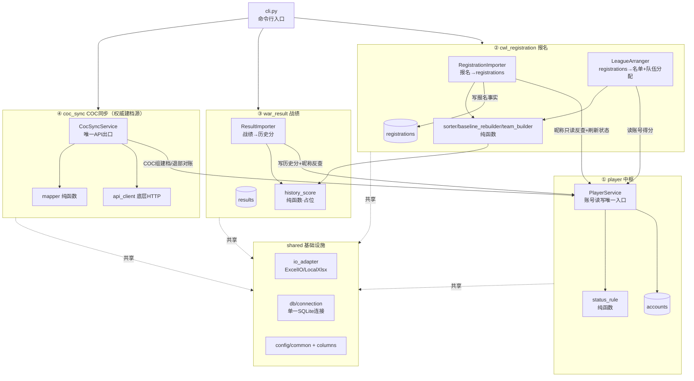
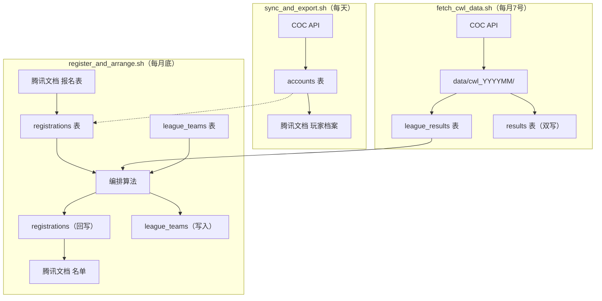
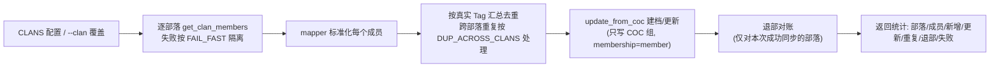

# 01 — 系统架构

> 联赛报名与名单编排管理系统 · 架构设计文档
> 版本：v3.0（2026-08）

---

## 一、系统定位

管理部落联赛（CWL）月度循环：COC 成员同步 → 报名导入 → 名单编排 → 战绩拉取 → 升降级 → 结果发布。

### 核心运维脚本

| 脚本 | 执行频率 | 核心职责 |
|------|---------|---------|
| `sync_and_export.sh` | 每天 | COC API 同步成员 → accounts 表 |
| `fetch_cwl_data.sh` | 每月 7 号 | COC API 拉取 CWL 战绩 → league_results + results |
| `register_and_arrange.sh` | 每月底 | 报名导入 → 编排+升降级 → 发布联赛安排 |

运维详情见 `06-operations.md`。

---

## 二、业务需求

### 原始需求清单

1. 活动每月报名，一个人可能有多个账号，每个账号含：名字、匹配值、是否参加实战
2. 联赛按账号来排名单
3. 每个账号有"匹配值"和"历史战绩"两个关键参数，据此排序
4. 联赛分两种：实战（要求高）、壳子（可随便打）
5. 账号分两类：战营账号（默认参加实战）、普通账号（报名时选择是否参加实战）
6. 实战人员排在一起：战营在前、普通实战在后，两类内部再按匹配值+历史战绩排序
7. 部落人员流动，需要长期跟踪每个账号状态
8. 需要数据库保存每月报名信息
9. 每月联赛结束后上传战绩，更新账号历史战绩
10. 每月活动名单输出到在线 Excel

### 关键决策

| 决策点 | 结论 |
|--------|------|
| 在线 Excel 交互 | 腾讯文档 API 自动读写；第一版走本地 xlsx，预留 API 接口层 |
| 账号唯一标识 | COC 真实 Tag（如 `#XXXX`）作为主键 `player_tag` |
| 排序组合方式 | 加权综合分：归一化匹配值 × 0.6 + 归一化历史战绩 × 0.4（权重可配） |
| 历史战绩计算 | 多指标折算，占位空函数，公式后续自行补充 |

---

## 三、总体架构

采用**领域分模块 + 依赖注入**架构。`player` 处于底层被依赖（数据中枢），三个业务模块都"更新到 player"，彼此互不感知；纯逻辑、IO、存储三者解耦。



### 分层职责

- **纯函数层**：`rank_score`（排序综合分）、`sorter`（分组排序）、`status_rule`（状态推断）、`history_score`（历史分）、`mapper`（COC 字段映射）、`columns`（表头关键词解析），输入→输出无副作用
- **IO 层**：`shared/io_adapter/ExcelIO` 抽象，当前用 `LocalXlsxAdapter`，`TencentDocAdapter` 预留
- **存储层**：三个各管一表的 Repository（`PlayerRepository` / `RegistrationRepository` / `ResultRepository`），共享同一个 SQLite 连接
- **中枢**：`PlayerService` 是账号数据读写的唯一入口，其他模块不直接碰 `accounts` 表

### 核心原则

- `PlayerService` 是账号数据读写的**唯一入口**
- player 处于底层被依赖，但不反向依赖任何业务模块（无循环依赖）
- 报名与 accounts 解耦（B 方案）：`registrations` 自包含，`player_tag` 降为可空缓存

---

## 四、领域模块详解

### ① player —— 玩家中枢

**PlayerService** 是账号读写唯一对外接口：

- `resolve_tag_by_name(account_name)`：按昵称反查 COC 真实 Tag
- `refresh_status(current_period, registered_names)`：按本月报名集合刷新全体账号状态
- `list_members_by_clan(clan_tags)`：按部落标签查成员（战营名单数据源）
- `get(player_tag)`：取单个账号（排序阶段取 trophies + history_score）
- `update_history_score()`：战绩回写
- `update_from_coc()`：COC 权威建档
- `mark_left_alliance()` / `relocate_within_alliance()`：部落归属维护

**status_rule.py**（纯函数）：
- `period_diff(from_period, to_period)`：计算间隔月数
- `infer_status()`：本月报名 → `active`；从未报名 → `maybe_left`；距最后报名 ≥ N 月 → `maybe_left`；否则 → `missed`

### ② cwl_registration —— 报名（核心业务模块）

报名模块负责「报名表 → 数据库 → 联赛名单」的完整数据流。

**数据流**：
```
报名表(腾讯文档/本地xlsx)
  → [1] read_sheet(fill_merged=True)    — 读取原始行
  → [2] parse_registration_row() × N    — 关键词映射 + 清洗
  → [3] _fill_player_name_forward()     — 兜底：空主号前向填充
  → [4] _dedup_latest()                 — 同昵称取最新提交
  → [5] _read_camp()                    — 从 accounts 拉 #2QQ 战营成员
  → [6] _merge_camp()                   — 战营优先合并
  → [7] _save() × N                     — 反查真实Tag → 落库 registrations
         ↓
  registrations 表（自包含报名事实）
         ↓
  → [A] _load_accounts(period)          — 读报名 + 反查得分 + 过滤排除名单
  → [B] sort_accounts()                 — 纯函数分组排序
  → [C] build_final_list()              — 基准重建+升降级（v3.0）
  → [D] build_teams()                   — 贪心填充+白名单+管理员
  → [E] 回写 team_name → registrations
  → [F] 导出 Excel（Part1-4）
```

核心文件：
| 文件 | 职责 |
|------|------|
| `importer.py` | 报名导入（7 步流水线） |
| `roster.py` | 编排主控：串联所有阶段、加载数据、回写 DB、输出 Excel + 公示发布 |
| `sorter.py` | 分组排序纯函数 |
| `rank_score.py` | 综合分公式 |
| `baseline_rebuilder.py` | 阶段 0-6：基准重建+升降级+增删（v3.0） |
| `team_builder.py` | 阶段 7-9：贪心填充+白名单+管理员（v3.0） |
| `promotion.py` | 升降级配对交换算法（纯函数） |
| `repository.py` | registrations 表数据访问 |
| `config/settings.yaml` | 全部配置（YAML） |

排序详情见 `03-sorting.md`，升降级详情见 `04-promotion-relegation.md`。

### ③ war_result —— 战绩

- `importer.py`：读战绩表 → 关键词解析 tag/联赛类型（其余列进 `raw_metrics` JSON）→ 按昵称反查，未知账号跳过告警 → upsert 写 `results` → 重算 `history_score` 回写
- `history_score.py`：纯函数 `compute_history_score`，当前占位恒返回 `0.0`
- `repository.py`：`results` 表读写，upsert（`(player_tag, period, league_type)` 唯一）

### ④ coc_sync —— COC 同步（权威建档源）

**唯一 API 出口**：所有 COC API 调用统一经 `CocSyncService` 封装。

分层：
| 文件 | 职责 |
|------|------|
| `api_client.py` | 底层 HTTP（token env-only / SSRF 白名单 / tag URL 编码 / 超时） |
| `mapper.py` | 纯函数：COC 原始成员 dict → player 档案 COC 组字段 |
| `config/settings.yaml` | `CLANS` + `DUP_ACROSS_CLANS` + `FAIL_FAST` + `ALLIANCE_CLAN_TAGS` |
| `service.py` | `CocSyncService`：多部落遍历、失败隔离、按真实 Tag 汇总去重、写库、退部对账 |

**退部对账**：每轮同步后，对本次成功同步的部落中消失的成员调 `get_player` 查新部落——仍属联盟则更新归属，联盟外/无部落则 `membership_status=left`。

**两类差集（v2.2 B 方案后）**：
- COC 有、报名无：正常（本月未报名）
- 报名有、COC 无：照常写入 `registrations`，`player_tag` 留空，排序得 0 分。不再临时建档

---

## 五、技术选型

- **Python 3.10+**
- **pandas + openpyxl**：读写 Excel
- **SQLite**（内置 `sqlite3`）：本地数据库，零配置、单文件、便于备份
- **pytest + pytest-cov**：单元测试与覆盖率
- **腾讯文档 OpenAPI v3**：在线文档读写（调试 access_token）

---

## 六、可测试性设计

三条设计约束：

1. **业务算法抽成纯函数**（输入→输出，无 IO、无全局状态）
2. **IO 和数据库走接口 + 依赖注入**：测试注入内存 `Database(":memory:")` + `FakeExcelIO`
3. **数据库测试用内存库**，每个用例独立建表、销毁

模块与测试方式对照：

| 模块 | 职责 | 测试方式 |
|------|------|---------|
| `rank_score.py` | 综合分（纯函数） | 纯输入输出断言 |
| `sorter.py` | 分组排序（纯函数） | 纯输入输出断言 |
| `promotion.py` | 升降级（纯函数） | 纯输入输出断言 |
| `baseline_rebuilder.py` | 基准重建（纯函数） | 纯输入输出断言 |
| `team_builder.py` | 贪心填充+白名单+管理员（纯函数） | 纯输入输出断言 |
| `history_score.py` | 历史分（占位） | 纯输入输出断言 |
| `status_rule.py` | 状态推断（纯函数） | 纯输入输出断言 |
| `player/service.py` | PlayerService | 内存库集成 |
| `cwl_registration/importer.py` | 报名导入 | 注入 Fake IO |
| `cwl_registration/roster.py` | 编排主控 | 注入 Fake IO |
| `war_result/importer.py` | 战绩导入 | 注入 Fake IO |

总计 **135 个测试全绿通过**。

---

## 七、安全

| 项 | 状态 | 说明 |
|----|------|------|
| SQL 注入 | ✅ | 全部参数绑定 |
| 命令执行 | ✅ | 无 shell/exec |
| 反序列化 | ✅ | `json.loads` 仅解析可信数据 |
| SSRF | ✅ | `coc_sync/api_client.py` 硬编码仅允许 `api.clashofclans.com` |
| 密钥管理 | ✅ | `COC_API_TOKEN` 仅从环境变量读取 |
| 文件解析 | 🟡 | `load_workbook` 解析外部 xlsx，理论 zip-bomb 风险 |

---

## 八、项目文件结构

```
sky-admin/
├── cli.py                              # 命令行入口
├── config/                             # 统一配置（YAML）
│   ├── settings.yaml                   # 全部业务配置
│   ├── __init__.py                     # 配置加载入口
│   └── loader.py                       # YAML 加载 + 校验
├── shared/                             # 基础设施
│   ├── config/
│   │   └── env_loader.py               # .env 加载逻辑
│   ├── columns.py                      # 表头关键词解析
│   ├── io_adapter/
│   │   ├── base.py                     # ExcelIO 抽象接口
│   │   ├── local_xlsx.py               # 本地 xlsx 实现
│   │   └── tencent_doc.py              # 腾讯文档实现
│   └── db/connection.py                # SQLite 连接 + 建表 + 迁移
├── modules/
│   ├── player/                         # ① 玩家中枢
│   │   ├── service.py / repository.py / status_rule.py
│   ├── cwl_registration/               # ② CWL 报名
│   │   ├── importer.py / roster.py / sorter.py / rank_score.py
│   │   ├── promotion.py / baseline_rebuilder.py / team_builder.py
│   │   ├── repository.py
│   ├── war_result/                     # ③ 战绩
│   │   ├── importer.py / history_score.py / repository.py
│   └── coc_sync/                       # ④ COC 同步
│       ├── api_client.py / mapper.py / service.py
├── tests/                              # 按模块归类
│   ├── conftest.py / fakes.py
│   ├── shared/ / player/ / cwl_registration/ / war_result/ / coc_sync/
├── scripts/                            # 运维脚本
│   ├── load_env.sh / register_and_arrange.sh / sync_and_export.sh
│   ├── fetch_cwl_data.py / fetch_cwl_data.sh
│   ├── publish_to_results.sh
│   ├── probe_coc_clan.py/.sh / dump_clans_to_xlsx.py/.sh
├── docs/                               # 文档
├── data/league.db                      # SQLite 数据库
├── .env.example
├── requirements.txt / requirements-dev.txt
└── pytest.ini
```

---

## 九、腾讯文档 API 接入

- 实现：`shared/io_adapter/tencent_doc.py`，OpenAPI v3
- **授权现状**：当前用调试 access_token，凭证仅从环境变量读取
- ⚠️ **需 30 天手动更新一次 token**：无 `client_secret` / `refresh_token`，不做自动刷新
- **安全**：所有凭证仅放环境变量，绝不入库、不提交仓库

---

## 十、数据流向总图（端到端）



---

## 十一、可插拔开放函数

系统预留**两个**开放函数，均与主流程解耦，可独立修改、独立测试：

### 11.1 历史战绩计算（占位空函数，待补充公式）

```python
def compute_history_score(history_results: list[dict], config: dict) -> float:
    """
    根据一个账号的历史战绩记录，计算其历史战绩综合分。
    history_results: [{'period':'2026-06','league_type':'combat','raw_metrics':{...}}, ...]
    返回: 一个可用于排序的浮点分数。

    TODO(待补充): 定义指标权重、最近N月加权/累计平均、新账号默认分、
                   实战与壳子是否分开计入 等规则。
    """
    return 0.0  # 占位，待补充
```

### 11.2 综合排序分计算（已给默认实现，可后续深入修改）

```python
def compute_rank_score(account, match_min, match_max, hist_min, hist_max, weights) -> float:
    """
    计算单个账号用于名单排序的综合分。
    当前默认实现: 归一化匹配值与历史战绩后加权求和（含除零保护）。
    后续可自行替换为更复杂的算法（例如非线性、分段、引入更多因子）。
    """
    def _norm(v, lo, hi):
        return 0.0 if hi <= lo else (v - lo) / (hi - lo)
    nm = _norm(account["match_value"], match_min, match_max)
    nh = _norm(account["history_score"], hist_min, hist_max)
    return weights["match_value"] * nm + weights["history_score"] * nh
```

排序权重放 config：
```python
SORT_WEIGHTS = {"match_value": 0.6, "history_score": 0.4}
```

---

## 十二、架构演进历史

### 12.1 v1.x → v2.0：从"技术分层"到"业务领域分模块"

v1.x 按技术切层（`core` / `io_adapter` / `db`），三个编排器共用一个大 `Repository`（一张接口管三表）。v2.0 改为按业务领域纵向切模块，**player 为数据中枢**，其他模块都"更新到 player"。

**核心原则**：`PlayerService` 是账号数据读写的**唯一入口**，其他模块不直接碰 `accounts` 表；player 处于底层被依赖，但不反向依赖任何业务模块（无循环依赖）。

### 12.2 领域逻辑归属

| 逻辑 | 归属模块 | 理由 |
|------|---------|------|
| `infer_status` 状态推断 | player | 账号状态是 player 固有属性 |
| `compute_rank_score` 名单排序分 | cwl_registration | 服务于"生成名单" |
| `compute_history_score` 历史分 | war_result | 消费 results，产出 player.history_score |

### 12.3 数据访问拆分

原大 `Repository` 拆为三个各管一表的 Repository（`PlayerRepository` / `RegistrationRepository` / `ResultRepository`），共享同一个 SQLite 连接，外键约束照常生效。

### 12.4 accounts 瘦身与旧库迁移（v2.1）

accounts 从 21 列瘦身到 16 列，只留"账号级事实"，按月维度字段下沉子表 / 派生：

| 原字段 | 处置 | 去向 |
|--------|------|------|
| `latest_match_value` | 删 | registrations 已有 `match_value` |
| `join_combat` | 删 | registrations 已有 `join_combat` |
| `account_type` | 下沉 | registrations 新增列（本月分类） |
| `camp_order` | 下沉 | registrations 新增列（本月战营顺序） |
| `last_reg_period` | 改派生 | 读取时 `MAX(period)` 实时算，不落列 |

**迁移策略**（幂等，新库为无害空操作）：
1. registrations 缺 `account_type` / `camp_order` 时 `ALTER TABLE ADD COLUMN` 补上
2. 把旧 `accounts.account_type` / `camp_order` 回填到该账号的报名行（仅当报名行为空）
3. accounts 仍含废弃列时重建表物理删净

### 12.5 报名与 accounts 解耦 · B 方案（v2.2）

v2.1 之前，报名导入必须先在 `accounts` 建行（`registrations` 挂 `player_tag` 外键）。对"报名有、COC 无"的新人，只能**临时建档**（`is_provisional=1`，tag 暂用昵称），待 `coc-sync` 命中同名再**合并**到真实 Tag——这套逻辑牵出临时账号、合并子表 FK、改名断链残留告警等一连串复杂度。

v2.2 把 `registrations` 升级为**自包含事实源**，从根上消除该复杂度：

| 维度 | v2.1（旧） | v2.2（B 方案） |
|------|-----------|----------------|
| registrations 定位 | accounts 的子表 | 自成一体的报名事实源 |
| 报名主标识 | `player_tag`（外键） | `account_name`（自持，无 FK） |
| 唯一键 | `(player_tag, period)` | `(account_name, period)` |
| `player_tag` 语义 | 必填外键 | 可空的关联缓存（命中真实账号才回填） |
| `player_name` 来源 | 从 accounts join | registrations 自持 |
| 报名有 / COC 无 | 临时建档 + 后续合并 | 照常落库、tag 留空、排序得 0 分 |
| accounts 由谁写 | coc_sync + 报名 + 战绩 | **仅 coc_sync + 战绩**（报名只读） |

**退休的部件**（不再有任何调用方）：
- `modules/cwl_registration/unmatched.py`（未匹配钩子）— 整个文件删除
- `PlayerService.upsert_from_registration` / `create_provisional_account` / `merge_provisional_account` / `find_provisional_tags_by_name` / `list_provisional_accounts`
- `PlayerRepository.merge_provisional` / `list_provisional`
- `CocSyncService` 的临时账号合并循环与残留告警

### 12.6 顺带修复的历史隐患

| 隐患 | 修复 | 落点 |
|------|------|------|
| #1 results 无唯一约束、重复导入累积 | 加 `UNIQUE(player_tag, period, league_type)`，`add_result` 改 upsert | `db/connection.py` + `war_result/repository.py` |
| #2 未知账号导入触发外键硬失败 | 导入前校验，不存在则跳过 + stderr 告警 | `war_result/importer.py` |
| #3 战绩 tag 体系与报名不一致 | 战绩表改关键词映射 + tag 同用"游戏昵称"来源 | `config/settings.yaml` + `war_result/importer.py` |
| #8 孤立报名记录静默降级 | v2.2 起撤销告警——报名与 accounts 解耦后"报名有/COC无"是常态 | `roster.py` |
| #9 战绩导入零测试 | 新增集成测试 | tests |

---

## 十三、腾讯文档 API 接入说明

- 实现：`shared/io_adapter/tencent_doc.py`，OpenAPI v3；核心接口 `get_range`（读）、`batchupdate`（写）、`get_sheet`（元数据）
- **授权现状**：当前用调试 access_token，凭证仅从环境变量读取（`TENCENT_DOC_ACCESS_TOKEN` / `TENCENT_DOC_CLIENT_ID` / `TENCENT_DOC_OPEN_ID`）
- ⚠️ **需 30 天手动更新一次 token**：因当前无 `client_secret` / `refresh_token`，不做自动刷新；access_token 约 30 天过期，到期回开放平台复制新 token 重新 export
- **安全**：所有凭证仅放环境变量，绝不入库、不提交仓库
- **接入方式**：仅新增 `io_adapter/tencent_doc.py` 实现 `ExcelIO`，业务层零改动

---

## 十四、COC 同步详细流程（coc_sync）

### 14.1 多部落汇总流程



> v2.2（B 方案）起，报名导入不再产生"昵称临时账号"，故本流程移除了原先的"命中同名临时账号 → 合并"与"残留临时账号告警"两个环节。

### 14.2 退部对账（成员流动跟踪）

coc-sync 默认"只增量、只写当前在部落的人"，退出部落的账号 COC 不再返回，其 `clan_tag`/`clan_role` 会停留旧值成为脏数据。为此每轮同步后追加退部对账：

```mermaid
flowchart TD
    A["本轮成功同步的部落集合<br/>(抓取失败的不参与, 避免误伤)"] --> B["候选 = 上次 clan_tag 属于这些部落<br/>但本轮成员列表里消失的真实账号"]
    B --> C{"对每个候选调<br/>get_player 查当前部落"}
    C -->|查询失败/限流| S["本轮跳过, 不改判定<br/>下次同步再对账"]
    C -->|新部落仍属联盟<br/>(含 enabled=False/本轮未同步)| M["relocate_within_alliance<br/>只更新归属, 保持 member"]
    C -->|新部落是联盟外 / 已无部落| L["mark_left_alliance<br/>membership_status=left<br/>记录新部落 tag"]
```

- **联盟判定**：由 `config.alliance_clan_tags()` 给出联盟全部落 tag（含 `enabled=False`）
- **只对本次成功同步的部落对账**：某部落抓取失败时，其成员本轮不出现在成员列表，但不能据此判退部
- **专用显式 UPDATE**：`set_clan_membership` 与 upsert 的 COALESCE 语义不同，只动 `clan_tag`/`clan_role`/`membership_status` 三列
- **回归自愈**：玩家若回到联盟部落，下次同步会重新出现在成员列表，`update_from_coc` 会把 `membership_status` 写回 `member`

### 14.3 大本等级（town_hall_level）

`/clans/{tag}/members` 成员对象不返回 `townHallLevel`，需对每个成员再调一次 `/players/{tag}`。底层接口 `api_client.get_player(player_tag)` 已存在（退部对账已用它查新部落），当前仅在 mapper 加注释说明字段暂空。

---

## 十五、已知隐患与待办

### 影响排序正确性

- **#5 None 匹配值被当 0 参与归一化**：`sorter._extents` 用 `or 0.0` 把 `None` 视作 0 计入极值，扭曲分布。建议归一化时排除 None 而非填 0
- **#6 去重时间比较依赖字符串**：`importer._submit_key` 用 `str(submit_time)` 后比较，openpyxl 读日期可能是 `datetime` 也可能是字符串

### 战营语义

- **#7 战营未报名账号被写成"本月已报名 + active"**：`_merge_camp` 对战营本月没报名的账号也纳入报名快照，`refresh_status` 会把这些"仅战营默认纳入"的账号算作本月已报名 → 状态恒 active。需明确是否为预期

### 输入校验

- **#10** 自定义 `--sheet` 名未做 openpyxl 合法性校验
- **#11** `--period` 无格式校验，非法值不报错

### 测试缺口

- **#13** `cli.py` 无任何测试
- **#15** `CocApiClient` 的 SSRF/URL 编码逻辑无直接单测

### 脚本优化

- **#18** `register_and_arrange.sh` 第 1 步 `coc-sync` 已注释
- **#19** 硬编码 `--to tencent`，无法回退到本地 xlsx
- **#20** 脚本缺少步骤间状态校验（导入 0 条仍会继续生成空名单）

### 历史分

- **#4** 历史分维度当前完全失效：`compute_history_score` 恒返回 0，实际只有匹配值在起作用

### 缓存优化

- **#17** 报名行缓存 `player_tag` 不自愈：若先 `import-reg`（新人 COC 未建档，tag 落 NULL）→ 后 `coc-sync`（建档得到真实 Tag），缓存 tag 不会自动回填。`arrange` 阶段有 live 反查兜底，排序结果不受影响——纯优化、优先级最低

---

## 十六、相关文档

- `02-database.md` — 数据库表结构与数据流
- `03-sorting.md` — 排序全流程与队伍填充
- `04-promotion-relegation.md` — 升降级算法
- `05-roster-output.md` — Part1-Part4 输出 + 公示发布
- `06-operations.md` — 运维脚本与月度循环
- `CHANGELOG.md` — 版本更新记录
