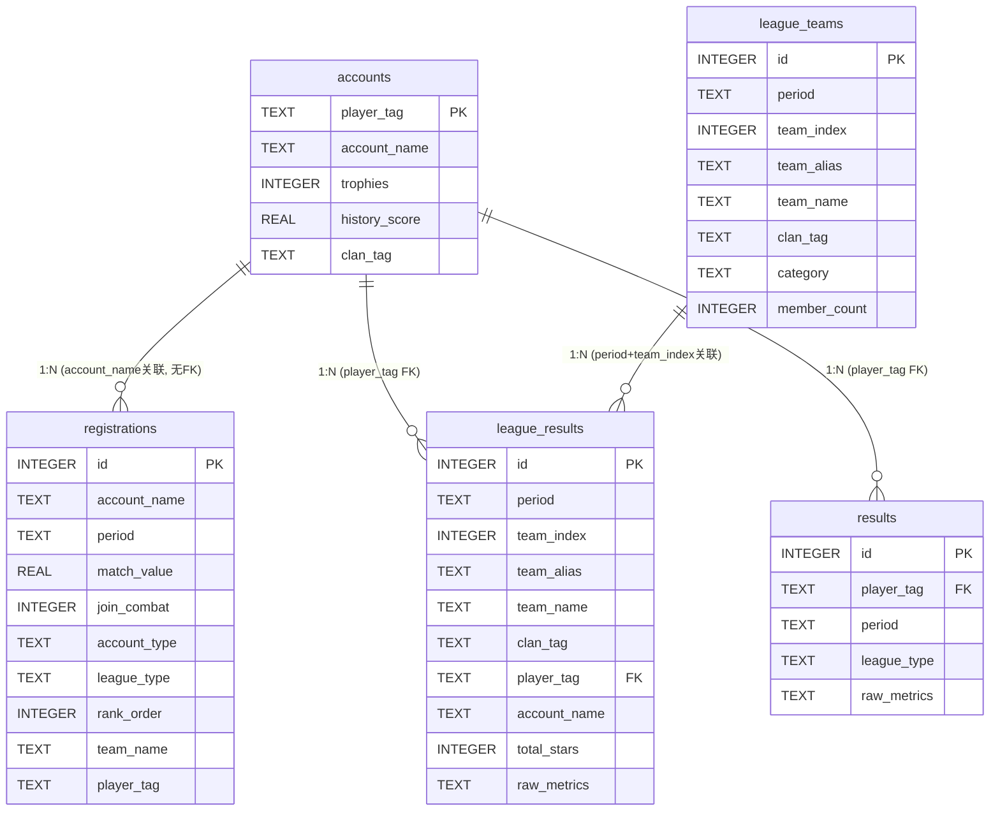
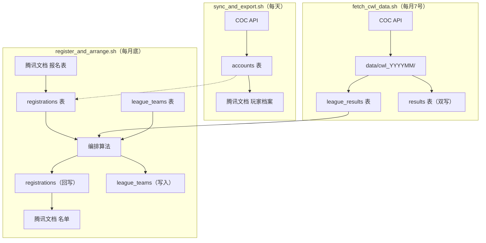
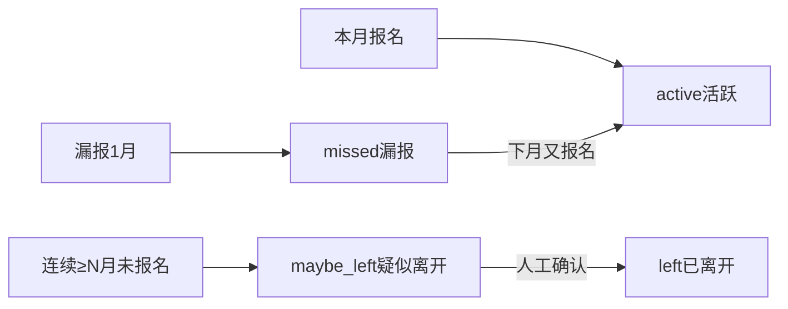

# 02 — 数据库表结构与数据流

> 版本：v3.0
> 数据库：SQLite `data/league.db`

---

## 一、数据库概览

系统包含 **5 张表**：

| 表名 | 职责 | 主键 | 状态 |
|------|------|------|------|
| `accounts` | 账号档案（COC 权威） | `player_tag` | 活跃 |
| `registrations` | 月度报名（自包含事实源） | `id` (自增) | 活跃 |
| `league_teams` | 队伍配置快照 | `id` (自增) | **v3.0 新增** |
| `league_results` | 联赛战绩（结构化） | `id` (自增) | **v3.0 新增** |
| `results` | 月度战绩（旧） | `id` (自增) | 过渡期保留 |

---

## 二、ER 图



---

## 三、accounts 表（账号档案）

只保留**账号级事实**。COC 权威组（由 `coc_sync` 更新）与报名/战绩组经 upsert COALESCE 语义互不覆盖。

| 字段 | 类型 | 组 | 说明 |
|------|------|----|------|
| `player_tag` | TEXT PK | — | COC 真实 Tag `#XXXX` |
| `account_name` | TEXT | COC | 游戏昵称（报名/战绩按此反查） |
| `exp_level` | INTEGER | COC | 等级 |
| `trophies` | INTEGER | COC | 奖杯 |
| `league_name` | TEXT | COC | 联赛段位 |
| `town_hall_level` | INTEGER | COC | 大本营等级（预留） |
| `clan_tag` | TEXT | COC | 当前所在部落 |
| `clan_role` | TEXT | COC | 部落职位 |
| `coc_raw` | TEXT(JSON) | COC | API 原始成员数据全量快照 |
| `last_synced_at` | TEXT | COC | 最近 COC 同步时间 |
| `membership_status` | TEXT | COC | `member` / `left`（退部对账维护） |
| `is_provisional` | INTEGER | — | 保留备用（v2.2 起恒为 0） |
| `player_name` | TEXT | 报名 | 归属人（= 主号昵称） |
| `status` | TEXT | 报名 | `active` / `missed` / `maybe_left` / `left` |
| `history_score` | REAL | 战绩 | 历史战绩综合分 |
| `updated_at` | TEXT | — | 更新时间 |

> **派生列**：`last_reg_period` 不落列，读取时 `MAX(period)` 子查询实时派生，按 `account_name` 关联 registrations。

---

## 四、registrations 表（月度报名，自包含事实源）

v2.2 B 方案：自成一体的报名事实源。自持 `account_name`/`player_name`，唯一键 `(account_name, period)`，`player_tag` 降为可空缓存、去外键。

| 字段 | 类型 | 约束 | 说明 |
|------|------|------|------|
| `id` | INTEGER PK | 自增 | 行 ID |
| `account_name` | TEXT NOT NULL | UNIQUE(account_name, period) | 报名昵称，报名事实主标识 |
| `player_name` | TEXT | | 主号归属（自持） |
| `period` | TEXT | UNIQUE | 联赛月份 `YYYY-MM`（v2.5 统一） |
| `match_value` | REAL | | 本月匹配值 |
| `join_combat` | INTEGER | | 是否实战 (0/1) |
| `account_type` | TEXT | | 本月分类：combat/normal |
| `willing_to_manage` | INTEGER | | 是否愿意做管理员 (0/1)（v2.8） |
| `league_type` | TEXT | | 编排结果：combat/shell |
| `rank_order` | INTEGER | | 最终名单位次（编排产物，arrange() 结束时回写） |
| `player_tag` | TEXT | 可空，无 FK | 真实 Tag 关联缓存 |
| `team_name` | TEXT | 可空 | 分配到哪个队伍（v2.3，回写格式含 index+alias+coc_name+clan_tag） |

**team_name 回写格式**：`"{team_index} {team_alias} {coc_name} {clan_tag}"`

**team_name 在 ARRANGEMENT_OUTPUT_HEADERS 中**：COC 真实部落名称列（v2.8 新增），供 Excel 展示使用。

---

## 五、league_teams 表（队伍配置快照，v3.0 新增）

队伍配置按月快照，替代旧 `TEAMS_LAST` 手工维护。

```sql
CREATE TABLE league_teams (
    id              INTEGER PRIMARY KEY AUTOINCREMENT,
    period          TEXT NOT NULL,
    team_index      INTEGER NOT NULL,
    team_alias      TEXT NOT NULL,
    team_name       TEXT,                   -- COC 真实部落名称
    clan_tag        TEXT,
    category        TEXT NOT NULL,
    member_count    INTEGER NOT NULL,
    leader          TEXT,
    league_level    TEXT,
    reserved_slots  INTEGER DEFAULT 0,
    UNIQUE(period, team_index)
);
```

**写入**：`arrange()` 时 `_write_league_teams()` 幂等写入，保留已有 `team_name`。
**读取**：升降级时 `_load_prev_teams_config()` 读上月配置。

---

## 六、league_results 表（联赛战绩，v3.0 新增）

结构化存储联赛战绩，替代旧 `results` 表。

```sql
CREATE TABLE league_results (
    id              INTEGER PRIMARY KEY AUTOINCREMENT,
    period          TEXT NOT NULL,
    team_index      INTEGER NOT NULL,
    team_alias      TEXT NOT NULL,
    team_name       TEXT,
    clan_tag        TEXT,
    category        TEXT NOT NULL,
    player_tag      TEXT NOT NULL,
    account_name    TEXT,
    total_stars     INTEGER,
    attacks         INTEGER,
    raw_metrics     TEXT,
    UNIQUE(period, team_index, player_tag),
    FOREIGN KEY(player_tag) REFERENCES accounts(player_tag)
);
```

**写入**：`fetch_cwl_data.py` 拉取后写入（同时双写到旧 `results` 表）。
**读取**：编排时 `_load_combat_star_data()` 和 `_load_prev_combat_from_results()` 优先读此表。

---

## 七、results 表（旧战绩，过渡期保留）

旧战绩表。`league_results` 写入时双写到此表，过渡期后废弃。

| 字段 | 类型 | 说明 |
|------|------|------|
| `id` | INTEGER PK | 自增主键 |
| `player_tag` | TEXT FK | 关联账号 |
| `period` | TEXT | CWL 实际发生月 |
| `league_type` | TEXT | 实战 / 壳子 |
| `raw_metrics` | TEXT(JSON) | 原始多指标 |

> `UNIQUE(player_tag, period, league_type)`；`league_type` 为 NULL 时 SQLite 不视为冲突。

---

## 八、核心概念定义

| 概念 | 来源 | 唯一性 | 用途 |
|------|------|--------|------|
| **team_index** | `enumerate(teams)` 索引（0-based） | 唯一 | 队伍身份标识、升降级分组 key |
| **team_alias** | config `name` 字段 | 不唯一 | 人类标签，如"大一"、"泰坦二" |
| **team_name** | COC API 真实部落名称 | 唯一 | 展示用途 |
| **clan_tag** | config `clan_tag` | 唯一 | COC API 查询标识 |
| **category** | config `category` | — | `combat` / `shell` |

---

## 九、period 语义

| 表 | period 含义 |
|----|------------|
| `registrations.period` | 联赛月份（实际打 CWL 的月份） |
| `results.period` | CWL 实际发生月 |
| `league_teams.period` | 联赛月份（与 registrations 一致） |
| `league_results.period` | CWL 实际发生月 |

> 编排 N 月联赛时：读 `registrations(N)` + `league_results(N-1)`

---

## 十、表读写关系矩阵

| 表 | 写入者 | 读取者 |
|----|--------|--------|
| `accounts` | `coc_sync`, `war_result`, `cwl_registration` | `player-export`, `import-reg`, `arrange`, `fetch_cwl_data` |
| `registrations` | `import-reg`, `arrange`（回写） | `arrange`, `refresh_status` |
| `league_teams` | `arrange`（幂等写入） | `arrange`（读上月配置+team_name） |
| `league_results` | `fetch_cwl_data` | `arrange`（读星数+队伍归属） |
| `results`（旧） | `fetch_cwl_data`（双写） | `arrange`（回退读取） |

---

## 十一、完整数据流转图



---

## 十二、账号状态流转



> **两套独立的"离开"体系**：
> - `status`（`active`/`missed`/`maybe_left`/`left`）是**报名维度**
> - `membership_status`（`member`/`left`）是**部落成员维度**，由 `coc_sync` 退部对账维护
> - 二者互不干扰

---

## 十三、关键设计决策

| 决策点 | 选择 | 理由 |
|--------|------|------|
| 账号主键 | COC 真实 Tag | 名实相符 |
| 报名与 accounts | 解耦，无 FK | 自包含 |
| period 双语义 | reg=联赛月, res=CWL月 | 编排N月读 N-1 |
| team_index | TEAMS 顺序索引 | 唯一身份标识 |
| team 字段冗余 | league_results 冗余存 | 避免 JOIN |
| team_name 来源 | league_teams 表读取 | 不重复调 COC API |
| TEAMS_LAST | 已删除 | league_teams 替代 |
| 战绩双写 | league_results + results | 过渡期兼容 |

---

## 十四、数据库重构推演（v3.0 引入 league_teams 和 league_results）

### 旧方案的痛点

v2.x 的数据库只有 3 张表（accounts / registrations / results），随着升降级系统的引入暴露出几个问题：

1. **队伍配置历史缺失**：`config.py` 中 `TEAMS` 每月变化，旧配置不持久化。上月队伍配置靠 `TEAMS_LAST` 手工维护，容易出错
2. **team 概念混淆**：旧 `registrations.team_name` 只存别名（如"大一"），无法区分 3 支同名"大一"队伍。`cur_team` 展示格式为 `"{team_index} {team_alias}"`，缺少 COC 真实部落名称
3. **results 表设计问题**：team 信息藏在 `raw_metrics` JSON 中（`team_name`/`team_index` 混在 JSON 里），无法直接 SQL 查询队伍维度的战绩
4. **信息存储分散**：队伍配置在 config、战绩在 results、队伍归属在 registrations，三处数据不同步

### 新方案设计

新增两张表：

- **league_teams**（队伍配置快照）：每月 `arrange()` 时幂等写入当月队伍配置，替代 `TEAMS_LAST`。`team_index` 作为唯一身份标识
- **league_results**（联赛战绩）：结构化存储 CWL 战绩，team 字段（`team_index`/`team_alias`/`team_name`/`clan_tag`/`category`）冗余存储避免 JOIN。`fetch_cwl_data.py` 拉取后写入

### 核心概念分离

| 概念 | 来源 | 唯一性 | 用途 |
|------|------|--------|------|
| **team_index** | `enumerate(teams)` 索引（0-based） | 唯一 | 队伍身份标识、升降级分组 key |
| **team_alias** | config `name` 字段 | 不唯一 | 人类标签，如"大一"、"泰坦二" |
| **team_name** | COC API 真实部落名称 | 唯一 | 展示用途 |

### 过渡策略

1. `league_results` 写入时双写到旧 `results` 表
2. `_load_prev_teams_config` 为空时回退 config TEAMS
3. `_load_combat_star_data` / `_load_prev_combat_from_results` 优先新表，回退旧表
4. `TEAMS_LAST` 已删除

### 迁移步骤（已完成）

1. ✅ DDL 添加 `league_teams` 和 `league_results`
2. ✅ `arrange()` 开始时写入 `league_teams`
3. ✅ `fetch_cwl_data.py` 读写新表
4. ✅ `registrations.team_name` 回写格式改为含 index + alias + coc_name + clan_tag
5. ✅ `baseline_rebuilder.py` 从 `league_teams` 读取上月配置
6. ✅ Excel 导出 `ARRANGEMENT_OUTPUT_HEADERS` 新增 `team_name` 列（13 列）
7. ✅ 迁移脚本 `migrate_results_202607.py` 将旧数据迁入新表
8. ✅ 回填脚本 `backfill_team_names.py` 通过 COC API 补全 team_name

---

## 十五、数据一致性保证

### SQLite 连接管理

- **单一连接**：`shared/db/connection.py` 的 `Database` 持有唯一 SQLite 连接，所有 Repository 共享。内存库测试时用同一个连接才能共享数据
- **WAL 模式**：默认使用 SQLite 默认 journal_mode，单连接下无并发写入问题

### 外键策略

| 表 | 外键 | 策略 |
|----|------|------|
| `registrations` | 无 | v2.2 B 方案解耦，`player_tag` 可空无 FK |
| `league_results` | `player_tag → accounts` | 有 FK，未知账号不写入 |
| `results` | `player_tag → accounts` | 有 FK，未知账号跳过告警 |

### 唯一约束

| 表 | 唯一键 | 说明 |
|----|--------|------|
| `registrations` | `(account_name, period)` | 防重复导入，同月同昵称覆盖 |
| `league_teams` | `(period, team_index)` | 同月同队伍不重复 |
| `league_results` | `(period, team_index, player_tag)` | 同月同队同人不重复 |
| `results` | `(player_tag, period, league_type)` | `league_type=NULL` 时 SQLite 不视为冲突 |

### upsert COALESCE 语义

`accounts` 表 upsert 时，COC 组字段与报名/战绩组字段互不覆盖——只有本次传入的非 NULL 字段才覆盖旧值。`PlayerRepository.upsert` 用 `ON CONFLICT ... COALESCE(excluded.col, 旧值)` 实现。

### 数据校验

- 报名导入：缺 `account_name` 的行跳过；`match_value` 用 `to_float()` 清洗
- 战绩导入：按昵称反查 Tag，未知账号跳过 + stderr 告警
- `period` 格式：`register_and_arrange.sh` 做正则校验（`YYYY-MM`）
