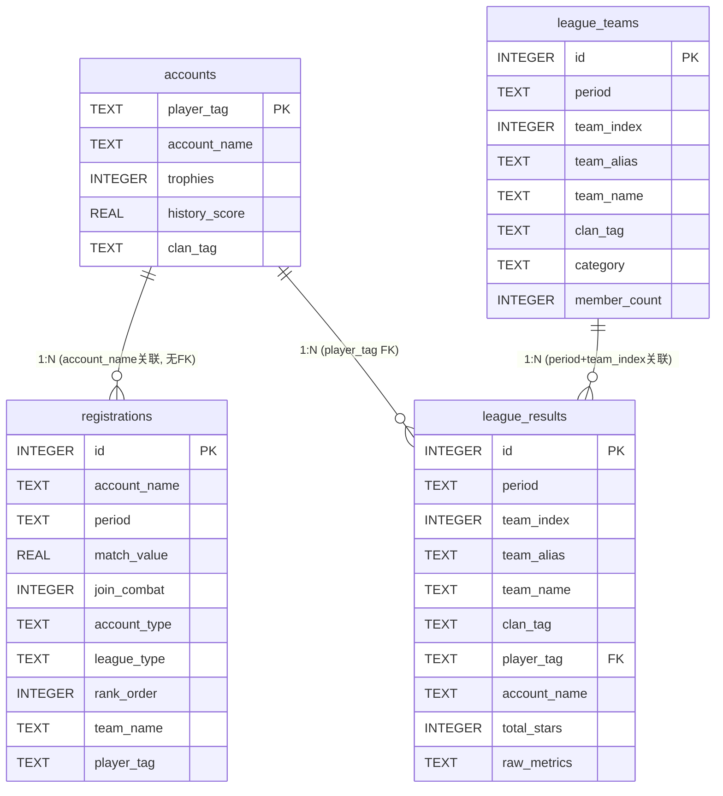
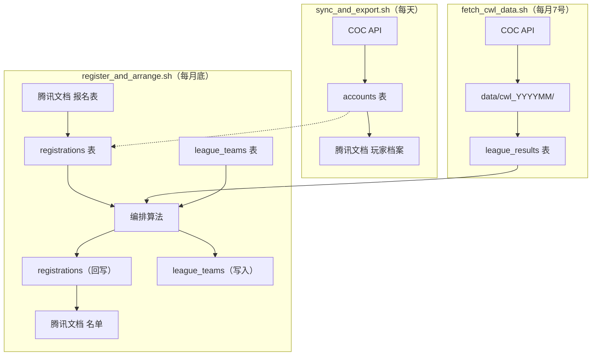
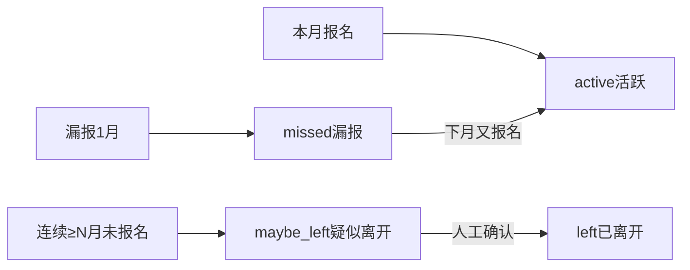

# 02 — 数据库表结构与数据流

> 版本：v3.1
> 数据库：SQLite `data/league.db`

---

## 一、数据库概览

系统当前包含 **19 张业务与运行状态表**：

| 表名 | 职责 | 主键 | 状态 |
|------|------|------|------|
| `accounts` | 账号档案（COC 权威） | `player_tag` | 活跃 |
| `registrations` | 月度报名（自包含事实源） | `id` (自增) | 活跃 |
| `league_teams` | 队伍配置快照 | `id` (自增) | **v3.0 新增** |
| `league_results` | 联赛战绩（结构化） | `id` (自增) | **v3.0 新增** |
| `war_results` | 普通部落战历史统计 | `id` (自增) | 活跃 |
| `farm_stats` | 互刷部落统计缓存 | `clan_tag` | 活跃 |
| `current_war_cache` | 自有部落当前战争缓存 | `clan_tag` | 活跃 |
| `war_history_cache` | 自有部落最近普通战争完整归档 | `(clan_tag, war_key)` | 活跃 |
| `member_war_facts` | 自有部落普通战逐玩家可追溯事实 | `(clan_tag, war_key, player_tag)` | 活跃 |
| `member_combat_stats_cache` | 成员普通战/CWL轻量摘要 | `player_tag` | 活跃 |
| `capital_raid_member_results` | 都城突袭周末逐成员事实 | `(clan_tag, start_time, player_tag)` | 活跃 |
| `clan_games_member_snapshots` | 竞赛月末成就快照与差值 | `(period, player_tag)` | 活跃 |
| `clan_profile_cache` | 自有部落官方资料缓存 | `clan_tag` | 活跃 |
| `cwl_live_group_cache` | 当月 CWL 联赛组缓存 | `(period, clan_tag)` | 活跃 |
| `cwl_live_war_cache` | CWL 单场战争缓存 | `war_tag` | 活跃 |
| `cwl_roster_snapshots` | CWL 正式名单不可变版本快照 | `id` | 活跃 |
| `cwl_assembly_cache` | 当月各联赛部落集结检查缓存 | `(period, clan_tag)` | 活跃 |
| `wechat_users` | 微信用户和游戏账号绑定 | `openid` | 活跃 |
| `sync_jobs` | 周期调度任务状态 | `job_id` | 活跃 |

`current_war_cache` 每个已启用自有部落一行，保存标准化后的当前战争 JSON、状态、错误、同步时间、最近尝试时间和连续失败次数。`current_wars` 调度任务每 2 分钟检查一次：战斗日每 2 分钟，准备日通常每 30 分钟且开战前 30 分钟内提升为每 2 分钟，无战争 / 已结束每 5 分钟，CWL 跳转状态每 30 分钟调用 COC；失败按 5～30 分钟退避。API 只读缓存，不在页面请求中直接调用 COC。

`war_history_cache` 保存普通战争标准化完整 JSON。准备日、战斗日和结束状态按稳定 `war_key` 幂等覆盖；CWL 不进入该表。每个自有部落最多保留最近 15 场 `war_ended`，当前未结束战争不占该限额。旧战营 5/15/45 统计仍读取 `war_results`；成员页在完整 JSON 清理前写入 `member_war_facts`，再从该事实表生成跨自有部落的 `member_combat_stats_cache`。

`clan_profile_cache` 每个已启用自有部落一行，保存 `/clans/{tag}` 规范化后的徽章、等级、战争战绩、联赛、三类积分、地区、标签、门槛和描述。跟随 `coc_sync` 每 6 小时更新；单部落失败时保留上次成功 JSON 并标记 `stale`。

`cwl_live_group_cache` 以当月 `league_teams` 为部落范围，保存官方联赛组和轮次 warTag；`cwl_live_war_cache` 以 `war_tag` 去重保存完整逐场攻防数据。两表由 `cwl_live` 增量更新，页面 API 只读缓存。已结束战争不再重复拉取。

`cwl_roster_snapshots` 保存每月正式公示表的 revision，同月只有一个 `is_active=1`；`cwl_assembly_cache` 保存正式名单与当前部落成员的比较结果。两表由 `cwl_assembly` 在每月 1 日 14:00 至 3 日 16:00 的窗口内维护，单部落开启当月联赛后冻结。完整边界见 [21-cwl-assembly-check.md](21-cwl-assembly-check.md)。

表的事实/缓存边界、可重建性、当前容量和已确认遗留列见
[23-data-task-audit.md](23-data-task-audit.md)。不要仅因表名含 `cache` 就直接清空；先确认消费者和重建路径。

---

## 二、ER 图


```mermaid
erDiagram
    accounts ||--o{ registrations : "1:N (account_name关联, 无FK)"
    accounts ||--o{ league_results : "1:N (player_tag FK)"

    league_teams ||--o{ league_results : "1:N (period+team_index关联)"

    accounts {
        TEXT player_tag PK
        TEXT account_name
        INTEGER trophies
        REAL history_score
        TEXT clan_tag
    }

    registrations {
        INTEGER id PK
        TEXT account_name
        TEXT period
        REAL match_value
        INTEGER join_combat
        TEXT account_type
        TEXT league_type
        INTEGER rank_order
        TEXT team_name
        TEXT player_tag
    }

    league_teams {
        INTEGER id PK
        TEXT period
        INTEGER team_index
        TEXT team_alias
        TEXT team_name
        TEXT clan_tag
        TEXT category
        INTEGER member_count
    }

    league_results {
        INTEGER id PK
        TEXT period
        INTEGER team_index
        TEXT team_alias
        TEXT team_name
        TEXT clan_tag
        TEXT player_tag FK
        TEXT account_name
        INTEGER total_stars
        TEXT raw_metrics
    }

```

---

## 三、accounts 表（账号档案）

只保留**账号级事实**。COC 权威组由 `coc_sync`、`player_details` 与 `clan_games_stats`
更新；`cwl_registration` 只维护报名状态。各写入方经 upsert COALESCE 语义互不覆盖。

| 字段 | 类型 | 组 | 说明 |
|------|------|----|------|
| `player_tag` | TEXT PK | — | COC 真实 Tag `#XXXX` |
| `account_name` | TEXT | COC | 游戏昵称（报名/战绩按此反查） |
| `exp_level` | INTEGER | COC | 等级 |
| `trophies` | INTEGER | COC | 奖杯 |
| `league_name` | TEXT | COC | 联赛段位 |
| `town_hall_level` | INTEGER | COC | 大本营等级（预留） |
| `clan_tag` | TEXT | COC | 当前所在部落 |
| `clan_role` | TEXT | COC | 部落职位 |
| `coc_raw` | TEXT(JSON) | COC | API 原始成员数据全量快照 |
| `last_synced_at` | TEXT | COC | 最近 COC 同步时间 |
| `membership_status` | TEXT | COC | `member` / `left`（退部对账维护） |
| `player_name` | TEXT | 报名 | 归属人（= 主号昵称） |
| `status` | TEXT | 报名 | `active` / `missed` / `maybe_left` / `left` |
| `history_score` | REAL | 兼容 | 历史分兼容字段；当前没有自动写入方 |
| `season_attack_wins` | INTEGER | COC 详情 | 当前赛季主世界进攻胜场 |
| `last_activity_at` | TEXT | 活动观察 | 最后检测到公开数据有效变化的时间 |
| `last_activity_reason` | TEXT(JSON) | 活动观察 | 本次有效变化原因列表 |
| `activity_observed_since` | TEXT | 活动观察 | 开始观察公开数据的时间 |
| `updated_at` | TEXT | — | 更新时间 |

> **派生列**：`last_reg_period` 不落列，读取时 `MAX(period)` 子查询实时派生，按 `account_name` 关联 registrations。

### 成员活动与贡献统计

`accounts` 已增加 `season_attack_wins`、`last_activity_at`、`last_activity_reason` 和 `activity_observed_since`。`coc_sync` 在覆盖旧 `coc_raw` 前比较有效字段，普通战与 CWL 实时缓存补充新进攻信号。

累计字段只认增加，赛季重置造成的下降不更新活动时间；奖杯、排名、联赛、职位和部落归属不参与判断。首次观察只写观察起点，不伪造历史活动时间。完整设计见 [22-member-activity.md](22-member-activity.md)。

成员主表的普通战和联赛摘要落在可重建的 `member_combat_stats_cache`，以 `player_tag` 为主键；当前 `clan_tag` 不作为统计边界。普通战组保存最近 90 天内跨全部自有部落最近最多 15 场参战普通战的来源部落、三星数、实际进攻数和可用进攻数；联赛组保存最近 3 个完整月份内跨全部自有联赛队伍的月份/队伍身份、三星数和实际进攻数。两组都限制自有部落边界，但不限制 `combat`、`shell`、互刷、偷矿等业务类型。缓存只保存计数及窗口身份，API 实时派生百分比。

`member_war_facts` 在 `war_history_cache` 完整 JSON 被清理前，按 `(clan_tag, war_key, player_tag)` 固化上阵、有效进攻、观察到的出刀、三星和可用刀数，保证玩家转部落或长期未上阵时不会提前丢失仍在 90 天内的数据。

都城与竞赛使用两张事件事实表：`capital_raid_member_results` 以 `(clan_tag, start_time, player_tag)` 唯一，保存每周出刀上限、额外刀数、实际出刀和掠夺都城金币；`clan_games_member_snapshots` 以 `(period, player_tag)` 唯一，保存月末 `Games Champion.value` 累计值、本期差值、快照部落和完整性。近 4 周和近 3 期展示值从这些事实批量派生，退部或换部落不得覆盖历史事实。

---

## 四、registrations 表（月度报名，自包含事实源）

v2.2 B 方案：自成一体的报名事实源。自持 `account_name`/`player_name`，唯一键 `(account_name, period)`，`player_tag` 降为可空缓存、去外键。

| 字段 | 类型 | 约束 | 说明 |
|------|------|------|------|
| `id` | INTEGER PK | 自增 | 行 ID |
| `account_name` | TEXT NOT NULL | UNIQUE(account_name, period) | 报名昵称，报名事实主标识 |
| `player_name` | TEXT | | 主号归属（自持） |
| `period` | TEXT | 与 `account_name` 联合唯一 | 联赛月份 `YYYY-MM`（v2.5 统一） |
| `match_value` | REAL | | 本月匹配值 |
| `join_combat` | INTEGER | | 是否实战 (0/1) |
| `account_type` | TEXT | | 本月分类：combat/normal |
| `willing_to_manage` | INTEGER | | 是否愿意做管理员 (0/1)（v2.8） |
| `league_type` | TEXT | | 编排结果：combat/shell |
| `rank_order` | INTEGER | | 最终名单位次（编排产物，arrange() 结束时回写） |
| `player_tag` | TEXT | 可空，无 FK | 真实 Tag 关联缓存 |
| `team_info` | TEXT | 可空 | 分配到哪个队伍，回写格式含 index+alias+coc_name+clan_tag |

**team_info 回写格式**：`"{team_index} {team_alias} {coc_name} {clan_tag}"`

`team_name` 是 `ARRANGEMENT_OUTPUT_HEADERS` 中的 COC 真实部落名称展示列，不是当前 `registrations` 的目标字段。生产库仍遗留的同名物理列见 [23-data-task-audit.md](23-data-task-audit.md)。

---

## 五、league_teams 表（队伍配置快照，v3.0 新增）

队伍配置按月快照，替代旧 `TEAMS_LAST` 手工维护。

```sql
CREATE TABLE league_teams (
    id              INTEGER PRIMARY KEY AUTOINCREMENT,
    period          TEXT NOT NULL,
    team_index      INTEGER NOT NULL,
    team_alias      TEXT NOT NULL,
    team_name       TEXT,                   -- COC 真实部落名称
    clan_tag        TEXT,
    category        TEXT NOT NULL,
    member_count    INTEGER NOT NULL,
    leader          TEXT,
    league_level    TEXT,
    reserved_slots  INTEGER DEFAULT 0,
    UNIQUE(period, team_index)
);
```

**写入**：`arrange()` 时 `_write_league_teams()` 幂等写入，保留已有 `team_name`。
**读取**：升降级时 `_load_prev_teams_config()` 读上月配置。

---

## 六、league_results 表（联赛战绩，v3.0 新增）

结构化存储联赛战绩，替代旧 `results` 表。

```sql
CREATE TABLE league_results (
    id              INTEGER PRIMARY KEY AUTOINCREMENT,
    period          TEXT NOT NULL,
    team_index      INTEGER NOT NULL,
    team_alias      TEXT NOT NULL,
    team_name       TEXT,
    clan_tag        TEXT,
    category        TEXT NOT NULL,
    player_tag      TEXT NOT NULL,
    account_name    TEXT,
    total_stars     INTEGER,
    attacks         INTEGER,
    raw_metrics     TEXT,
    UNIQUE(period, team_index, player_tag),
    FOREIGN KEY(player_tag) REFERENCES accounts(player_tag)
);
```

**写入**：`fetch_cwl_data.py` 拉取后写入。
**读取**：编排时 `_load_combat_star_data()` 和 `_load_prev_combat_from_league_results()` 读取此表。

---

## 八、核心概念定义

| 概念 | 来源 | 唯一性 | 用途 |
|------|------|--------|------|
| **team_index** | `enumerate(teams)` 索引（0-based） | 唯一 | 队伍身份标识、升降级分组 key |
| **team_alias** | config `name` 字段 | 不唯一 | 人类标签，如"大一"、"泰坦二" |
| **team_name** | COC API 真实部落名称 | 唯一 | 展示用途 |
| **clan_tag** | config `clan_tag` | 唯一 | COC API 查询标识 |
| **category** | config `category` | — | `combat` / `shell` |

---

## 九、period 语义

| 表 | period 含义 |
|----|------------|
| `registrations.period` | 联赛月份（实际打 CWL 的月份） |
| `league_teams.period` | 联赛月份（与 registrations 一致） |
| `league_results.period` | CWL 实际发生月 |

> 编排 N 月联赛时：读 `registrations(N)` + `league_results(N-1)`

---

## 十、表读写关系矩阵

| 表 | 写入者 | 读取者 |
|----|--------|--------|
| `accounts` | `coc_sync`、`player_details`、`clan_games_stats`、`cwl_registration`（报名状态） | `player-export`, `import-reg`, `arrange`, `fetch_cwl_data`, `api_server`（members 与 clan overview） |
| `registrations` | `import-reg`, `arrange`（回写） | `arrange`, `refresh_status` |
| `league_teams` | `arrange`（幂等写入） | `arrange`（读上月配置+team_name） |
| `league_results` | `fetch_cwl_data` | `arrange`（读星数+队伍归属） |
| `war_results` | `fetch_war_data` | `api_server`（war-stats） |
| `farm_stats` | `scheduler.py`（farm_stats） | `api_server`（farm-config） |
| `current_war_cache` | `scheduler.py`（current_wars） | `api_server`（current-wars 汇总/详情） |
| `war_history_cache` | `scheduler.py`（current_wars）、`backfill_war_history.py` | `api_server`（war-history 汇总/详情） |
| `member_war_facts` | `current_wars`、历史缓存物化 | `member_combat_stats` |
| `member_combat_stats_cache` | `current_wars`、`cwl`、`member_combat_stats` | `api_server`（members） |
| `capital_raid_member_results` | `capital_member_stats` | `api_server`（members） |
| `clan_games_member_snapshots` | `clan_games_stats` | `api_server`（members） |
| `clan_profile_cache` | `scheduler.py`（coc_sync） | `api_server`（clan overview 详情） |
| `cwl_live_group_cache` | `scheduler.py`（cwl_live） | `api_server`（cwl-live 汇总/详情） |
| `cwl_live_war_cache` | `scheduler.py`（cwl_live） | `api_server`（cwl-live 详情与总览） |
| `cwl_roster_snapshots` | `scheduler.py`（cwl_assembly） | `scheduler.py`、`api_server`（cwl-assembly） |
| `cwl_assembly_cache` | `scheduler.py`（cwl_assembly） | `api_server`（cwl-assembly 汇总/详情） |
| `wechat_users` | `api_server`（登录/绑定） | `api_server` |
| `sync_jobs` | `scheduler.py` | `scheduler.py`（任务状态） |

---

## 十一、完整数据流转图


```mermaid
flowchart TD
    subgraph S1["sync_and_export.sh（每天）"]
        COC1["COC API"] --> ACC["accounts 表"]
        ACC --> TD1["腾讯文档 玩家档案"]
    end

    subgraph S2["fetch_cwl_data.sh（每月7号）"]
        COC2["COC API"] --> JSON["data/cwl_YYYYMM/"]
        JSON --> LR["league_results 表"]
    end

    subgraph S3["register_and_arrange.sh（每月底）"]
        TD2["腾讯文档 报名表"] --> REG["registrations 表"]
        ACC -.-> REG
        REG --> ARR["编排算法"]
        LR --> ARR
        LT["league_teams 表"] --> ARR
        ARR --> REG2["registrations（回写）"]
        ARR --> LT2["league_teams（写入）"]
        REG2 --> TD3["腾讯文档 名单"]
    end
```

---

## 十二、账号状态流转


```mermaid
flowchart LR
    R[本月报名] --> AC[active活跃]
    N1[漏报1月] --> MS[missed漏报]
    N2[连续≥N月未报名] --> ML[maybe_left疑似离开]
    ML -->|人工确认| LF[left已离开]
    MS -->|下月又报名| AC
```

> **两套独立的"离开"体系**：
> - `status`（`active`/`missed`/`maybe_left`/`left`）是**报名维度**
> - `membership_status`（`member`/`left`）是**部落成员维度**，由 `coc_sync` 退部对账维护
> - 二者互不干扰

---

## 十三、关键设计决策

| 决策点 | 选择 | 理由 |
|--------|------|------|
| 账号主键 | COC 真实 Tag | 名实相符 |
| 报名与 accounts | 解耦，无 FK | 自包含 |
| period 双语义 | reg=联赛月, res=CWL月 | 编排N月读 N-1 |
| team_index | TEAMS 顺序索引 | 唯一身份标识 |
| team 字段冗余 | league_results 冗余存 | 避免 JOIN |
| team_name 来源 | league_teams 表读取 | 不重复调 COC API |
| TEAMS_LAST | 已删除 | league_teams 替代 |
| CWL 战绩存储 | league_results | 队伍身份和战绩字段结构化、可按队伍查询 |

---

## 十四、数据库重构推演（v3.0 引入 league_teams 和 league_results）

### 旧方案的痛点

v2.x 的数据库只有 3 张表（accounts / registrations / results），随着升降级系统的引入暴露出几个问题：

1. **队伍配置历史缺失**：`config/settings.yaml` 中 `TEAMS` 每月变化，旧配置不持久化。上月队伍配置靠 `TEAMS_LAST` 手工维护，容易出错
2. **team 概念混淆**：旧 `registrations.team_name` 只存别名（如"大一"），无法区分 3 支同名"大一"队伍。`cur_team` 展示格式为 `"{team_index} {team_alias}"`，缺少 COC 真实部落名称
3. **results 表设计问题**：team 信息藏在 `raw_metrics` JSON 中（`team_name`/`team_index` 混在 JSON 里），无法直接 SQL 查询队伍维度的战绩
4. **信息存储分散**：队伍配置在 config、战绩在 results、队伍归属在 registrations，三处数据不同步

### 新方案设计

新增两张表：

- **league_teams**（队伍配置快照）：每月 `arrange()` 时幂等写入当月队伍配置，替代 `TEAMS_LAST`。`team_index` 作为唯一身份标识
- **league_results**（联赛战绩）：结构化存储 CWL 战绩，team 字段（`team_index`/`team_alias`/`team_name`/`clan_tag`/`category`）冗余存储避免 JOIN。`fetch_cwl_data.py` 拉取后写入

### 核心概念分离

| 概念 | 来源 | 唯一性 | 用途 |
|------|------|--------|------|
| **team_index** | `enumerate(teams)` 索引（0-based） | 唯一 | 队伍身份标识、升降级分组 key |
| **team_alias** | config `name` 字段 | 不唯一 | 人类标签，如"大一"、"泰坦二" |
| **team_name** | COC API 真实部落名称 | 唯一 | 展示用途 |

### 迁移完成后的兼容边界

1. `_load_prev_teams_config` 为空时回退 config TEAMS
2. `_load_combat_star_data` / `_load_prev_combat_from_league_results` 只读新表
3. `TEAMS_LAST` 与旧 `results` 表已退役；旧库在迁移预检和 COS 恢复备份后删除旧表

### 迁移步骤（已完成）

1. ✅ DDL 添加 `league_teams` 和 `league_results`
2. ✅ `arrange()` 开始时写入 `league_teams`
3. ✅ `fetch_cwl_data.py` 读写新表
4. ✅ `registrations.team_info` 回写格式改为含 index + alias + coc_name + clan_tag
5. ✅ `baseline_rebuilder.py` 从 `league_teams` 读取上月配置
6. ✅ Excel 导出 `ARRANGEMENT_OUTPUT_HEADERS` 新增 `team_name` 列（13 列）
7. ✅ 迁移脚本 `migrate_results_202607.py` 将旧数据迁入新表
8. ✅ 回填脚本 `backfill_team_names.py` 通过 COC API 补全 team_name

---

## 十五、数据一致性保证

### SQLite 连接管理

- **单一连接**：`shared/db/connection.py` 的 `Database` 持有唯一 SQLite 连接，所有 Repository 共享。内存库测试时用同一个连接才能共享数据
- **WAL 模式**：默认使用 SQLite 默认 journal_mode，单连接下无并发写入问题

### 外键策略

| 表 | 外键 | 策略 |
|----|------|------|
| `registrations` | 无 | v2.2 B 方案解耦，`player_tag` 可空无 FK |
| `league_results` | `player_tag → accounts` | 有 FK，未知账号不写入 |

### 唯一约束

| 表 | 唯一键 | 说明 |
|----|--------|------|
| `registrations` | `(account_name, period)` | 防重复导入，同月同昵称覆盖 |
| `league_teams` | `(period, team_index)` | 同月同队伍不重复 |
| `league_results` | `(period, team_index, player_tag)` | 同月同队同人不重复 |

### upsert COALESCE 语义

`accounts` 表 upsert 时，COC 组字段与报名/战绩组字段互不覆盖——只有本次传入的非 NULL 字段才覆盖旧值。`PlayerRepository.upsert` 用 `ON CONFLICT ... COALESCE(excluded.col, 旧值)` 实现。

### 数据校验

- 报名导入：缺 `account_name` 的行跳过；`match_value` 用 `to_float()` 清洗
- 战绩导入：按昵称反查 Tag，未知账号跳过 + stderr 告警
- `period` 格式：`register_and_arrange.sh` 做正则校验（`YYYY-MM`）
