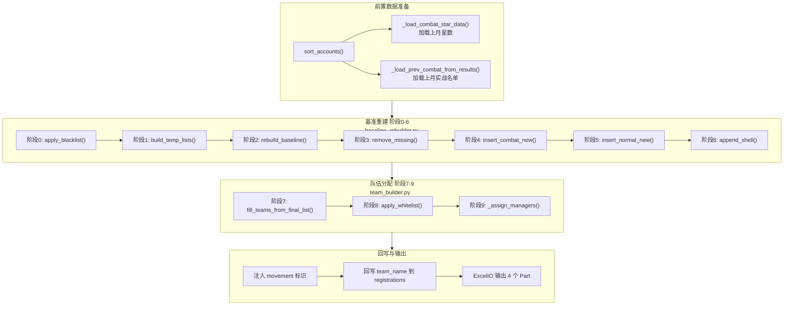
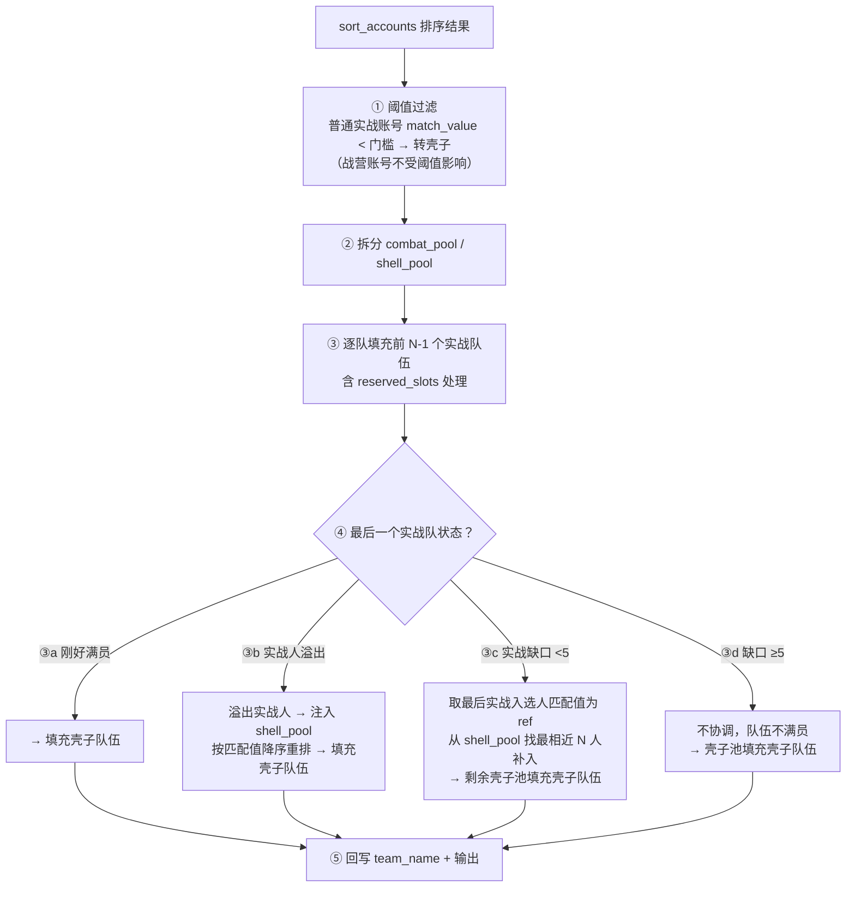

# 03 — 排序全流程与队伍填充

> 版本：v3.0
> 关联代码：`sorter.py`、`rank_score.py`、`baseline_rebuilder.py`、`team_builder.py`、`config.py`

---

## 一、TEAMS 配置体系

### 1.1 TEAMS 数据结构

```python
TEAMS = [
    {"name": "泰坦二",    "clan_tag": "#2QQ",  "category": "combat", "member_count": 15, ...},
    {"name": "冠一 一队",  "clan_tag": "#2GGGGGGG", "category": "combat", ...},
    {"name": "冠二",      "clan_tag": "#2C822CJJC", "category": "combat", ...},
    {"name": "冠三",      "clan_tag": "#2QQQQ2G", "category": "combat", ...},
    {"name": "大一",      "clan_tag": "#UUP2",  "category": "combat", ...},      # team_index=4
    {"name": "大一",      "clan_tag": "#CYYL",  "category": "combat", ...},      # team_index=5
    {"name": "大一",      "clan_tag": "#2CU9JPYU8", "category": "combat", ...},  # team_index=6
    {"name": "大一",      "clan_tag": "#2R9Y209LY", "category": "shell", ...},   # team_index=7
    {"name": "大三",      "clan_tag": "#2JQR89P9G", "category": "shell", ...},   # team_index=8
    {"name": "水一",      "clan_tag": "#2JUJRYVQP", "category": "shell", ...},   # team_index=9
    {"name": "水二",      "clan_tag": "#2GR0LPGVQ", "category": "shell", ...},   # team_index=10
]
```

11 支队伍：7 combat + 4 shell。`team_index` = 列表索引（0~10），**是队伍的唯一身份标识**。

每个 team dict 字段：

| 字段 | 含义 | 唯一性 |
|------|------|--------|
| `name` | 队伍别名 | **不唯一**（4支"大一"） |
| `clan_tag` | COC 部落标签 | 唯一 |
| `category` | `"combat"` / `"shell"` | — |
| `member_count` | 队伍容量 | — |
| `reserved_slots` | 预留空位（>0 留空位 / <0 多招备选） | — |
| `leader` | 领队名称 | — |
| `league_level` | 联赛等级 | — |
| `manager` | 管理员 | 被 `_assign_managers()` 覆盖 |

### 1.2 三个名字概念

| 概念 | 来源 | 唯一性 | 用途 |
|------|------|--------|------|
| **team_index** | `enumerate(teams)` 索引 | **唯一** | 队伍身份标识、分组 key、升降级分组、DB 存储 |
| **team_alias** | config `name` 字段 | 不唯一（4支"大一"） | 人类可读的标签、Excel 展示 |
| **team_name** | COC API 返回 | 唯一 | 真实部落名称、Excel 新增列 |

---

## 二、综合分计算（rank_score）

**代码位置**：`rank_score.py` → `compute_rank_score()`

```
rank_score = 0.6 × 归一化(match_value) + 0.4 × 归一化(history_score)
```

| 因子 | 权重 | 说明 |
|------|------|------|
| `match_value` | 0.6 | 匹配值，归一化到 [0,1] |
| `history_score` | 0.4 | 历史战绩分，归一化到 [0,1] |

归一化基于当月全体报名账号的极值（`match_min/max`, `hist_min/max`），含除零保护。

> 注意：`history_score` 当前占位恒为 0，排序实际只由匹配值决定。

配置项：
```python
SORT_WEIGHTS = {"match_value": 0.6, "history_score": 0.4}
```

---

## 三、设计原文（用户原始需求）

> 以下为用户最初提出的设计方案原文，是整个排序系统的出发点。所有后续设计均围绕此方案展开。

联赛排序规则
这个问题非常复杂，我们详细梳理讨论实战队伍如何排序，我自己可能也没有想清楚，我先说一下想法，你看看有什么问题

首先配置中有两个名单
1）黑名单，在这个名单内的成员一定不会出现在当月所有队伍中。
2）白名单，每一项（name, 队伍标签），强制安排这个成员到队伍，整个名单整体后移

首先我们建立多个临时名单
1）上月所有参加实战联赛的名单1（不想修改打乱上月战斗组数据）
2）这月所有参加实战联赛的名单2（战营名单+报名实战）
3）这月所有参加壳子联赛的名单3（报名壳子）
4）实战缺失名单4，以上月实战名单为基准，上月中哪些成员不在当月实战名单（即当月没有报名、离队、去打壳子的人）
5）实战新增名单5，以上月实战名单为基准，当月增加了哪些新的参加实战的成员
每个名单内部有成员编号，编号从0到n，编号越大战力越弱
6）战营实战新增名单6，是 实战新增名单5 中来自于当月战营中的成员
7）普通营实战新增名单7，是 实战新增名单5 中来自于当月普通营中报名实战的成员
实战新增名单5 = 战营实战新增名单6 + 普通营实战新增名单7

我们建立当月联赛队伍
1）实战队伍1，有N1个实战队伍（根据配置来），队伍的概念不变，但可能是15人或30人，根据配置来确定。队伍的名字和tag是为了展示的，所有队伍从上到小有队伍编号，0到n，编号越大实力越弱
2）壳子队伍2，有N2个壳子队伍（根据配置来），队伍的概念不变，但可能是15人或30人，根据配置来确定。队伍的名字和tag是为了展示的，所有队伍从上到小有队伍编号，0到n，编号越大实力越弱

队伍和成员
1）队伍的概念不变，但可能是15人或30人，根据配置来确定。队伍的名字和tag是为了展示的，所有队伍从上到小有队伍编号，0到n，编号越大实力越弱
2）我们用成员去从上到下填充队伍，尽可能安排强队员给强队伍，贪心算法

我们的输出：
1）建立当月最终联赛成员名单，初始化为空，目标这份名单能够完美填充满当月所有实战队伍，不多不少

如何确定当月最终联赛成员名单
1）在 上月所有参加实战联赛的名单1 中，进行升降级，升降级规则就是现在的规则（根据上月联赛战绩）
2）把 上月所有参加实战联赛的名单1 合入 当月最终联赛成员名单，合入规则很简单，因为此时  当月最终联赛成员名单 为空
3）在 当月最终联赛成员名单 中，筛选出这月没有报名实战或已经离队的成员（可根据实战缺失名单4），在 当月最终联赛成员名单 中删除这些成员。删掉的人员可以记录下来，最后在展示
4）把战营实战新增名单6 和入新的 当月最终联赛成员名单，合并规则如下，默认新增成员从第30编号（写在配置文件中，默认30，即默认插入在第3个队伍）开始连续插入（上月所有参加实战联赛的名单1 内部从0开始编号）
5）把普通营实战新增名单7 和入新的 当月最终联赛成员名单，合并规则如下，在编号44以后，按得分合并，我记得有先有规则（匹配值？得分？）
5）把这月所有参加壳子联赛的名单3 和入新的 当月最终联赛成员名单，
6）处理黑名单，所有在黑名单的成员从当月最终联赛成员名单中删除，完成最终名单

生成联赛队伍名单
1）当月最终联赛成员名单 从上到下填充当月联赛队伍，先填充实战队伍，后填充壳子队伍
2）处理白名单，按照队伍tag，把人员插入到队伍开头，其他所有成员后移

最终在线文档excel展示这些内容
1）格式和现在一样
rank_order	league_type	team_name	movement	player_tag	account_name	player_name	account_type	prev_rank	trophies	match_value	history_score
2）part1 展示 当月最终联赛成员名单，格式和现在一样
3）part2 展示 队伍名单，格式和现在一样（movement信息很多，但我们只展示战绩升降级相关的move，还有 新人 标签）
3）part3 展示 离队情况
4）part4 展示 最终队伍名单，五人一行

---

## 四、12 个关键问题与回答

在设计讨论过程中，提出了 12 个关键问题，以下是每个问题及最终确认的回答。

### 问题 1：名单1 的数据来源

**问题**：名单1（上月所有参加实战联赛的名单）用哪个数据源？
- (A) `registrations` 表 combat 记录
- (B) `results` 表

**回答**：用 `results` 表。`results` 表代表实际打了联赛的人，含战绩数据。

### 问题 2：名单3（壳子名单）的排序基准

**问题**：壳子名单内部排序用什么？

**回答**：用综合分（rank_score）降序排序。

### 问题 3：升降级是在上月队伍分组上做，还是线性列表上做

**问题**：
- (A) 在队伍分组上做
- (B) 在线性列表上做

**回答**：(A) 升降级是在上月队伍分组上做的。

### 问题 4：删除缺失人员后是否使用占位符

**问题**：步骤3 删除缺失人员后，是否用占位符保持编号不变？
- (A) 占位符保持编号
- (B) 直接删除前移

**回答**：(B) 不使用占位符，后续人员前移填补空位，名单紧凑。不使用占位符的原因是，前面高等级队伍，直接放新人不太稳，新人还是要往后放。

### 问题 5："编号30"是原始上月名单位置，还是删除后的位置

**问题**：战营新增人员从编号30开始插入，这个30是：
- (A) 原始上月名单的编号位置
- (B) 删除缺失人员后的名单的编号位置

**回答**：(B) 在删除缺失人员后的名单的编号 30 位置插入。

### 问题 6：普通营新增合并方式

**问题**：普通营新增人员在编号44以后如何合并？
- (A) 按综合分（rank_score）插入到合适位置（二分插入）
- (B) 追加到编号44之后，然后对44以后的部分重新按得分排序

**回答**：(A) 按综合分（rank_score）插入到合适位置。编号默认改为 **45**，第四队基本已经排完战营了，后面都是普通部落成员。

### 问题 7：壳子名单为什么合入同一个最终名单

**问题**：为什么要把壳子名单合入同一个最终名单？

**回答**：用一个线性名单统一从上到下填充所有队伍（先实战后壳子）。

### 问题 8：升降级是配对交换还是单向移动

**问题**：
- (A) 配对交换（当前逻辑）：上队降 1 人，下队必须升 1 人来交换
- (B) 单向移动：上队低星人直接降到下队，不要求下队有人升上来

**回答**：(A) 配对交换（当前逻辑）：上队降 1 人，下队必须升 1 人来交换。

### 问题 9：黑名单执行时机

**问题**：黑名单在什么时候执行？
- (A) 构建名单前过滤
- (B) 填队后删除

**回答**：(A) 黑名单在步骤2之前就过滤（从名单1、名单2、名单3 中都先排除黑名单成员），白名单在步骤8 队伍填充后处理。

### 问题 10：白名单人员没报名怎么办

**问题**：如果白名单人员不在最终名单中（比如没报名），怎么处理？
- (A) 跳过
- (B) 报错

**回答**：如果白名单人员不在最终名单中，也强制插入。白名单主要就是解决这种问题的，可能会手动插入一些占位符，为了自由安排。

### 问题 11：编号是否随升降级变化

**问题**：名单1 的"内部编号"如何确定？升降级后编号是否更新？

**回答**：编号是"位置锚点"，升降级后人员移动到新位置，编号跟随位置变化。

### 问题 12：编号30/45是写死配置还是动态计算

**问题**：编号30和45是写死的，还是根据队伍容量动态计算的？

**回答**：可以写死，最好是读 config 配置，后面可以根据配置调整。这里其实默认战营有50人，前三队基本都是战营成员，所以新的战营成员尽可能插入第三队，新的普通部落实战成员，从第四队开始插入。

### 补充问题 A：阶段5 的"二分插入"范围

**问题**：普通营新增在编号45之后按综合分插入，是：
- (A) 只把名单7 的人逐个二分插入到编号45之后的现有列表中（不动已有人员的相对顺序）
- (B) 把编号45之后的所有人（老兵+战营新增+普通营新增）全部拿出来，按综合分统一重排

**回答**：(A) 只把名单7 的人逐个二分插入到编号45之后的现有列表中（不动已有人员的相对顺序）。

### 补充问题 B：白名单导致超员的处理

**问题**：如果白名单强制插入后某队伍超员，第16人怎么处理？
- (A) 溢出到下一支队伍开头（连锁后移）
- (B) 直接丢弃超出的人
- (C) 从队伍末尾挤出最弱的人到下一队

**回答**：(A) 溢出到下一支队伍开头（连锁后移）。(A) 和 (C) 本质上是一样的，因为 final_list 本身是按实力从上到下排列的，队伍末尾就是最弱的。

### 补充问题 C：上月队伍数量和本月不同怎么办

**问题**：如果上月有 6 支实战队，本月配置了 7 支实战队，怎么处理？

**回答**：阶段2c 升降级完全是在上月名单上做的，这个时候还没有删减成员，不涉及本月信息。上月几支队就在几支队之间升降级。上月队伍数 ≠ 本月队伍数的差异由后续阶段（贪心填充）自然消化：
- final_list 不够填满本月实战队伍 → 最后几支实战队伍不满员
- final_list 超过本月实战队伍总容量 → 溢出的人进入壳子队伍

### 补充问题 D：名单1 的成员顺序如何确定

**问题**：`results` 表没有 rank_order 字段，同一个 team_name 下的成员顺序如何确定？

**回答**：名单1 的排序方式是——先按 `team_name` 在上月 TEAMS 配置中的顺序分组，组内按星数降序。

---

## 五、初次排序分组（sort_accounts）

**代码位置**：`sorter.py` → `sort_accounts()`

当月报名账号被分为三组：

| 分组 | 成员来源 | 排序键 | 合并位置 |
|------|----------|--------|----------|
| `combat_camp` | 战营部落成员（`account_type=combat`） | **奖杯降序**（同杯以综合分 tie-break） | 最前面 |
| `combat_normal` | 普通账号 + 选了"想实战" | **综合分降序** | 紧随战营之后 |
| `shell` | 普通账号 + 未选实战 | **综合分降序** | 排在最后 |

> 战营用奖杯排序（更能体现真实水平），普通账号用综合分排序。

排序后全局从 1 递增分配 `rank_order`。

---

## 六、基准重建全流程（v3.0）

v3.0 核心思路：以**上月实战名单为锚点**做基准重建，而非完全重排后微调。

### 6.1 流程总览

```
报名数据(registrations) 
  → _load_accounts() 加载 + 注入得分/奖杯
  → sort_accounts() 分组+排序
  → build_final_list() 基准重建+升降级（阶段0~6）
  → build_teams() 贪心填充队伍（阶段7~9）
  → arrange_and_export() 导出 Excel
```

### 6.2 整体架构图



### 6.3 临时名单定义

| 名单 | 来源 | 排序规则 |
|------|------|----------|
| **名单1** | `results` 表上月 combat 记录 | 按 `team_index` 分组，组内按星数降序 |
| **名单2** | 当月实战人员 | 保持 `sort_accounts()` 的输出顺序 |
| **名单3** | 当月壳子人员 | 综合分降序 |
| **名单4** | 名单1 - 名单2 | 实战缺失（上月打了但本月没报） |
| **名单5** | 名单2 - 名单1 | 实战新增（本月报了但上月没打） |
| **名单6** | 名单5 ∩ 战营账号 | 战营实战新增 |
| **名单7** | 名单5 - 名单6 | 普通营实战新增，综合分降序 |

名单关系：
```
名单5 = 名单6 + 名单7
名单4 = 名单1 - 名单2
名单5 = 名单2 - 名单1
```

### 6.4 各阶段详解

#### 阶段 0：黑名单过滤（`apply_blacklist`）

黑名单从所有数据源中排除（名单1/2/3 均不含黑名单成员）。

#### 阶段 1：构建 7 个临时名单（`build_temp_lists`）

名单1 按 `team_index` 分组（`team_index=None` 的旧数据回退到 `team_name` 分组）。`prev_team` 字段拼接为 `"{team_index} {team_name}"` 格式以区分同名队伍。

#### 阶段 2：基准重建 + 升降级（`rebuild_baseline`）

**2a. 切分队伍**：将名单1 按上月队伍编号切分为 `prev_slots`。

**2b. 配对交换升降级**（`_apply_promotion_relegation_on_slots`）：

对每对相邻实战队伍执行配对交换：

```
降级方向: 上队 → 下队（星数 ≤ 18，星数最低者优先）
升级方向: 下队 → 上队（星数 = 21满星，星数最高者优先）
不动区域: 19-20 星（安全区），无星数数据
每对上限: 最多交换 2 人
```

配置项：
```python
PROMOTION_RELEGATION_CONFIG = {
    "count": 2,                  # 每对最多交换人数
    "promotion_min_stars": 21,   # 升级门槛（满星）
    "relegation_max_stars": 18,  # 降级门槛
}
```

**2c. 展开为线性列表**：升降级后的 slots 展开为 `final_list`，编号跟随位置变化。

升降级详情见 `04-promotion-relegation.md`。

#### 阶段 3：删除实战缺失（`remove_missing`）

从 `final_list` 中删除名单4 成员。不使用占位符，人员前移，名单紧凑。删除人员记录到 `removed_list`（供 Part3 展示）。

#### 阶段 4：插入战营实战新增（`insert_combat_new`）

在 `final_list` 编号 `NEW_COMBAT_INSERT_START`（默认30，即第3队开头）处连续插入名单6 所有成员，标记 `movement = "新"`。

> 原因：前两支高等级队伍不放新人，新人从第3队起插入。

#### 阶段 5：插入普通营实战新增（`insert_normal_new`）

名单7 全部追加到实战区末尾（壳子区之前）。当前实现为统一追加，不再按综合分二分插入。

> 原因：新人放后面，老人放前面。

#### 阶段 6：追加壳子名单（`append_shell`）

名单3 按综合分降序追加到 `final_list` 末尾。最终 `final_list = [实战区] + [壳子区]`。

---

## 七、贪心填充队伍（team_builder.py）

### 阶段 7：贪心填充（`fill_teams_from_final_list`）

`final_list` 已经是按实力从上到下排好的完整线性名单，直接按 TEAMS 配置顺序依次填充：

```python
pool = list(final_list)
for team_index, team in enumerate(teams):
    capacity = effective_capacity(team)
    members = pool[:capacity]
    pool = pool[capacity:]
    cur_team = f"{team_index} {team['name']}"  # 如 "5 大一"
```

> `effective_capacity = member_count - reserved_slots`

队伍数变化由贪心填充自然消化：
- `final_list` 不够填满 → 最后几支队伍不满员
- `final_list` 超出容量 → 剩余追加到最后一支队伍

### 阶段 8：白名单（`apply_whitelist`）

对白名单每一项 `(account_name, clan_tag)`：
1. 找到 `clan_tag` 对应的队伍
2. 如果已在队伍中 → 移到开头
3. 如果不在名单中 → 创建新成员（`movement = "白名单"`）强制插入开头
4. 超员连锁：末尾溢出到下一支队伍开头

### 阶段 9：管理员分配（`_assign_managers`）

三级优先级：
1. 按 `MANAGER_CANDIDATES` 列表顺序逐个匹配队伍成员
2. 未命中时在队伍中找 `willing_to_manage=True` 的第一个
3. 都没有就留空

---

## 八、配置项汇总

### 排序相关

```python
SORT_WEIGHTS = {"match_value": 0.6, "history_score": 0.4}
PROMOTION_RELEGATION_CONFIG = {"count": 2, "promotion_min_stars": 21, "relegation_max_stars": 18}
NEW_COMBAT_INSERT_START = 30     # 战营新增插入位置
NEW_NORMAL_INSERT_START = 45     # 已废弃（改为追加到实战末尾）
```

### 黑白名单

```python
BLACK_LIST = set()                                      # 阶段0过滤
WHITE_LIST = [("10°C✨Godwin 2", "#2QQ")]               # 阶段8强制插入
EXCLUDED_CAMP_NAMES = {"Pluto2QQ", "落花归尘", ...}     # 双阶段过滤
```

### 编号与队伍的映射关系

以当前配置（7支实战队伍）为例：

```
泰坦二:   15人 → 编号 0~14    (第1队)
冠一 一队: 15人 → 编号 15~29   (第2队)
冠二:     15人 → 编号 30~44   (第3队)  ← 战营新增插入点(30)
冠三:     15人 → 编号 45~59   (第4队)  ← 普通营新增插入点(45)
大一_A:   15人 → 编号 60~74   (第5队)
大一_B:   30人 → 编号 75~104  (第6队)
大一_C:   30人 → 编号 105~134 (第7队)
```

---

## 九、Excel 输出结构

输出 sheet 包含 4 个 Part：

| Part | 内容 | 说明 |
|------|------|------|
| Part1 | 排序名单（含白名单） | 完整名单 |
| Part2 | 队伍明细（逐队展示） | 队伍分配明细 |
| Part3 | 离队/缺失/黑名单 | 名单4 + 黑名单命中 |
| Part4 | 联赛名单排布网格（5列） | 见 `05-roster-part4.md` |

**ARRANGEMENT_OUTPUT_HEADERS**：
```
rank_order, league_type, cur_team, prev_team, movement,
player_tag, account_name, player_name, account_type,
prev_rank, trophies, match_value, history_score
```

### movement 标识

| 标识 | 含义 |
|------|------|
| `↑升级(N★)` | 升级（满星21升到上一队） |
| `↓降级(N★)` | 降级（≤18星降到下一队） |
| `新` | 新人（当月新增成员） |
| `↓转壳` | 转去打壳子 |
| 无 | 安全区（19-20星）或无星数数据 |

---

## 十、cur_team 格式

当前格式：`"{team_index} {team_alias} {coc_name}"`
例：`"5 大一 苍穹·泰坦二"`

registrations.team_name 回写格式：`"{team_index} {team_alias} {coc_name} {clan_tag}"`

---

## 十一、边界场景

| 场景 | 处理 |
|------|------|
| 本月队多 | final_list 不够填满，最后几支队伍不满员 |
| 本月队少 | final_list 超出实战容量，溢出的人进入壳子队伍 |
| 冷启动（无上月数据） | 名单1 为空，全部由名单2/3 的新人构成 |
| 无星数数据 | 跳过升降级，名单1 直接展开 |
| 白名单超员 | 连锁后移，直到最后一支壳子队伍 |
| 编号插入点超出长度 | 追加到末尾 |

---

## 十二、模块职责

| 文件 | 职责 | 类型 |
|------|------|------|
| `sorter.py` | 综合分计算 + 初次排序分组 | 纯函数 |
| `rank_score.py` | 综合分公式 | 纯函数 |
| `baseline_rebuilder.py` | 阶段 0-6：基准重建+升降级+增删 | 纯函数 |
| `promotion.py` | 升降级配对交换算法 | 纯函数 |
| `team_builder.py` | 阶段 7-9：贪心填充+白名单+管理员 | 纯函数 |
| `team_filler.py` | 旧版队伍填充（保留兼容） | 纯函数 |
| `roster.py` | 编排主控 | 编排器 |
| `config.py` | 所有配置项 | 配置 |

---

## 十三、关键设计决策总结

| 决策点 | 选择 | 理由 |
|--------|------|------|
| 名单1 来源 | `results` 表 | 代表实际打了联赛的人，含战绩 |
| 名单1 组内排序 | 按星数降序 | 星数高=实力强 |
| 名单1 分组键 | `team_index` 为主 | 避免重名队伍混组 |
| 战营排序键 | 奖杯降序 | 奖杯更能体现战营真实水平 |
| 普通营排序键 | 综合分降序 | 匹配值+历史战绩更公平 |
| 升降级方式 | 配对交换 | 稳定 |
| 升降级星数门槛 | 升级21/降级18 | 19-20星安全区 |
| 删除缺失 | 不用占位符，前移 | 高等级队不放新人 |
| 战营新增插入点 | 编号30（第3队） | 前两队不放新人 |
| 普通营新增插入 | 追加到实战区末尾 | 新人放后面 |
| 队伍数变化 | 不特殊处理 | 贪心填充自然消化 |
| 黑名单 | 前置过滤 | 最早排除 |
| 白名单 | 填队后处理 | 强制插入，溢出连锁 |

---

## 十四、设计推演：为什么从"完全重排"改为"基准重建"

### 旧方案的问题（v2.x 完全重排 + 升降级微调）

v2.x 的排序流程是：`sort_accounts()` 完全重排 → `fill_teams()` 贪心填充 → `apply_promotion_relegation()` 局部微调。

核心矛盾：
- 完全重排导致每月排名**大幅波动**：上月排名第 5 的人本月可能掉到第 30，队伍归属完全打乱
- 升降级只在 `fill_teams` 后的队伍级别上做局部交换，无法处理"上月打了实战但本月没报名"的人员流失
- 新人按综合分插入，没有考虑"高等级队伍不放新人"的业务约束
- 战营和普通营的新增人员混在一起，无法区分处理

### 新方案的设计思路（v3.0 基准重建）

核心思路：**以上月实战名单为锚点**，在上面做"增删改"——保持老兵位置相对稳定，只在特定位置插入新人。

关键改进：
- **稳定性**：老兵除非升降级或未报名，否则位置不变
- **分层插入**：战营新人从第3队（编号30）插入，普通营新人追加到实战末尾
- **明确语义**：7 个临时名单（名单1~7）清晰定义了"缺失"和"新增"
- **黑/白名单**：前置过滤 + 后置强制插入，两步处理

### 新旧流程对照

| 阶段 | 旧流程（v2.x） | 新流程（v3.0） |
|------|----------------|----------------|
| 排序 | `sort_accounts` 完全重排 | 构建名单 + 基准重建 |
| 填队 | `fill_teams` 完全重排 | 贪心填充线性名单 |
| 升降级 | `apply_promotion_relegation` 局部微调 | 阶段2 在上月分组上配对交换 |
| 黑名单 | 无 | 阶段0 前置过滤 |
| 白名单 | 无 | 阶段8 填队后强制插入 |
| 新人安排 | 按综合分填空位 | 战营从编号30插入，普通营追加到实战末尾 |

---

## 十五、旧版队伍填充详解（team_filler.py，v2.3）

> v3.0 中 `team_filler.py` 已被 `team_builder.py` 替代，但保留兼容。以下记录旧版算法供历史参考。

### 队伍配置结构（TEAMS）

```python
{
    "name": "实战一队",          # 队伍名称
    "clan_tag": "#XXXXX",        # 部落标签
    "leader": "",                # 领队
    "member_count": 15,          # 标准人数（15 或 30）
    "league_level": "",          # 联赛等级
    "manager": "xxx",            # 管理员
    "category": "combat",        # combat=实战 / shell=壳子
    "reserved_slots": 0,         # >0 留空位 / 0 不预留 / <0 多招备选
}
```

### 分配流程



### 阈值过滤例外

战营账号（`account_type=combat`）不受 `COMBAT_MIN_MATCH_VALUE` 影响，始终留在实战池中——即使 `match_value` 为空（未报名自动纳入）或低于门槛也不会被转壳子。这样保证战营成员优先进入实战队伍。

### 预留位置（reserved_slots）语义

| reserved_slots | 实际容量 | 说明 |
|----------------|---------|------|
| `0` | `member_count` | 标准人数，不预留 |
| `>0`（如 2） | `member_count - 2` | 留空位给后续手动安排 |
| `<0`（如 -2） | `member_count + 2` | 多招备选，超出标准人数 |

### 协调匹配值相近成员（③c）

当最后一个实战队缺口 <5 时，取最后一个实战入选者的 `match_value` 作为参考值，从壳子池中选取差值绝对值最小的 N 人补入（`_pick_closest_by_match_value`），补入者 `league_type` 更新为 combat。

### 函数签名

```python
def fill_teams(
    ordered: list[dict],       # sort_accounts 输出（含 league_type/rank_order）
    teams: list[dict],         # TEAMS 配置
    threshold: float | None,   # COMBAT_MIN_MATCH_VALUE
) -> tuple[list[dict], list[dict]]:
    """返回 (ordered_with_team, team_results)"""
```
