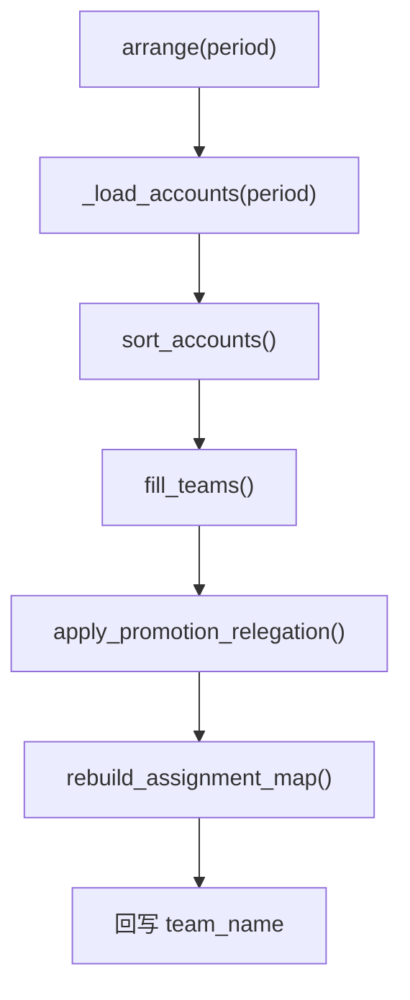

# 04 — 实战队伍升降级系统

> 版本：v2.0
> 日期：2026-07-30
> 状态：已实现，135 测试全绿
> 关联代码：`promotion.py`、`roster.py`

---

## 一、问题背景

### 核心矛盾

不同队伍的比赛强度不同，**三星率不可直接横向比较**。无法将所有实战队员的三星率拉通统一排序。

### 解法：升降级制度

根据**上月联赛实际表现**，在相邻队伍之间执行人员交换：
- 上队星数低的 → 降级到下队
- 下队满星的 → 升级到上队

---

## 二、月份语义

```
CWL 时间线（以 8 月联赛为例）：

  7/1-7    7 月 CWL 战争 → 产生星数
  7/8-31   为 8 月 CWL 报名 → 产生报名数据
  8/1-7    8 月 CWL 战争（本次编排的目标）
```

| 操作 | period 含义 | 示例 |
|------|------------|------|
| `import-reg` | 联赛月份 | `--period 2026-08` |
| `arrange` | 联赛月份 | `--period 2026-08` |
| `fetch_cwl_data.py` | CWL 实际发生月 | `--period 2026-07` |

```
arrange("2026-08")                ← 联赛月份
     ├── registrations WHERE period="2026-08"   读报名数据
     ├── cwl_period = "2026-07"                 ← 上月 CWL
     │     └── _load_combat_star_data("2026-07")  读星数数据
```

---

## 三、算法详述

### 输入

| 参数 | 类型 | 说明 |
|------|------|------|
| `team_results` | `list[dict]` | `fill_teams()` 的输出 |
| `star_data` | `dict[str, int]` | `{account_name: total_stars}` |
| `config` | `dict` | `PROMOTION_RELEGATION_CONFIG` |

### 步骤

```
对于每对相邻实战队伍 (Team_Higher, Team_Lower)，自上而下依次处理：

步骤 1：识别实战队伍
  从 team_results 中筛选 category=="combat" 的队伍
  按配置顺序，从第 0 队到第 n-2 队，依次与下一队配对处理

步骤 2：筛选降级候选（来自 Team_Higher）
  条件：有星数数据 + total_stars ≤ 18 + 不在 moved 集合中
  按 total_stars 升序排列，取前 count 人

步骤 3：筛选升级候选（来自 Team_Lower）
  条件：有星数数据 + total_stars ≥ 21 + 不在 moved 集合中
  按 total_stars 降序排列，取前 count 人

步骤 4：配对交换
  第 1 降级 ↔ 第 1 升级，第 2 降级 ↔ 第 2 升级
  某侧候选不足，有多少换多少
  已移动的人加入 moved 集合
```

### 函数签名

```python
def apply_promotion_relegation(
    team_results: list[dict],
    star_data: dict[str, int],
    config: dict | None = None,
) -> tuple[list[dict], list[dict]]:
    """返回 (调整后的 team_results, 升降级日志列表)。"""

def rebuild_assignment_map(
    ordered_with_team: list[dict],
    team_results: list[dict],
) -> None:
    """升降级交换后重建 ordered_with_team 的 team_name 映射。"""
```

---

## 四、配置参数

```python
PROMOTION_RELEGATION_CONFIG = {
    "count": 2,                  # 每对相邻队伍最多交换人数
    "promotion_min_stars": 21,   # 升级门槛：≥21星（满星）
    "relegation_max_stars": 18,  # 降级门槛：≤18星
}
```

**设计理由**：
- 升级门槛 21/21：避免"接近满星"的人升到更强队后表现断崖下跌
- 降级门槛 ≤18/21：给 19-20 星留出安全区，防一两次失误即降级
- 星数离散（0-21 整数），天然有 ≥3 星的 gap

---

## 五、设计原则

1. **离散星数比较**：总星数 0-21，用整数直接比较
2. **只在边界流动**：只动每队的前几名和后几名，大部分人员稳定
3. **满星才能升**：升级门槛严格限定 21/21
4. **低于门槛才降**：≤ 18/21 才降级，19-20 星安全区
5. **每人每月最多跳 1 级**：`moved` 集合阻止同轮重复移动
6. **配置驱动**：所有阈值在 `config.py` 中可调
7. **纯函数设计**：`promotion.py` 无 IO，便于测试

---

## 六、数据流与架构



### roster.py 集成

```python
def arrange(self, period, ...):
    accounts = self._load_accounts(period)
    ordered = sort_accounts(accounts, ...)
    ordered_with_team, team_results = fill_teams(ordered, ...)
    
    # 升降级（星数从上月 CWL 加载：联赛月 -1）
    cwl_period = _prev_period(period)
    star_data = star_data or self._load_combat_star_data(cwl_period)
    team_results, movements = apply_promotion_relegation(team_results, star_data, ...)
    rebuild_assignment_map(ordered_with_team, team_results)
    ...
```

---

## 七、冷启动方案

### 数据准备

| 步骤 | 内容 | 产出 |
|------|------|------|
| ① COC API 采集 | 对 6 支实战队伍调 leaguegroup API | 28 warTag/队 |
| ② 拉明细 | 逐 warTag 调 clanwarleagues/wars/{warTag} | 每人每场星数 |
| ③ 导出 JSON | `fetch_cwl_data.py` | `data/cwl_YYYYMM/*.json` |
| ④ 战营手工补录 | 手动提供 tag+星数 | `泰坦二_战营.json` |

### 执行

```bash
# 拉取 CWL 战绩 JSON
python scripts/fetch_cwl_data.py

# 冷启动编排（用 JSON 替代 DB 星数）
python scripts/cold_start_arrange.py --period 2026-08 -o 2026-08名单.xlsx
```

---

## 八、测试覆盖

测试文件：`tests/cwl_registration/test_promotion.py`（12 个用例）

| # | 场景 | 预期 |
|---|------|------|
| 1 | 基本升降级 | 2 升 2 降，4 条日志 |
| 2 | 升级候选不足 | 1 升 1 降 |
| 3 | 降级候选不足 | 1 升 1 降 |
| 4 | 无候选 | 0 日志 |
| 5 | 安全区不动（19 星） | 不在候选 |
| 6 | 无星数数据跳过 | 不参与 |
| 7 | moved 集合保护 | 每人最多跳 1 级 |
| 8 | 3 支实战队级联 | 逐对处理 |
| 9 | 空队伍 | 无异常 |
| 10 | 仅壳子队伍 | 返回原结果 |
| 11 | 自定义配置 | 阈值可覆盖 |
| 12 | rebuild_assignment_map | team_name 正确回写 |

完整测试套件：**135 passed**

---

## 九、COC API 数据采集

### API 端点

| 端点 | warTag | 每人星数 | 可用时机 |
|------|--------|----------|----------|
| `/clans/{tag}/currentwar/leaguegroup` | ✅ | — | CWL 周 + 结束后保留期 |
| `/clans/{tag}/warlog` | ❌ | ❌ | 始终可用 |
| `/clanwarleagues/wars/{warTag}` | — | ✅ | warTag 有效期内 |

### 采集链路

```
leaguegroup → warTags[28] → clanwarleagues/wars/{warTag} → per-player stars
```

### 关键发现

1. **leaguegroup 在结束后仍可查**（state="ended"），但新赛季开始后可能失效
2. **warlog 不含 warTag**，事后无法通过 warlog 回溯 CWL 每人明细
3. **`attacksPerMember=1`** 可在 warlog 中区分 CWL 和常规 war
4. **战营 #2QQ 不参加 CWL**，leaguegroup 返回 404，需手工录入

---

## 十、运行流程

### 每月完整流程（以 8 月联赛为例）

```bash
# 步骤 1：导入报名表
python cli.py import-reg 8月报名表.xlsx --period 2026-08

# 步骤 2：编排 + 导出（升降级自动生效）
python cli.py arrange --period 2026-08 -o 2026-08名单.xlsx
```

### 控制台输出示例

```
[升降级] 本月人员调整：
  小小龙 (16星) ↓降级: 泰坦二 → 冠一 一队
  ...
=== 升降级汇总 ===
升级 8 人, 降级 8 人, 共 16 条变动
```

---

## 十一、后续演进

- **阶段二**（3-4 个月后）：计算每队难度系数，个人校准三星率融入 `history_score.py`
- **阶段三**（长期）：引入 Elo / Glicko 能力分体系

---

## 附录：术语表

| 术语 | 说明 |
|------|------|
| combat team | 实战队伍，参加 CWL 联赛 |
| shell team | 壳子队伍，不参加 CWL |
| 联赛月份 | `arrange` / `import-reg` 的参数 |
| CWL 实际发生月 | `fetch_cwl_data.py` 的参数 |
| total_stars | 一个玩家在一个月 CWL 中获得的总星数（最大 21） |
| promotion | 升级：从低强度队升到高强度队 |
| relegation | 降级：从高强度队降到低强度队 |
| cold start | 冷启动：首次运行，用 JSON 数据替代 DB 星数 |
| moved set | 已移动账号集合，保证同轮内每人最多跳 1 级 |
