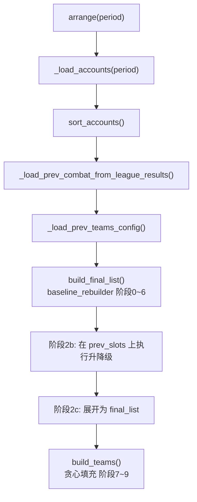

# 04 — 实战队伍升降级系统

> 版本：v3.1（基准重建内嵌升降级 + 稳定重排保护）
> 日期：2026-09-08
> 状态：已实现
> 关联代码：`baseline_rebuilder.py`、`roster.py`

---

## 一、问题背景

### 核心矛盾

不同队伍的比赛强度不同，**三星率不可直接横向比较**。无法将所有实战队员的三星率拉通统一排序。

### 解法：升降级制度

根据**上月联赛实际表现**，在相邻队伍之间执行人员交换：
- 上队星数低的 → 降级到下队
- 下队满星的 → 升级到上队

---

## 二、月份语义

```
CWL 时间线（以 8 月联赛为例）：

  7/1-7    7 月 CWL 战争 → 产生星数
  7/8-31   为 8 月 CWL 报名 → 产生报名数据
  8/1-7    8 月 CWL 战争（本次编排的目标）
```

| 操作 | period 含义 | 示例 |
|------|------------|------|
| `import-reg` | 联赛月份 | `--period 2026-08` |
| `arrange` | 联赛月份 | `--period 2026-08` |
| `fetch_cwl_data.py` | CWL 实际发生月 | `--period 2026-07` |

```
arrange("2026-08")                ← 联赛月份
     ├── registrations WHERE period="2026-08"   读报名数据
     ├── cwl_period = "2026-07"                 ← 上月 CWL
     │     └── _load_combat_star_data("2026-07")  读星数数据
```

---

## 三、算法详述

### 输入

| 参数 | 类型 | 说明 |
|------|------|------|
| `prev_slots` | `list[list[dict]]` | 上月实战队伍分组（`baseline_rebuilder` 阶段 2a 切分） |
| `star_data` | `dict[str, int]` | `{account_name: total_stars}` |
| `config` | `dict` | `PROMOTION_RELEGATION_CONFIG` |

### 步骤（v3.1 基准重建阶段 2b）

```
在 baseline_rebuilder.py 的阶段 2b 中，对每对相邻实战队伍执行配对交换：

步骤 1：识别相邻实战队伍对
  从 prev_slots 中按顺序取相邻队伍 (Team_Higher, Team_Lower)

步骤 2：筛选降级候选（来自 Team_Higher）
  条件：有星数/进攻数据 + 得星率 ≤ 18/21（85.714%）+ 不在 moved 集合中
  按得星率升序排列，同率沿用上月队内顺序，取前 count 人

步骤 3：筛选升级候选（来自 Team_Lower）
  条件：有星数/进攻数据 + 得星率 = 100% + 不在 moved 集合中
  按得星率降序排列，同率沿用上月队内顺序，取前 count 人

步骤 4：配对交换
  第 1 降级 ↔ 第 1 升级，第 2 降级 ↔ 第 2 升级
  某侧候选不足，有多少换多少
  已移动的人加入 moved 集合
```

每支队伍的满星值取该队成员最大进攻次数 × 3。五轮队伍按 15 星计算，因此 12/15 及以下降级、13/15 处于安全区、15/15 才能升级；七轮队伍仍等价于原来的 ≤18 星降级、21 星升级。使用队伍轮数而非个人进攻次数，避免漏打一场的人被误算成满星率 100%。旧战绩没有进攻次数字段时，兼容回退到 21/18 星绝对门槛。

这里的“上队队尾/下队队首”沿用现有实现的含义：分别在上队、下队中按得星率筛选最弱/最强的合格成员，而不是无条件取数组的最后/第一个元素；候选数量和 `moved` 规则均不变。

升降级日志同时把目标队伍写入成员内部元数据，供后续删除、新增和白名单阶段校验。该元数据不改变 Excel 展示格式。

### 候选范围与缺席成员

候选来自上月实际参赛的 `prev_slots`。升降级评价上月表现，不要求候选本月仍报名实战。
阶段 2b 配对时尚未执行阶段 3 的本月缺失删除，这是确定的业务顺序：

1. 下队满星成员先与上队低于门槛成员完成一组配对交换；
2. 如果该满星成员本月缺席，阶段 3 再将其从最终名单删除；
3. 与其配对的上队成员仍保持降级，产生的空位由后续稳定填充补齐。

上队降级候选本月缺席时也相同：该成员随后被删除，但与其配对的下队满星成员保留升级结果。
因此不要用本月报名、离队或转壳状态预先过滤升降级候选。

同表现候选沿用上月最终 `rank_order` 所代表的队内顺序。每对相邻队伍最多交换 `count` 人
（当前为 2），实际交换数为双方合格候选人数的较小值；下队没有满星候选，就不执行对应降级。

### 后续名单调整的统一保护规则

升降级完成后，名单仍会发生缺失删除、新增插入、壳子补位和白名单强制插入。所有这些操作都采用稳定重排：普通成员保持相对顺序并吸收前移/后移。

约束如下：

```text
升级成员：最终不能低于升级目标队伍；可以继续进入更强队伍。
降级成员：最终不能回到原来的更强队伍；可以继续进入更弱队伍。
```

- 删除缺失时，升级成员不保护，可以随整体向上；降级成员不得被补回原队。
- 战营新增（位置 30）和普通营新增（实战区末尾）时，若升级成员被推到目标以下，执行局部稳定修复；降级成员不保护，可以继续下移。
- 白名单最后执行但业务优先级最高。先尽量通过普通成员级联同时满足白名单和升降级约束；确实无法同时满足时，以白名单目标为准并打印告警日志。
- 队伍总容量不足时沿用现有策略，由最后配置队伍吸收超员，并打印容量告警；若受保护边界仍无法满足，额外打印边界冲突告警。
- 最终展示仍使用原有的 `↑升级` / `↓降级`、`新` 等标识，不展示内部补位或兜底移动。

### 函数签名

```python
# baseline_rebuilder.py（主流程阶段 2b 的纯函数）
def _apply_promotion_relegation_on_slots(
    prev_slots: list[list[dict]],
    star_data: dict[str, int],
    config: dict | None = None,
) -> tuple[list[list[dict]], list[dict]]:
    """在队伍分组(slots)上执行配对交换升降级。
    返回 (调整后的 slots, 升降级日志列表)。"""
```

---

## 四、配置参数

```python
PROMOTION_RELEGATION_CONFIG = {
    "count": 2,                  # 每对相邻队伍最多交换人数
    "promotion_min_rate": 1.0,   # 升级门槛：满星率 100%
    "relegation_max_rate": 18 / 21,
    "promotion_min_stars": 21,   # 无进攻次数的旧数据兼容值
    "relegation_max_stars": 18,
}
```

**设计理由**：
- 升级门槛 100%：避免"接近满星"的人升到更强队后表现断崖下跌
- 降级门槛 ≤18/21：七轮时给 19-20 星留出安全区，五轮时 13-14 星安全
- 按队伍实际轮数换算，使五轮和七轮队伍可使用同一比例规则

---

## 五、设计原则

1. **按队伍轮数归一化**：总星数除以队伍实际满星值后比较
2. **只在边界流动**：只动每队的前几名和后几名，大部分人员稳定
3. **满星才能升**：升级门槛严格限定 100%
4. **低于门槛才降**：得星率 ≤ 18/21 才降级
5. **每人每月最多跳 1 级**：`moved` 集合阻止同轮重复移动
6. **配置驱动**：所有阈值在 `config/settings.yaml` 中可调
7. **纯函数设计**：`baseline_rebuilder.py` 的升降级阶段无 IO，便于测试

---

## 六、数据流与架构（v3.1 基准重建内嵌）


```mermaid
flowchart TD
    A["arrange(period)"] --> B["_load_accounts(period)"]
    B --> C["sort_accounts()"]
    C --> D["_load_prev_combat_from_league_results()"]
    D --> E["_load_prev_teams_config()"]
    E --> F["build_final_list()<br/>baseline_rebuilder 阶段0~6"]
    F --> G["阶段2b: 在 prev_slots 上执行升降级"]
    G --> H["阶段2c: 展开为 final_list"]
    H --> I["build_teams()<br/>贪心填充 阶段7~9"]
```

### roster.py 集成（v3.1）

```python
def arrange(self, period, ...):
    accounts = self._load_accounts(period)
    ordered = sort_accounts(accounts, ...)
    
    # 读上月数据
    prev_combat_regs = self._load_prev_combat_from_league_results(prev_period)
    star_data = self._load_combat_star_data(prev_period)
    prev_teams_config = self._load_prev_teams_config(prev_period)
    
    # 基准重建（阶段0~6，升降级内嵌在阶段2b）
    final_list, removed_list, movements, black_hits = build_final_list(
        accounts, prev_combat_regs, star_data, teams, ...
    )
    
    # 贪心填充（阶段7~9）
    team_results = build_teams(final_list, teams, ...)
    # 队伍切分和白名单后再次校验/修复升降级边界；冲突打印告警
    ...
```

---

## 七、冷启动方案

### 数据准备

| 步骤 | 内容 | 产出 |
|------|------|------|
| ① COC API 采集 | 对 6 支实战队伍调 leaguegroup API | 28 warTag/队 |
| ② 拉明细 | 逐 warTag 调 clanwarleagues/wars/{warTag} | 每人每场星数 |
| ③ 导出 JSON | `fetch_cwl_data.py` | `data/cwl_YYYYMM/*.json` |
| ④ 战营手工补录 | 手动提供 tag+星数 | `泰坦二_战营.json` |

### 执行

```bash
# 拉取 CWL 战绩 JSON
python scripts/fetch_cwl_data.py

# 冷启动编排（用 JSON 替代 DB 星数）
python scripts/cold_start_arrange.py --period 2026-08 -o 2026-08名单.xlsx
```

---

## 八、测试覆盖

测试文件：`tests/cwl_registration/test_baseline_guards.py`（稳定重排与升降级保护用例）

| # | 场景 | 预期 |
|---|------|------|
| 1 | 基本升降级 | 2 升 2 降，4 条日志 |
| 2 | 升级候选不足 | 1 升 1 降 |
| 3 | 降级候选不足 | 1 升 1 降 |
| 4 | 无候选 | 0 日志 |
| 5 | 安全区不动（19 星） | 不在候选 |
| 6 | 无星数数据跳过 | 不参与 |
| 7 | moved 集合保护 | 每人最多跳 1 级 |
| 8 | 3 支实战队级联 | 逐对处理 |
| 9 | 空队伍 | 无异常 |
| 10 | 仅壳子队伍 | 返回原结果 |
| 11 | 自定义配置 | 阈值可覆盖 |
| 12 | 升降级后映射重建 | 数据正确回写 |
| 13 | 五轮队伍比例换算 | 12/15 降级，13/15 安全 |
| 14 | 旧数据无进攻次数 | 回退到 21/18 星绝对门槛 |

现有升降级测试覆盖候选不足、安全区、无星数、级联和配置覆盖；新增稳定重排测试覆盖缺失补位、战营/普通营新增升级兜底、强队空槽降级保护，以及白名单冲突告警。

---

## 九、COC API 数据采集

### API 端点

| 端点 | warTag | 每人星数 | 可用时机 |
|------|--------|----------|----------|
| `/clans/{tag}/currentwar/leaguegroup` | ✅ | — | CWL 周 + 结束后保留期 |
| `/clans/{tag}/warlog` | ❌ | ❌ | 始终可用 |
| `/clanwarleagues/wars/{warTag}` | — | ✅ | warTag 有效期内 |

### 采集链路

```
leaguegroup → warTags[28] → clanwarleagues/wars/{warTag} → per-player stars
```

### 关键发现

1. **leaguegroup 在结束后仍可查**（state="ended"），但新赛季开始后可能失效
2. **warlog 不含 warTag**，事后无法通过 warlog 回溯 CWL 每人明细
3. **`attacksPerMember=1`** 可在 warlog 中区分 CWL 和常规 war
4. **战营 #2QQ 不参加 CWL**，leaguegroup 返回 404，需手工录入

---

## 十、运行流程

### 每月完整流程（以 8 月联赛为例）

```bash
# 步骤 1：导入报名表
python cli.py import-reg 8月报名表.xlsx --period 2026-08

# 步骤 2：编排 + 导出（升降级在 build_final_list 阶段2b 自动生效）
python cli.py arrange --period 2026-08 -o 2026-08名单.xlsx
```

### 控制台输出示例

```
[升降级] 本月人员调整：
  小小龙 (16星) ↓降级: 泰坦二 → 冠一 一队
  ...
=== 升降级汇总 ===
升级 8 人, 降级 8 人, 共 16 条变动
```

---

## 十一、后续演进

- **阶段二**（3-4 个月后）：计算每队难度系数，个人校准三星率融入 `history_score.py`
- **阶段三**（长期）：引入 Elo / Glicko 能力分体系

---

## 附录：术语表

| 术语 | 说明 |
|------|------|
| combat team | 实战队伍，参加 CWL 联赛 |
| shell team | 壳子队伍，不参加 CWL |
| 联赛月份 | `arrange` / `import-reg` 的参数 |
| CWL 实际发生月 | `fetch_cwl_data.py` 的参数 |
| total_stars | 一个玩家在一个月 CWL 中获得的总星数（最大 21） |
| promotion | 升级：从低强度队升到高强度队 |
| relegation | 降级：从高强度队降到低强度队 |
| cold start | 冷启动：首次运行，用 JSON 数据替代 DB 星数 |
| moved set | 已移动账号集合，保证同轮内每人最多跳 1 级 |
