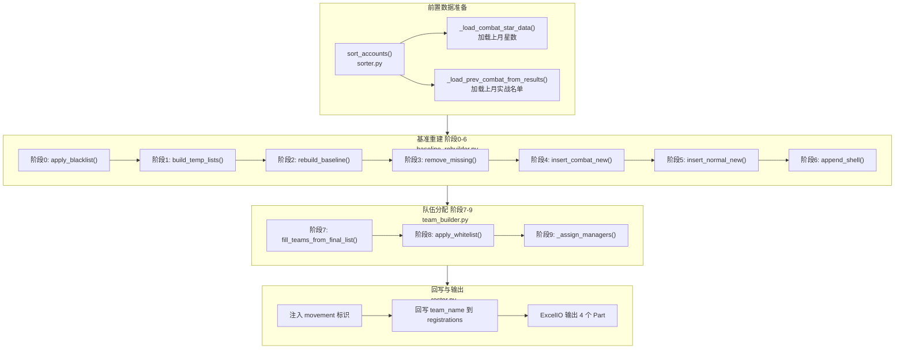

# 实战队伍排序规则设计文档

> **版本**: v3.0
> **日期**: 2026-07-31
> **状态**: 方案已确认，待实施

---

## 目录

0. [前置概念：排序基础](#0-前置概念排序基础)
1. [设计原文](#1-设计原文)
2. [12 个关键问题与回答](#2-12-个关键问题与回答)
3. [最终方案](#3-最终方案)
4. [配置项](#4-配置项)
5. [完整流程](#5-完整流程)
6. [数据流对照](#6-数据流对照)
7. [输出格式](#7-输出格式)
8. [关键设计决策总结](#8-关键设计决策总结)
9. [边界场景](#9-边界场景)
10. [测试要点](#10-测试要点)

---

## 0. 前置概念：排序基础

在进入阶段流程之前，先理解系统中三个核心排序概念。

### 0.1 综合分（rank_score）计算

**代码位置**：`rank_score.py` → `compute_rank_score()`

```python
rank_score = 0.6 × 归一化(match_value) + 0.4 × 归一化(history_score)
```

| 因子 | 权重 | 说明 |
|------|------|------|
| `match_value` | 0.6 | 匹配值，归一化到 [0,1] |
| `history_score` | 0.4 | 历史战绩分，归一化到 [0,1] |

归一化基于当月全体报名账号的极值（`match_min/max`, `hist_min/max`），含除零保护。

配置项 `SORT_WEIGHTS`（`config.py`）：
```python
SORT_WEIGHTS = {"match_value": 0.6, "history_score": 0.4}
```

### 0.2 初次排序分组（sort_accounts）

**代码位置**：`sorter.py` → `sort_accounts()`

当月报名账号被分为三组，按不同键排序后合并：

| 分组 | 成员来源 | 排序键 | 合并位置 |
|------|----------|--------|----------|
| `combat_camp` | 战营部落成员（`account_type=combat`） | **奖杯降序**（`camp_sort_key`） | 最前面 |
| `combat_normal` | 普通账号 + 选了"想实战" | **综合分降序** | 紧随战营之后 |
| `shell` | 普通账号 + 未选实战 | **综合分降序** | 排在最后 |

> **为什么战营用奖杯排序？** 战营账号实力更强，奖杯更能体现真实水平；普通账号用综合分（匹配值+历史战绩）排序更公平。

排序后全局从 1 递增分配 `rank_order`。此阶段还会回填 `league_type`（combat/shell）到每个账号。

### 0.3 关键字段说明

| 字段 | 含义 | 写入时机 | 读取时机 |
|------|------|----------|----------|
| `rank_order` | 本月全局位次 | `sort_accounts()` 排序后分配 | 展示、下月反查为 `prev_rank` |
| `prev_rank` | 上月全局位次 | 报名导入时从下月 registrations 反查 | `adjust_camp_by_prev_rank()` 预留接口 |
| `team_name` | 队伍中文名（展示用） | 编排完成 `arrange()` 回写 | 展示用（不再作为冷启动回退数据源） |
| `team_index` | 队伍在 TEAMS 配置中的顺序索引（唯一身份标识） | 队伍填充阶段写入 | 升降级分组 key（避免重名混组） |

> `team_name` 可能重名（如 3 支"大一"），`team_index` 才是唯一身份标识。升降级分组和队伍匹配都使用 `team_index`。

### 0.4 TEAMS 配置与队伍编号

**代码位置**：`config.py` → `TEAMS`

队伍按配置列表顺序从上到下编号（`team_index = 0, 1, 2, ...`），编号越大实力越弱。填充时按此顺序贪心分配。

当前配置（11 支队伍）：

```
实战队伍（7支）:
  [0] 泰坦二    15人
  [1] 冠一 一队  15人
  [2] 冠二      15人    ← 战营新增插入点（编号30，第3队开头）
  [3] 冠三      15人    ← 普通营新增插入点（编号45，第4队开头）
  [4] 大一      15人
  [5] 大一      30人
  [6] 大一      30人

壳子队伍（4支）:
  [7] 大一      30人
  [8] 大三      30人
  [9] 水一      30人
  [10] 水二     30人
```

---

## 1. 设计原文

> 以下为用户最初提出的设计方案原文，作为方案的出发点。

联赛排序规则
这个问题非常复杂，我们详细梳理讨论实战队伍如何排序，我自己可能也没有想清楚，我先说一下想法，你看看有什么问题

首先配置中有两个名单
1）黑名单，在这个名单内的成员一定不会出现在当月所有队伍中。
2）白名单，每一项（name, 队伍标签），强制安排这个成员到队伍，整个名单整体后移

首先我们建立多个临时名单
1）上月所有参加实战联赛的名单1（不想修改打乱上月战斗组数据）
2）这月所有参加实战联赛的名单2（战营名单+报名实战）
3）这月所有参加壳子联赛的名单3（报名壳子）
4）实战缺失名单4，以上月实战名单为基准，上月中哪些成员不在当月实战名单（即当月没有报名、离队、去打壳子的人）
5）实战新增名单5，以上月实战名单为基准，当月增加了哪些新的参加实战的成员
每个名单内部有成员编号，编号从0到n，编号越大战力越弱
6）战营实战新增名单6，是 实战新增名单5 中来自于当月战营中的成员
7）普通营实战新增名单7，是 实战新增名单5 中来自于当月普通营中报名实战的成员
实战新增名单5 = 战营实战新增名单6 + 普通营实战新增名单7

我们建立当月联赛队伍
1）实战队伍1，有N1个实战队伍（根据配置来），队伍的概念不变，但可能是15人或30人，根据配置来确定。队伍的名字和tag是为了展示的，所有队伍从上到小有队伍编号，0到n，编号越大实力越弱
2）壳子队伍2，有N2个壳子队伍（根据配置来），队伍的概念不变，但可能是15人或30人，根据配置来确定。队伍的名字和tag是为了展示的，所有队伍从上到小有队伍编号，0到n，编号越大实力越弱

队伍和成员
1）队伍的概念不变，但可能是15人或30人，根据配置来确定。队伍的名字和tag是为了展示的，所有队伍从上到小有队伍编号，0到n，编号越大实力越弱
2）我们用成员去从上到下填充队伍，尽可能安排强队员给强队伍，贪心算法

我们的输出：
1）建立当月最终联赛成员名单，初始化为空，目标这份名单能够完美填充满当月所有实战队伍，不多不少

如何确定当月最终联赛成员名单
1）在 上月所有参加实战联赛的名单1 中，进行升降级，升降级规则就是现在的规则（根据上月联赛战绩）
2）把 上月所有参加实战联赛的名单1 合入 当月最终联赛成员名单，合入规则很简单，因为此时  当月最终联赛成员名单 为空
3）在 当月最终联赛成员名单 中，筛选出这月没有报名实战或已经离队的成员（可根据实战缺失名单4），在 当月最终联赛成员名单 中删除这些成员。删掉的人员可以记录下来，最后在展示
4）把战营实战新增名单6 和入新的 当月最终联赛成员名单，合并规则如下，默认新增成员从第30编号（写在配置文件中，默认30，即默认插入在第3个队伍）开始连续插入（上月所有参加实战联赛的名单1 内部从0开始编号）
5）把普通营实战新增名单7 和入新的 当月最终联赛成员名单，合并规则如下，在编号44以后，按得分合并，我记得有先有规则（匹配值？得分？）
5）把这月所有参加壳子联赛的名单3 和入新的 当月最终联赛成员名单，
6）处理黑名单，所有在黑名单的成员从当月最终联赛成员名单中删除，完成最终名单

生成联赛队伍名单
1）当月最终联赛成员名单 从上到下填充当月联赛队伍，先填充实战队伍，后填充壳子队伍
2）处理白名单，按照队伍tag，把人员插入到队伍开头，其他所有成员后移

最终在线文档excel展示这些内容
1）格式和现在一样
rank_order	league_type	team_name	movement	player_tag	account_name	player_name	account_type	prev_rank	trophies	match_value	history_score
2）part1 展示 当月最终联赛成员名单，格式和现在一样
3）part2 展示 队伍名单，格式和现在一样（movement信息很多，但我们只展示战绩升降级相关的move，还有 新人 标签）
3）part3 展示 离队情况
4）part4 展示 最终队伍名单，五人一行

---

## 2. 12 个关键问题与回答

在设计讨论过程中，提出了 12 个关键问题，以下是每个问题及最终确认的回答。

### 问题 1：名单1 的数据来源

**问题**：名单1（上月所有参加实战联赛的名单）用哪个数据源？
- (A) `registrations` 表 combat 记录
- (B) `results` 表

**回答**：用 `results` 表。`results` 表代表实际打了联赛的人，含战绩数据。

---

### 问题 2：名单3（壳子名单）的排序基准

**问题**：壳子名单内部排序用什么？

**回答**：用综合分（rank_score）降序排序。

---

### 问题 3：升降级是在上月队伍分组上做，还是线性列表上做

**问题**：
- (A) 在队伍分组上做
- (B) 在线性列表上做

**回答**：(A) 升降级是在上月队伍分组上做的。

---

### 问题 4：删除缺失人员后是否使用占位符

**问题**：步骤3 删除缺失人员后，是否用占位符保持编号不变？
- (A) 占位符保持编号
- (B) 直接删除前移

**回答**：(B) 不使用占位符，后续人员前移填补空位，名单紧凑。不使用占位符的原因是，前面高等级队伍，直接放新人不太稳，新人还是要往后放。

---

### 问题 5："编号30"是原始上月名单位置，还是删除后的位置

**问题**：战营新增人员从编号30开始插入，这个30是：
- (A) 原始上月名单的编号位置
- (B) 删除缺失人员后的名单的编号位置

**回答**：(B) 在删除缺失人员后的名单的编号 30 位置插入。

---

### 问题 6：普通营新增合并方式

**问题**：普通营新增人员在编号44以后如何合并？
- (A) 按综合分（rank_score）插入到合适位置（二分插入）
- (B) 追加到编号44之后，然后对44以后的部分重新按得分排序

**回答**：(A) 按综合分（rank_score）插入到合适位置。编号默认改为 **45**，第四队基本已经排完战营了，后面都是普通部落成员。

---

### 问题 7：壳子名单为什么合入同一个最终名单

**问题**：为什么要把壳子名单合入同一个最终名单？

**回答**：用一个线性名单统一从上到下填充所有队伍（先实战后壳子）。

---

### 问题 8：升降级是配对交换还是单向移动

**问题**：
- (A) 配对交换（当前逻辑）：上队降 1 人，下队必须升 1 人来交换
- (B) 单向移动：上队低星人直接降到下队，不要求下队有人升上来

**回答**：(A) 配对交换（当前逻辑）：上队降 1 人，下队必须升 1 人来交换。

---

### 问题 9：黑名单执行时机

**问题**：黑名单在什么时候执行？
- (A) 构建名单前过滤
- (B) 填队后删除

**回答**：(A) 黑名单在步骤2之前就过滤（从名单1、名单2、名单3 中都先排除黑名单成员），白名单在步骤8 队伍填充后处理。

---

### 问题 10：白名单人员没报名怎么办

**问题**：如果白名单人员不在最终名单中（比如没报名），怎么处理？
- (A) 跳过
- (B) 报错

**回答**：如果白名单人员不在最终名单中，也强制插入。白名单主要就是解决这种问题的，可能会手动插入一些占位符，为了自由安排。

---

### 问题 11：编号是否随升降级变化

**问题**：名单1 的"内部编号"如何确定？升降级后编号是否更新？

**回答**：编号是"位置锚点"，升降级后人员移动到新位置，编号跟随位置变化。

---

### 问题 12：编号30/45是写死配置还是动态计算

**问题**：编号30和45是写死的，还是根据队伍容量动态计算的？

**回答**：可以写死，最好是读 config 配置，后面可以根据配置调整。这里其实默认战营有50人，前三队基本都是战营成员，所以新的战营成员尽可能插入第三队，新的普通部落实战成员，从第四队开始插入。

---

### 补充问题 A：阶段5 的"二分插入"范围

**问题**：普通营新增在编号45之后按综合分插入，是：
- (A) 只把名单7 的人逐个二分插入到编号45之后的现有列表中（不动已有人员的相对顺序）
- (B) 把编号45之后的所有人（老兵+战营新增+普通营新增）全部拿出来，按综合分统一重排

**回答**：(A) 只把名单7 的人逐个二分插入到编号45之后的现有列表中（不动已有人员的相对顺序）。

---

### 补充问题 B：白名单导致超员的处理

**问题**：如果白名单强制插入后某队伍超员，第16人怎么处理？
- (A) 溢出到下一支队伍开头（连锁后移）
- (B) 直接丢弃超出的人
- (C) 从队伍末尾挤出最弱的人到下一队

**回答**：(A) 溢出到下一支队伍开头（连锁后移）。(A) 和 (C) 本质上是一样的，因为 final_list 本身是按实力从上到下排列的，队伍末尾就是最弱的。

---

### 补充问题 C：上月队伍数量和本月不同怎么办

**问题**：如果上月有 6 支实战队，本月配置了 7 支实战队，怎么处理？

**回答**：阶段2c 升降级完全是在上月名单上做的，这个时候还没有删减成员，不涉及本月信息。上月几支队就在几支队之间升降级。上月队伍数 ≠ 本月队伍数的差异由后续阶段（贪心填充）自然消化：
- final_list 不够填满本月实战队伍 → 最后几支实战队伍不满员
- final_list 超过本月实战队伍总容量 → 溢出的人进入壳子队伍

---

### 补充问题 D：名单1 的成员顺序如何确定

**问题**：`results` 表没有 rank_order 字段，同一个 team_name 下的成员顺序如何确定？

**回答**：名单1 的排序方式是——先按 `team_name` 在上月 TEAMS 配置中的顺序分组，组内按星数降序。

---

## 3. 最终方案

### 核心思路

以**上月实战名单为锚点**做基准重建，而非当前的"完全重排后微调"。通过构建 7 个临时名单，在上月名单基础上做升降级、删除缺失、插入新增、追加壳子，最终生成一个线性名单，从上到下贪心填充所有队伍。

### 临时名单定义

| 名单 | 来源 | 说明 |
|------|------|------|
| 名单1 | `results` 表上月 combat 记录 | 按 team_name 在上月配置中的顺序分组，组内按星数降序 |
| 名单2 | 当月战营账号 + 普通报名实战账号 | 当月所有参加实战联赛的成员 |
| 名单3 | 当月报名壳子账号 | 按综合分降序排序 |
| 名单4 | 名单1 - 名单2 | 实战缺失：未报名/离队/转壳子 |
| 名单5 | 名单2 - 名单1 | 实战新增 |
| 名单6 | 名单5 ∩ 当月战营账号 | 战营实战新增 |
| 名单7 | 名单5 - 名单6 | 普通营实战新增，按综合分降序 |

名单关系：
```
名单5 = 名单6 + 名单7
名单4 = 名单1 - 名单2
名单5 = 名单2 - 名单1
```

---

## 4. 配置项

以下配置项需新增到 `config.py`：

```python
# --- 黑名单与白名单 ---

# 黑名单：不出现在任何队伍中
BLACK_LIST: set[str] = set()

# 白名单：[(account_name, clan_tag)]，强制插入到指定队伍开头
WHITE_LIST: list[tuple[str, str]] = []

# --- 新增人员插入位置 ---

# 战营新增人员起始插入编号（第3队开头，前两支高等级队不放新人）
NEW_COMBAT_INSERT_START = 30

# 普通营新增人员起始插入编号（第4队开头，按综合分二分插入）
NEW_NORMAL_INSERT_START = 45
```

### 配置项说明

| 配置项 | 默认值 | 含义 |
|--------|--------|------|
| `BLACK_LIST` | `set()` | 黑名单：不出现在任何队伍中 |
| `WHITE_LIST` | `[]` | 白名单：强制插入到指定队伍开头 |
| `NEW_COMBAT_INSERT_START` | `30` | 战营新增人员起始插入编号（第3队开头） |
| `NEW_NORMAL_INSERT_START` | `45` | 普通营新增人员起始插入编号（第4队开头） |

### 编号与队伍的映射关系

以当前配置为例（7支实战队伍）：

```
泰坦二:   15人 → 编号 0~14    (第1队)
冠一 一队: 15人 → 编号 15~29   (第2队)
冠一 二队: 15人 → 编号 30~44   (第3队)  ← 战营新增插入点(30)
冠三:     15人 → 编号 45~59   (第4队)  ← 普通营新增插入点(45)
大一_A:   15人 → 编号 60~74   (第5队)
大一_B:   30人 → 编号 75~104  (第6队)
大一_C:   30人 → 编号 105~134 (第7队)
```

- 编号 30 = 冠一 二队开头（第3队），战营新增从这里插入
- 编号 45 = 冠三开头（第4队），普通营新增从这里之后二分插入
- 前三队基本是战营成员（约50人），新战营成员插入第3队
- 第4队起基本是普通部落成员，按实力排序

---

## 5. 完整流程（含代码映射）

整体入口：`roster.py` → `LeagueArranger.arrange()`，它串联以下所有阶段。

### 整体架构图



### 阶段 0：前置过滤

**函数**：`baseline_rebuilder.py` → `apply_blacklist()`

黑名单从所有数据源中排除（名单1/2/3 均不含黑名单成员）。黑名单命中记录到 `black_hits`，供 Part3 展示。

### 阶段 1：构建 7 个临时名单

**函数**：`baseline_rebuilder.py` → `build_temp_lists()`

| 名单 | 来源 | 排序规则 |
|------|------|----------|
| **list1** | `results` 表上月 combat 记录 | 按 `team_index`（队伍编号）分组，组内按星数降序 |
| **list2** | 当月实战人员 | 保持 `sort_accounts()` 的输出顺序 |
| **list3** | 当月壳子人员 | 综合分降序 |
| **list4** | list1 - list2 | 实战缺失（上月打了但本月没报） |
| **list5** | list2 - list1 | 实战新增（本月报了但上月没打） |
| **list6** | list5 ∩ 战营账号 | 战营实战新增 |
| **list7** | list5 - list6 | 普通营实战新增，综合分降序 |

> **名单1 的分组逻辑**：使用 `team_index` 作为主分组 key，`team_index` 为 None 的旧数据回退到 `team_name` 分组。`prev_team` 字段拼接为 `"{team_index} {team_name}"` 格式以区分同名队伍。

名单关系：
```
名单5 = 名单6 + 名单7
名单4 = 名单1 - 名单2
名单5 = 名单2 - 名单1
```

### 阶段 2：基准重建 + 升降级

**函数**：`baseline_rebuilder.py` → `rebuild_baseline()`

#### 2a. 切分队伍（`_split_list1_into_slots()`）

将名单1 按上月队伍编号切分为 `prev_slots`，每个 slot 是一支队伍。

#### 2b. 加载上月星数（`star_data`）

从 `results.raw_metrics.total_stars` 加载，格式 `{player_tag: stars}`。

#### 2c. 配对交换升降级（`_apply_promotion_relegation_on_slots()`）

对每对相邻实战队伍（slot_k, slot_{k+1}）执行配对交换：

```
降级方向: 上队 → 下队（星数 ≤ 18，星数最低者优先）
升级方向: 下队 → 上队（星数 = 21满星，星数最高者优先）
不动区域: 19-20 星（安全区），无星数数据
每对上限: 最多交换 2 人
```

算法伪代码：
```python
for k in range(len(slots) - 1):
    # 降级候选：上队中 star ≤ 18 的人，按星数升序（最低的优先降）
    relegation = [m for m in slots[k] if star[m] ≤ 18]
    relegation.sort(by star asc)[:2]

    # 升级候选：下队中 star == 21 的人，按星数降序（最高的优先升）
    promotion = [m for m in slots[k+1] if star[m] == 21]
    promotion.sort(by star desc)[:2]

    # 配对交换（取两侧较少者）
    n = min(len(relegation), len(promotion))
    for i in range(n):
        swap(relegation[i], promotion[i])
        # 降级者插入下队队首（在新队伍中排名靠前）
        # 升级者追加到上队末尾（在新队伍中排名靠后）
```

配置项（`config.py` → `PROMOTION_RELEGATION_CONFIG`）：
```python
{
    "count": 2,                  # 每对最多交换人数
    "promotion_min_stars": 21,   # 升级门槛（满星）
    "relegation_max_stars": 18,  # 降级门槛
}
```

#### 2d. 展开为线性列表

升降级后的 slots 按队伍顺序展开为一个线性列表 `final_list`。编号跟随位置变化。

### 阶段 3：删除实战缺失人员

**函数**：`baseline_rebuilder.py` → `remove_missing()`

从 `final_list` 中删除名单4（实战缺失）的成员。不使用占位符，人员前移，名单紧凑。删除的人员记录到 `removed_list`（供 Part3 展示）。

### 阶段 4：插入战营实战新增

**函数**：`baseline_rebuilder.py` → `insert_combat_new()`

在 `final_list` 编号 `NEW_COMBAT_INSERT_START`（默认30，即第3队开头）处连续插入名单6 的所有成员，标记 `movement = "新"`。

> 原因：前两支高等级队伍不放新人，新人从第3队起插入。

### 阶段 5：插入普通营实战新增

**函数**：`baseline_rebuilder.py` → `insert_normal_new()`

名单7 全部追加到实战区末尾（壳子区之前）。当前实现为统一追加，不再按综合分二分插入。新人放后面，老人放前面。

> 原因：第4队起基本是普通部落成员，按实力排序更合理。

### 阶段 6：追加壳子名单

**函数**：`baseline_rebuilder.py` → `append_shell()`

名单3 按综合分降序追加到 `final_list` 末尾。最终 `final_list = [实战区] + [壳子区]`。

### 阶段 7：贪心填充队伍

**函数**：`team_builder.py` → `fill_teams_from_final_list()`

`final_list` 已经是按实力从上到下排好的完整线性名单，直接按 TEAMS 配置顺序（先实战后壳子）依次填充：

```python
pool = list(final_list)
for team_index, team in enumerate(teams):
    capacity = effective_capacity(team)
    members = pool[:capacity]    # 取最强的 capacity 人
    pool = pool[capacity:]
    # 给每个成员写入 cur_team = "{team_index} {team_name}"

if pool:
    # 剩余人员追加到最后一支队伍
    last_team.members.extend(pool)
```

> `effective_capacity = member_count - reserved_slots`（reserved_slots > 0 时留空位，< 0 时多招备选）

队伍数变化由贪心填充自然消化：
- `final_list` 不够填满 → 最后几支队伍不满员
- `final_list` 超出容量 → 剩余追加到最后一支队伍

### 阶段 8：白名单处理

**函数**：`team_builder.py` → `apply_whitelist()`

对白名单每一项 `(account_name, clan_tag)`：
1. 找到 `clan_tag` 对应的队伍
2. 如果 `account_name` 已在队伍中 → 移到该队伍开头
3. 如果不在名单中 → 创建新成员（`movement = "白名单"`）强制插入开头
4. 超员连锁：末尾溢出到下一支队伍开头（`_cascade_overflow()`）

### 阶段 9：管理员分配

**函数**：`team_builder.py` → `_assign_managers()`

三级优先级：
1. 按 `MANAGER_CANDIDATES` 列表顺序逐个匹配队伍成员
2. 未命中时在队伍中找 `willing_to_manage=True` 的第一个
3. 都没有就留空

### 回写与输出

**代码位置**：`roster.py` → `arrange()` 末尾

1. **注入 movement 标识**：优先按 `player_tag` 匹配，回退到 `account_name`
   - `↑升级(N★)` / `↓降级(N★)`
   - `新`：新人
   - `↓转壳(N★)`：老兵转壳子
2. **回写 team_name 到 registrations 表**：供下月反查上月队伍归属
3. **ExcelIO 输出 4 个 Part**

---

## 6. 数据流对照

### 当前数据流（v3.0 已实施）

```
【新流程 — roster.py → LeagueArranger.arrange()】
                                        ↓
_sort_and_load_historical() ──→ sort_accounts() 初次排序
    ├── _load_combat_star_data()       加载上月星数（results 表）
    ├── _load_combat_team_map()        加载上月队伍归属（results.raw_metrics）
    └── _load_prev_combat_from_results() 加载上月实战名单（results 表）
                                        ↓
build_final_list() 基准重建 ──→ baseline_rebuilder.py
    ├── apply_blacklist()              阶段0: 黑名单过滤
    ├── build_temp_lists()             阶段1: 构建7个临时名单
    ├── rebuild_baseline()             阶段2: 基准重建+升降级
    ├── remove_missing()               阶段3: 删除缺失人员
    ├── insert_combat_new()            阶段4: 插入战营新增
    ├── insert_normal_new()            阶段5: 插入普通营新增
    └── append_shell()                 阶段6: 追加壳子名单
                                        ↓
build_teams() 队伍分配 ──→ team_builder.py
    ├── fill_teams_from_final_list()   阶段7: 贪心填充
    ├── apply_whitelist()              阶段8: 白名单处理
    └── _assign_managers()             阶段9: 管理员分配
                                        ↓
回写 + 输出 ──→ roster.py
    ├── 注入 movement 标识
    ├── 回写 team_name 到 registrations
    └── ExcelIO 输出 Part1~4
```

### 模块职责

| 文件 | 职责 | 类型 |
|------|------|------|
| `sorter.py` | 综合分计算 + 初次排序分组（战营按奖杯、普通按综合分） | 纯函数 |
| `rank_score.py` | 综合分公式（match_value + history_score 归一化加权） | 纯函数 |
| `baseline_rebuilder.py` | 阶段 0-6：基准重建、升降级、增删、壳子追加 | 纯函数 |
| `promotion.py` | 升降级配对交换算法 | 纯函数 |
| `team_builder.py` | 阶段 7-9：贪心填充、白名单、管理员 | 纯函数 |
| `team_filler.py` | 旧版队伍填充（已弃用，保留兼容） | 纯函数 |
| `roster.py` | 编排主控：串联所有阶段、加载数据、回写 DB、输出 Excel | 编排器 |
| `repository.py` | DB 读写：registrations/accounts/results 表操作 | 数据层 |
| `config.py` | 所有配置项：TEAMS、权重、升降级参数、黑白名单等 | 配置 |

### 阶段对照

| 阶段 | 旧流程 | 新流程（v3.0） |
|------|--------|----------------|
| 排序 | `sort_accounts` 完全重排 | 构建名单 + 基准重建 |
| 填队 | `fill_teams` 完全重排 | 贪心填充线性名单 |
| 升降级 | `apply_promotion_relegation` 局部微调 | 阶段2 在上月分组上配对交换 |
| 黑名单 | 无 | 阶段0 前置过滤 |
| 白名单 | 无 | 阶段8 填队后强制插入 |
| 新人安排 | 按综合分填空位 | 战营从编号30插入，普通营追加到实战末尾 |

### 数据来源总结

| 数据 | 来源表 | 读取时机 |
|------|--------|----------|
| 当月报名数据 | `registrations` + `accounts` | `_load_accounts()` 导入阶段 |
| 上月星数 | `results.raw_metrics.total_stars` | `_load_combat_star_data()` |
| 上月队伍归属 | `results.raw_metrics.team_name/team_index` | `_load_prev_combat_from_results()` |

> 上月队伍归属从 `results.raw_metrics` 读取（CWL API 导入时直接写入），是唯一数据源。

---

## 7. 输出格式

### Excel 输出字段

格式和现在一样：

```
rank_order  league_type  team_name  movement  player_tag  account_name  player_name  account_type  prev_rank  trophies  match_value  history_score
```

### 四个 Part

| Part | 内容 | 说明 |
|------|------|------|
| Part1 | 当月最终联赛成员名单 | 排序后的完整名单，格式同现在 |
| Part2 | 队伍名单 | 队伍分配明细，movement 只展示战绩升降级相关 + 新人标签 |
| Part3 | 离队情况 | 名单4（实战缺失）+ 黑名单命中 |
| Part4 | 最终队伍名单 | 五人一行排布展示 |

### movement 标识

| 标识 | 含义 |
|------|------|
| `↑` | 升级（满星21升到上一队） |
| `↓` | 降级（≤18星降到下一队） |
| `新` | 新人（当月新增成员） |
| `↓转壳` | 转去打壳子 |
| 无 | 安全区（19-20星）或无星数数据，保持不动 |

---

## 8. 关键设计决策总结

| 决策点 | 选择 | 理由 |
|--------|------|------|
| 名单1 来源 | `results` 表 | 代表实际打了联赛的人，含战绩 |
| 名单1 组内排序 | 按星数降序 | 星数高=实力强，排前面 |
| 名单1 分组键 | `team_index` 为主，`team_name` 回退 | 避免重名队伍（如3支"大一"）混组 |
| 战营排序键 | 奖杯降序 | 奖杯比综合分更能体现战营真实水平 |
| 普通营排序键 | 综合分降序 | 匹配值+历史战绩更公平 |
| 综合分权重 | match_value 0.6, history_score 0.4 | 匹配值权重更高，更反映当前实力 |
| 升降级方式 | 配对交换 | 和当前逻辑一致，稳定 |
| 升降级阶段 | 仅在上月名单上做 | 不涉及本月信息 |
| 升降级星数门槛 | 升级21/降级18 | 19-20星安全区，防一两次失误即降级 |
| 删除缺失 | 不用占位符，前移 | 高等级队不放新人 |
| 战营新增插入点 | 编号30（第3队） | 前两队不放新人 |
| 普通营新增插入 | 追加到实战区末尾 | 不再二分插入，简化逻辑，新人放后面 |
| 队伍数变化 | 不特殊处理 | 贪心填充自然消化 |
| 黑名单 | 前置过滤 | 最早排除 |
| 白名单 | 填队后处理 | 强制插入，溢出连锁 |
| 白名单超员 | 溢出到下一队开头 | 连锁后移，末尾即最弱 |
| 白名单未报名 | 强制插入 | 白名单就是解决这个问题的 |
| 壳子合入最终名单 | 统一线性名单填充 | 先实战后壳子 |

---

## 9. 边界场景

### 9.1 队伍数量变化

上月队伍数和本月队伍数不同时，**阶段2 升降级不特殊处理**——上月几支队就在几支队之间升降级。差异由阶段7 贪心填充自然消化：

| 场景 | 处理 |
|------|------|
| 本月队多 | final_list 不够填满，最后几支实战队伍不满员 |
| 本月队少 | final_list 超出实战容量，溢出的人进入壳子队伍 |

### 9.2 冷启动（无上月数据）

`prev_period` 为 `None` 或上月无 `results` 数据时，名单1 为空，final_list 全部由名单2/3 的新人构成，按综合分排序填充。

### 9.3 无星数数据

当 `star_data` 为空时，跳过升降级（阶段2c），名单1 直接展开为 final_list，后续流程正常执行。

### 9.4 白名单导致连锁溢出

白名单强制插入后，队伍超员 → 末尾溢出到下一队开头 → 下一队可能也超员 → 连锁后移，直到最后一支壳子队伍。如果壳子队伍也满员，超出的人不分配（记录到日志）。

### 9.5 白名单人员不在任何名单中

白名单人员没报名、不在战营、不在壳子名单中 → 仍然强制插入到指定队伍开头（白名单的核心用途）。

### 9.6 黑名单命中

黑名单成员在阶段0 就从所有数据源排除，不会出现在任何名单中，也不会出现在最终队伍中。黑名单命中记录保存到 Part3 展示。

### 9.7 编号插入点超出名单长度

如果 `NEW_COMBAT_INSERT_START`(30) 或 `NEW_NORMAL_INSERT_START`(45) 超过 final_list 当前长度，则追加到末尾。

---

## 10. 测试要点

| # | 场景 | 预期 |
|---|------|------|
| 1 | 正常月份，上月有6支实战队 | 名单1按队伍分组升降级，删除缺失，插入新增，追加壳子，贪心填充 |
| 2 | 本月新增一支实战队 | final_list 不够填满，第7队不满员 |
| 3 | 本月减少一支实战队 | final_list 溢出的人进入壳子队伍 |
| 4 | 冷启动（无上月数据） | final_list 全部由新人构成，按综合分排序填充 |
| 5 | 无星数数据 | 跳过升降级，名单1直接展开 |
| 6 | 上月老兵本月未报名 | 从 final_list 删除，记录到 Part3 |
| 7 | 全部是新人（无老兵） | final_list 全部由名单6/7/3构成 |
| 8 | 战营新增插入 | 从编号30连续插入 |
| 9 | 普通营新增插入 | 从编号45之后二分插入，不动老兵顺序 |
| 10 | 白名单强制插入 | 插入到指定队伍开头，其他人后移 |
| 11 | 白名单超员连锁 | 末尾溢出到下一队，连锁后移 |
| 12 | 白名单人员未报名 | 仍然强制插入 |
| 13 | 黑名单过滤 | 所有名单中均无黑名单成员 |
| 14 | 黑名单命中记录 | 保存到 Part3 展示 |
| 15 | 满星老兵升级 | 21星升到上一队（配对交换） |
| 16 | 低星老兵降级 | ≤18星降到下一队（配对交换） |
| 17 | 安全区老兵 | 19-20星保持不动 |
| 18 | 壳子名单追加 | 按综合分降序追加到 final_list 末尾 |
| 19 | 编号插入点超出长度 | 追加到末尾 |
| 20 | 输出格式 | Part1/2/3/4 格式正确，movement 标识正确 |
