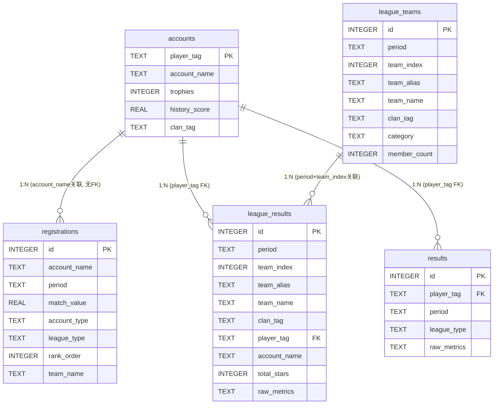
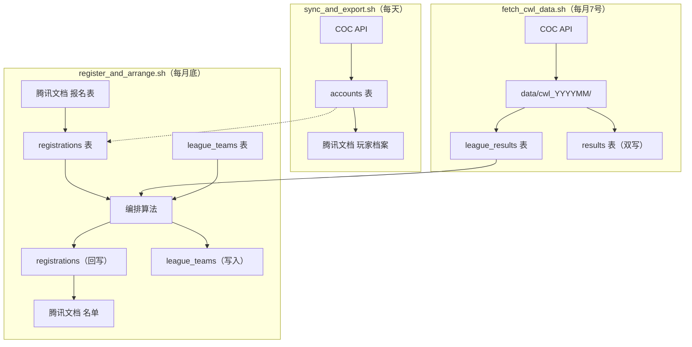

# 苍穹联赛管理系统 — 数据库表结构与数据流转

> 版本：v2.0（联赛重构后）
> 更新日期：2026-08-01

---

## 一、数据库概览

系统使用 SQLite 数据库 `data/league.db`，包含 **5 张表**：

| 表名 | 职责 | 主键 | 状态 |
|------|------|------|------|
| `accounts` | 账号档案（COC 权威） | `player_tag` | 活跃 |
| `registrations` | 月度报名 | `id` (自增) | 活跃 |
| `results` | 月度战绩（旧） | `id` (自增) | 过渡期保留 |
| `league_teams` | 队伍配置快照 | `id` (自增) | **新增** |
| `league_results` | 联赛战绩（新） | `id` (自增) | **新增** |

---

## 二、表关系图



---

## 三、accounts 表

不变，保持 COC 权威建档 + 报名状态 + 历史分。

---

## 四、registrations 表

不变，保持两阶段写入模型（报名导入 + 编排回写）。

**registrations.team_name 回写格式变更**：
- 旧：`"大一"`（仅别名）
- 新：`"5 大一 raiders x #CYYL"`（team_index + 别名 + COC真实名称 + clan_tag）

---

## 五、league_teams 表（新增）

队伍配置按月快照，替代 `TEAMS_LAST` 手工维护。

| 字段 | 说明 |
|------|------|
| `period` | 月份，如 `2026-08` |
| `team_index` | 队伍索引（0-based），唯一身份标识 |
| `team_alias` | 别名，来自 config `name` |
| `team_name` | COC 真实部落名称（通过 API 回填） |
| `clan_tag` | 部落 Tag |
| `category` | combat / shell |
| `member_count` | 队伍容量 |
| `leader` | 领队 |

**写入**：`arrange()` 时 `_write_league_teams()` 幂等写入，保留已有 `team_name`。
**读取**：升降级时 `_load_prev_teams_config()` 读上月配置。

---

## 六、league_results 表（新增）

结构化存储联赛战绩，替代旧 `results` 表。

| 字段 | 说明 |
|------|------|
| `period` | CWL 实际发生月 |
| `team_index` | 队伍索引 |
| `team_alias` | 别名（冗余） |
| `team_name` | COC 真实名称（冗余） |
| `clan_tag` | 部落 Tag（冗余） |
| `player_tag` | 玩家 Tag（FK → accounts） |
| `account_name` | 账号名 |
| `total_stars` | 总星数 |
| `raw_metrics` | JSON 详细数据 |

**写入**：`fetch_cwl_data.py` 拉取后写入（双写到 results）。
**读取**：编排时 `_load_combat_star_data()` 和 `_load_prev_combat_from_results()` 优先读此表。

---

## 七、results 表（过渡期保留）

旧战绩表，`league_results` 写入时双写到此表。过渡期后废弃。

---

## 八、period 语义

```
registrations.period = 联赛月份（实际打 CWL 的月份）
results.period       = CWL 实际发生月
league_teams.period  = 联赛月份（与 registrations 一致）
league_results.period = CWL 实际发生月（与 results 一致）

编排 N 月联赛时：读 registrations(N) + league_results(N-1)
```

---

## 九、完整数据流转图



---

## 十、表读写关系矩阵

| 表 | 写入者 | 读取者 |
|----|--------|--------|
| `accounts` | `coc_sync`, `war_result`, `cwl_registration` | `player-export`, `import-reg`, `arrange`, `fetch_cwl_data` |
| `registrations` | `import-reg`, `arrange`（回写） | `arrange`, `refresh_status` |
| `league_teams` | `arrange`（幂等写入） | `arrange`（读上月配置+team_name） |
| `league_results` | `fetch_cwl_data` | `arrange`（读星数+队伍归属） |
| `results`（旧） | `fetch_cwl_data`（双写） | `arrange`（回退读取） |

---

## 十一、关键设计决策

| 决策点 | 选择 | 理由 |
|--------|------|------|
| 账号主键 | COC 真实 Tag | 名实相符 |
| 报名与 accounts | 解耦，无 FK | 自包含 |
| period 双语义 | reg=联赛月, res=CWL月 | 编排N月读 N-1 |
| team_index | TEAMS 顺序索引 | 唯一身份标识 |
| team 字段冗余 | league_results 冗余存 | 避免 JOIN |
| team_name 来源 | league_teams 表读取 | 不重复调 COC API |
| TEAMS_LAST | 已删除 | league_teams 替代 |
