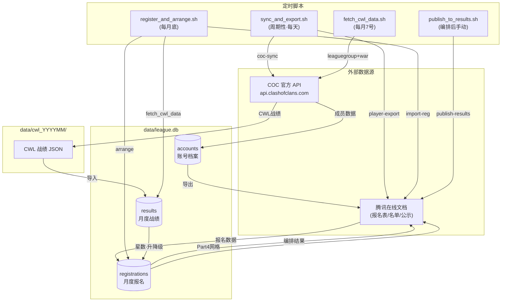
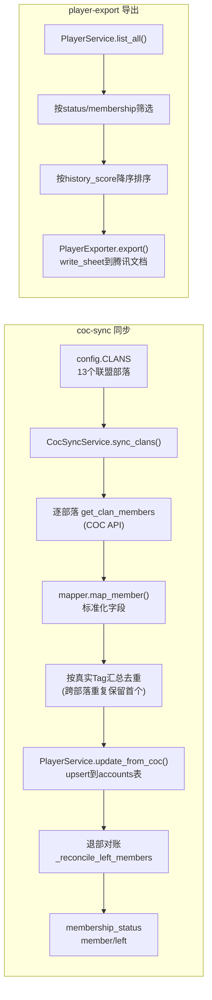
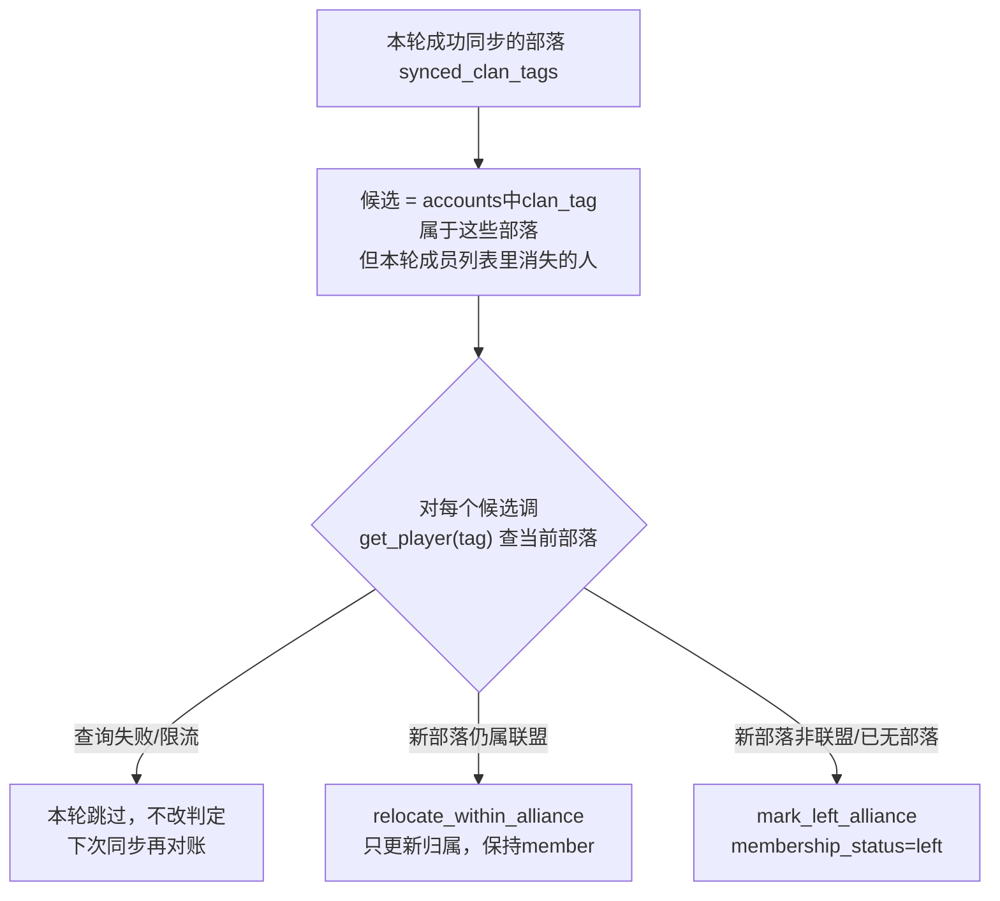
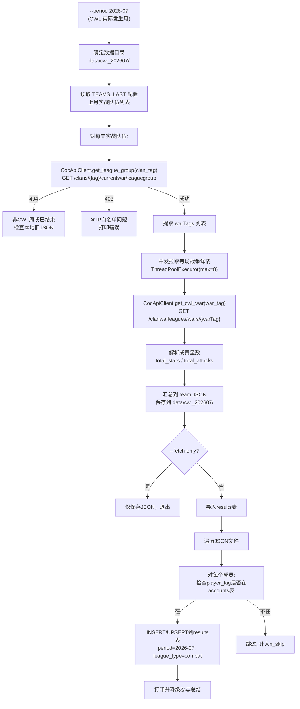
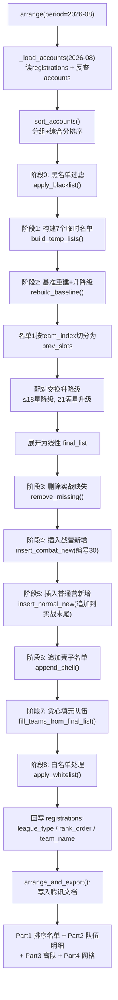
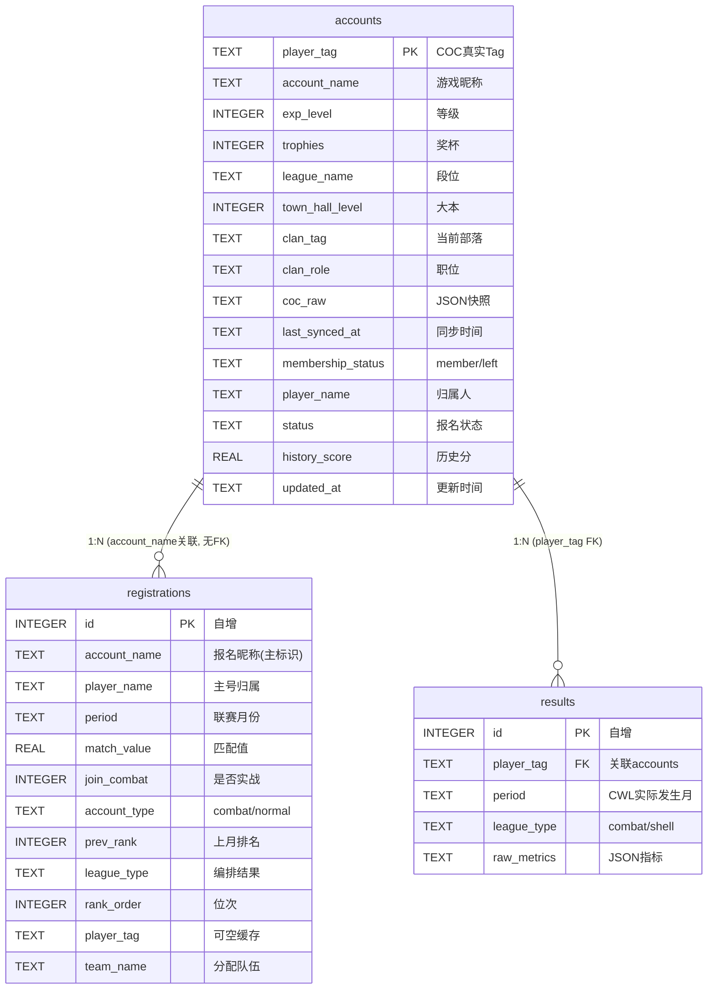
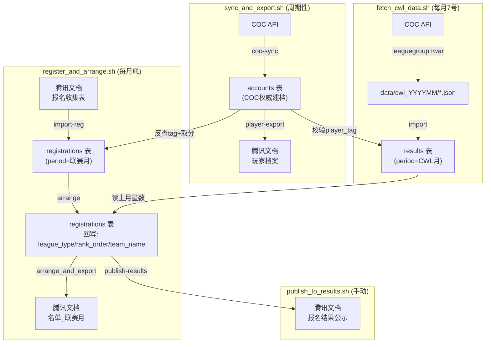
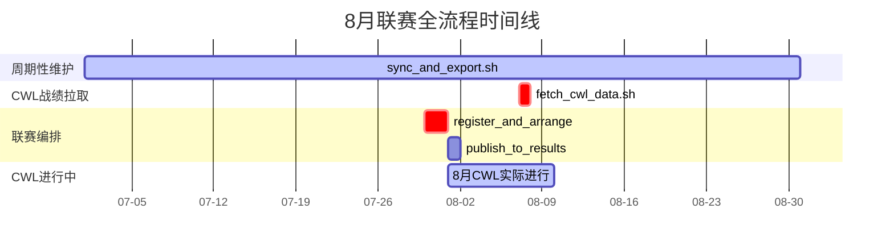

# 苍穹联赛管理系统 — 全流程与数据流文档

> 版本：v1.0  
> 生成日期：2026-07-31  
> 对应代码版本：DESIGN.md v2.7 + combat_baseline_design.md v3.0

---

## 一、系统总览

### 1.1 系统定位

本系统管理部落联赛（CWL）的**月度循环**：成员同步 → 报名导入 → 名单编排 → 战绩拉取 → 升降级 → 结果发布。围绕三个定时执行入口展开：

| 脚本 | 执行频率 | 核心职责 | period 语义 |
|------|---------|---------|------------|
| `sync_and_export.sh` | 周期性（如每天 08:00） | COC API 同步全体成员 → accounts 表 → 导出腾讯文档 | 无 period 参数 |
| `fetch_cwl_data.sh` | 每月 7 号 | COC API 拉取上月 CWL 战绩 → results 表 | CWL 实际发生月 |
| `register_and_arrange.sh` | 每月底 | 报名导入 → 编排+升降级 → 发布联赛安排 | 联赛月份 |

### 1.2 时间语义（核心规则）

```
registrations.period = 联赛月份（实际打 CWL 的月份）
results.period       = CWL 实际发生月（战绩所属月）

编排 N 月联赛时：读 registrations(N) + results(N-1)
```

**示例（8 月联赛）**：
- 报名表导入：`--period 2026-08`（联赛月份）
- 拉 CWL 星数：`--period 2026-07`（上月 CWL 实际发生月）
- 编排联赛：`--period 2026-08`（联赛月份）

### 1.3 系统架构图



---

## 二、三大定时脚本详解

### 2.1 `sync_and_export.sh` — 周期性成员同步

**执行频率**：每天（或每隔几天）一次，建议 cron：`0 8 * * *`

**两步流程**：

```
[1/2] COC 官方 API → accounts 表（建档 / 更新 / 退部对账）
      python cli.py coc-sync

[2/2] accounts 表 → 腾讯在线文档（导出玩家档案，供人工核对）
      python cli.py player-export --to tencent -o $ROSTER_DOC_FILE_ID
```

**数据流详解**：



**accounts 表更新内容**（COC 权威组字段，COALESCE 语义互不覆盖）：

| 字段 | 来源 | 更新方式 |
|------|------|---------|
| `player_tag` | COC 真实 Tag | 主键，不覆盖 |
| `account_name` | COC 昵称 | 非NULL时覆盖 |
| `exp_level` | COC 等级 | 非NULL时覆盖 |
| `trophies` | COC 奖杯 | 非NULL时覆盖 |
| `town_hall_level` | COC 大本 | 非NULL时覆盖 |
| `clan_tag` | COC 部落 | 非NULL时覆盖 |
| `clan_role` | COC 职位 | 非NULL时覆盖 |
| `membership_status` | 退部对账 | member/left |
| `last_synced_at` | 系统 | 每次更新 |
| `coc_raw` | COC 全量JSON | 非NULL时覆盖 |

**退部对账逻辑**：



**依赖的环境变量**：

```
COC_API_TOKEN           # COC API 密钥
TENCENT_DOC_ACCESS_TOKEN # 腾讯文档 token（30天过期）
TENCENT_DOC_CLIENT_ID
TENCENT_DOC_OPEN_ID
ROSTER_DOC_FILE_ID       # 导出目标文档 fileId
```

---

### 2.2 `fetch_cwl_data.sh` — 每月 CWL 战绩拉取

**执行频率**：每月 7 号（CWL 结束后几天，确保 API 数据完整）

**核心逻辑**：拉取上月 CWL 战绩 JSON → 导入 results 表



**results 表写入内容**：

```sql
INSERT INTO results (player_tag, period, league_type, raw_metrics)
VALUES (?, ?, ?, ?)
ON CONFLICT(player_tag, period, league_type) DO UPDATE SET
    raw_metrics = excluded.raw_metrics
```

`raw_metrics` JSON 结构：

```json
{
    "total_stars": 18,
    "team_name": "泰坦二",
    "clan_tag": "#2QQ",
    "team_index": 0
}
```

**关键设计**：

1. **TEAMS_LAST 配置**：拉取上月战绩时使用上月队伍配置（队伍 tag 可能每月变化）
2. **2小时缓存**：JSON 文件 <2h 内跳过重新拉取
3. **回退逻辑**：API 失败 → 检查本地旧 JSON → 全部失败则告警
4. **升降级参与规则**：只有相邻两支队伍都成功拉到数据时，该对才参与升降级

**依赖的环境变量**：

```
COC_API_TOKEN    # 仅需 COC API 密钥
```

---

### 2.3 `register_and_arrange.sh` — 每月联赛编排

**执行频率**：每月底（如 30/31 号），生成下月联赛安排

**三步流程**：

```
register_and_arrange.sh 2026-08     ← 用户参数：联赛月份
  │
  ├─ REG_PERIOD = 2026-07           ← 自动推算：联赛-1（CWL月，用于fetch + sheet名）
  │
  ├─ [1] import-reg --period 2026-08 ← 联赛月份
  │       registrations.period = 2026-08
  │       sheet名按 REG_PERIOD(2026-07) 推算
  │
  ├─ [2] fetch_cwl_data.py --period 2026-07 ← CWL实际发生月
  │       → COC API 拉 7月 CWL → JSON → results 表
  │
  └─ [3] arrange --period 2026-08    ← 联赛月份
          → 读 registrations(2026-08) + results(2026-07)
          → 基准重建 + 升降级 → 导出 "名单_2026-08"
```

**[1] 报名导入数据流**：

```mermaid
flowchart LR
    A["腾讯文档<br/>报名收集表"] -->|"read_sheet<br/>(fill_merged=True)"| B["原始行数据"]
    B --> C["parse_registration_row()<br/>关键词列映射"]
    C --> D["_fill_player_name_forward()<br/>主号前向填充"]
    D --> E["_dedup_latest()<br/>同昵称取最新提交"]
    E --> F["_read_camp()<br/>从accounts表拉#2QQ成员"]
    F --> G["_merge_camp()<br/>战营优先(combat+强制实战)"]
    G --> H["_save() × N"]
    H --> I["resolve_tag_by_name()<br/>昵称→真实Tag反查"]
    I --> J["registrations.add_registration()<br/>UPSERT到registrations表"]
    J --> K["refresh_status()<br/>刷新accounts.status"]
```



**registrations 表写入内容**：

| 字段 | 来源 | 说明 |
|------|------|------|
| `account_name` | 报名表 | 主标识，NOT NULL |
| `player_name` | 报名表/前向填充 | 主号归属 |
| `period` | --period 参数 | 联赛月份 |
| `match_value` | 报名表 | 本月匹配值 |
| `join_combat` | 报名表"想实战" | 0/1 |
| `account_type` | 战营判定 | combat/normal |
| `prev_rank` | 上月 registrations | 上月排名 |
| `player_tag` | resolve_tag_by_name | 可空缓存 |
| `league_type` | arrange 回写 | combat/shell |
| `rank_order` | arrange 回写 | 全局位次 |
| `team_name` | arrange 回写 | 分配队伍 |

**[3] 编排数据流（v3.0 基准重建方案）**：



**编排读取的 results 数据**：

```
arrange(2026-08) 调用:
  _load_combat_star_data("2026-07")  → {account_name: total_stars}
  _load_prev_combat_from_results("2026-07") → 上月实战名单(成员+队伍归属+星数)
  _load_combat_team_map("2026-07")  → {account_name: team_name}
```

**升降级参数**（`config.py`）：

```python
PROMOTION_RELEGATION_CONFIG = {
    "count": 2,                # 每对相邻队伍最多交换人数
    "promotion_min_stars": 21,  # 升级门槛：满星
    "relegation_max_stars": 18, # 降级门槛：≤18星
}
```

**依赖的环境变量**：

```
COC_API_TOKEN
TENCENT_DOC_ACCESS_TOKEN / TENCENT_DOC_CLIENT_ID / TENCENT_DOC_OPEN_ID
REG_DOC_FILE_ID        # 报名表文档 fileId
ROSTER_DOC_FILE_ID     # 名单输出文档 fileId
```

---

### 2.4 `publish_to_results.sh` — 发布公示文档（可选，手动执行）

**执行时机**：`register_and_arrange.sh` 完成后，手动执行

**流程**：

```
publish_to_results.sh 2026-08
  │
  └─ cli.py publish-results --period 2026-08 --file-id $PUBLISH_DOC_FILE_ID
       │
       ├─ arrange(2026-08)           ← 重跑完整编排流程，保证数据一致
       ├─ _build_part4_grid()         ← 构建5列网格
       └─ 前20行固定文字 + Part4网格 → 写入公示文档
```

---

## 三、数据库表结构与数据流转

### 3.1 三张表总览



### 3.2 三张表的写入者与读取者

| 表 | 写入者 | 读取者 | period 语义 |
|----|--------|--------|-----------|
| `accounts` | `coc_sync`（COC组）, `war_result`（history_score）, `cwl_registration`（status） | `player-export`, `import-reg`（反查tag）, `arrange`（取分）, `fetch_cwl_data`（校验tag） | 无 period |
| `registrations` | `import-reg`（报名事实）, `arrange`（回写编排结果） | `arrange`（读报名）, `refresh_status`（派生status） | 联赛月份 |
| `results` | `fetch_cwl_data`（CWL API导入）, `import-result`（手动导入） | `arrange`（读上月星数+队伍归属）, `import-result`（读历史算分） | CWL实际发生月 |

### 3.3 数据流转全链路



### 3.4 accounts 表字段分组与更新语义

```
┌─────────────────────────────────────────────────────────┐
│ accounts 表                                              │
│                                                          │
│ ┌── COC 权威组（coc_sync 更新）─────────────────────────│
│ │ account_name / exp_level / trophies / league_name     │
│ │ town_hall_level / clan_tag / clan_role / coc_raw      │
│ │ last_synced_at / membership_status                    │
│ │  → upsert COALESCE: 只覆盖非NULL值，互不清零           │
│ └──────────────────────────────────────────────────────│
│                                                          │
│ ┌── 报名组（cwl_registration 更新）─────────────────────│
│ │ player_name / status                                  │
│ │  → status 由 refresh_status 按报名情况推断              │
│ └──────────────────────────────────────────────────────│
│                                                          │
│ ┌── 战绩组（war_result 更新）────────────────────────────│
│ │ history_score                                         │
│ │  → 独立方法 update_history_score，不被 upsert 覆盖     │
│ └──────────────────────────────────────────────────────│
│                                                          │
│  派生列（不落表）：last_reg_period = MAX(registrations.period)│
│  读取时子查询实时计算                                    │
└─────────────────────────────────────────────────────────┘
```

### 3.5 results 表 raw_metrics 结构

**CWL API 导入**（`fetch_cwl_data.py`）：

```json
{
    "total_stars": 18,
    "team_name": "泰坦二",
    "clan_tag": "#2QQ",
    "team_index": 0
}
```

**手动导入**（`import-result`）：其余列全部作为指标保留，结构灵活。

**升降级读取**：`_extract_total_stars()` 优先取 `total_stars`，兼容 `three_stars/two_stars/one_stars` 格式。

---

## 四、月度循环时间线

以 **8 月联赛**为例（CWL 发生在 7 月）：



| 日期 | 执行脚本 | 说明 |
|------|---------|------|
| 每天 08:00 | `sync_and_export.sh` | 同步 COC 成员到 accounts，导出腾讯文档 |
| 7月底 (30-31号) | `register_and_arrange.sh 2026-08` | 导入报名 → 拉取7月CWL星数 → 编排8月联赛 |
| 编排后 | `publish_to_results.sh 2026-08` | 发布 Part4 网格到公示文档 |
| 8月7号 | `fetch_cwl_data.sh --period 2026-08` | 拉取8月CWL战绩（供9月联赛编排用） |
| 9月底 | `register_and_arrange.sh 2026-09` | 编排9月联赛，读取8月CWL星数 |

---

## 五、模块与代码对照表

### 5.1 核心模块

| 模块 | 职责 | 核心文件 | 对应表 |
|------|------|---------|--------|
| `coc_sync` | COC API 同步（唯一 API 出口） | `service.py`, `api_client.py`, `mapper.py` | accounts（写COC组） |
| `player` | 玩家中枢（账号读写唯一入口） | `service.py`, `repository.py`, `status_rule.py` | accounts（读写） |
| `cwl_registration` | 报名导入 + 名单编排 | `importer.py`, `roster.py`, `sorter.py`, `baseline_rebuilder.py`, `team_builder.py` | registrations（读写） |
| `war_result` | 战绩导入 + 历史分计算 | `importer.py`, `repository.py`, `history_score.py` | results（读写）, accounts（写history_score） |

### 5.2 脚本 → CLI → 代码映射

| 脚本 | CLI 命令 | 入口函数 | 核心代码 |
|------|---------|---------|---------|
| `sync_and_export.sh` | `coc-sync` | `cmd_coc_sync()` | `CocSyncService.sync_clans()` → `PlayerService.update_from_coc()` |
| | `player-export` | `cmd_player_export()` | `PlayerExporter.export()` → `ExcelIO.write_sheet()` |
| `fetch_cwl_data.sh` | `fetch_cwl_data.py --fetch-only` | `main()` | `_fetch_from_api()` → `_fetch_team_cwl()` → `CocApiClient` |
| `register_and_arrange.sh` [1] | `import-reg` | `cmd_import_reg()` | `RegistrationImporter.import_from()` |
| `register_and_arrange.sh` [2] | `fetch_cwl_data.py` | `main()` | `_fetch_from_api()` + `_import_to_results()` |
| `register_and_arrange.sh` [3] | `arrange` | `cmd_arrange()` | `LeagueArranger.arrange_and_export()` |
| `publish_to_results.sh` | `publish-results` | `cmd_publish_results()` | `LeagueArranger.publish_part4_to_doc()` |

### 5.3 纯函数 vs IO 层

| 类型 | 文件 | 说明 |
|------|------|------|
| 纯函数（无IO） | `sorter.py`, `rank_score.py`, `baseline_rebuilder.py`, `team_builder.py`, `mapper.py`, `status_rule.py`, `history_score.py` | 可独立测试 |
| IO 适配层 | `ExcelIO`（抽象）, `LocalXlsxAdapter`, `TencentDocAdapter` | 可替换 |
| 数据访问层 | `PlayerRepository`, `RegistrationRepository`, `ResultRepository` | 持有共享 SQLite 连接 |
| 编排层 | `RegistrationImporter`, `LeagueArranger`, `ResultImporter`, `CocSyncService` | 组合纯函数+IO+Repo |

---

## 六、配置体系

### 6.1 公共配置（`shared/config/common.py`）

| 配置项 | 值 | 说明 |
|--------|-----|------|
| `IO_ADAPTER` | `"tencent"` | 全局 IO 适配器 |
| `DB_PATH` | `"data/league.db"` | 数据库路径 |
| `LEAGUE_COMBAT` / `LEAGUE_SHELL` | `"combat"` / `"shell"` | 联赛类型 |
| `MAYBE_LEFT_MONTHS` | `2` | 连续未报名N月标记疑似离开 |

### 6.2 COC 同步配置（`modules/coc_sync/config.py`）

| 配置项 | 说明 |
|--------|------|
| `CLANS` | 13 个联盟部落列表（tag/name/enabled） |
| `DUP_ACROSS_CLANS` | `"warn"` 跨部落重复告警 |
| `FAIL_FAST` | `False` 单部落失败不中断 |

### 6.3 报名编排配置（`modules/cwl_registration/config.py`）

| 配置项 | 说明 |
|--------|------|
| `SORT_WEIGHTS` | 综合分权重：匹配值 0.6 / 历史分 0.4 |
| `CAMP_CLAN_TAG` | 战营部落 `#2QQ` |
| `EXCLUDED_CAMP_NAMES` | 战营排除名单（8个昵称） |
| `TEAMS` | 当月队伍配置（7实战 + 4壳子） |
| `TEAMS_LAST` | 上月队伍配置（供 fetch_cwl_data 使用） |
| `COMBAT_MIN_MATCH_VALUE` | 实战最低匹配值门槛 `600` |
| `PROMOTION_RELEGATION_CONFIG` | 升降级：count=2, 升21星, 降≤18星 |
| `BLACK_LIST` | 黑名单（不出现在任何队伍） |
| `WHITE_LIST` | 白名单（强制插入到指定队伍开头） |
| `NEW_COMBAT_INSERT_START` | 战营新增插入点 `30`（第3队开头） |

### 6.4 环境变量（`.env`）

```bash
# COC API
COC_API_TOKEN=

# 腾讯文档（30天过期需手动更新）
TENCENT_DOC_ACCESS_TOKEN=
TENCENT_DOC_CLIENT_ID=
TENCENT_DOC_OPEN_ID=

# 文档 fileId
REG_DOC_FILE_ID=       # 报名收集表
ROSTER_DOC_FILE_ID=    # 名单输出
PUBLISH_DOC_FILE_ID=   # 公示文档

# 可选
REG_SHEET=             # 报名子表名（留空自动推算）
ROSTER_SHEET=          # 名单子表名（留空用"名单_<period>"）
```

---

## 七、数据目录结构

```
data/
├── league.db                    # SQLite 主数据库
├── league.db.bak                # 备份
├── cwl_202607/                  # 7月 CWL 战绩 JSON 缓存
│   ├── 0_泰坦二.json
│   ├── 1_冠一_一队.json
│   ├── ...
│   └── 6_大一.json
├── coc_members.xlsx             # COC 成员导出（调试用）
└── 2026-08名单.xlsx             # 本地名单导出（调试用）
```

---

## 八、Cron 配置建议

```bash
# 每天早上 8 点同步 COC 成员 + 导出腾讯文档
0 8 * * * cd /path/to/sky-admin && scripts/sync_and_export.sh >> logs/sync.log 2>&1

# 每月 7 号拉取上月 CWL 战绩（CWL 通常月底结束，7号确保数据完整）
0 8 7 * * cd /path/to/sky-admin && scripts/fetch_cwl_data.sh --period $(date -d 'last month' +%Y-%m) >> logs/fetch_cwl.log 2>&1

# 每月 30 号编排下月联赛（月底前生成安排）
0 20 30 * * cd /path/to/sky-admin && scripts/register_and_arrange.sh $(date -d 'next month' +%Y-%m) >> logs/arrange.log 2>&1
```

> **注意**：腾讯文档 `access_token` 约 30 天过期，需定期手动更新 `.env` 中的 `TENCENT_DOC_ACCESS_TOKEN`。

---

## 九、关键设计决策汇总

| 决策点 | 选择 | 理由 |
|--------|------|------|
| 账号主键 | COC 真实 Tag | 名实相符，COC 权威建档 |
| 报名与 accounts 关系 | 解耦（B 方案） | registrations 自包含，无 FK，新人不建临时行 |
| period 语义 | registrations=联赛月, results=CWL月 | 编排N月读 results(N-1) |
| 升降级数据源 | results 表（非 registrations） | results 代表实际打了联赛的人，含战绩 |
| team_index | 队伍在 TEAMS 中的顺序索引 | 队伍唯一身份标识，避免重名混淆 |
| IO 层 | 可替换适配器 | 本地 xlsx / 腾讯文档，业务零改动 |
| 腾讯文档 token | 调试 token，手动更新 | 无 client_secret，不做自动刷新 |
| 退部对账 | 仅对成功同步的部落 | 避免抓取失败误判退部 |
| 战营名单来源 | accounts 表（#2QQ 成员） | 不再从报名表 sheet 读取 |
| 编排方案 | v3.0 基准重建 | 以上月名单为锚点做升降级+增删 |
